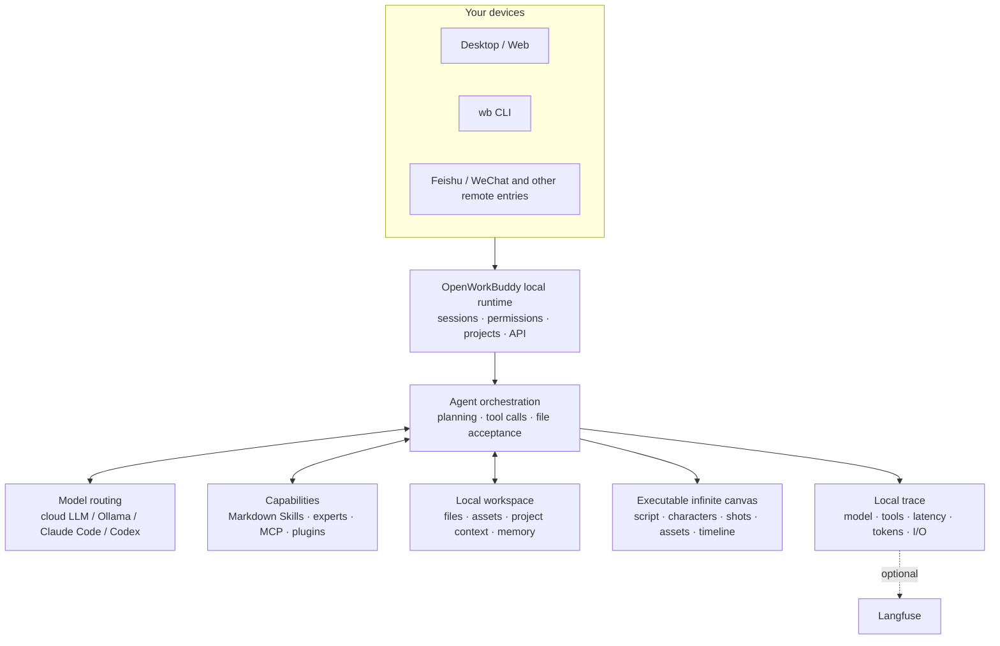

<p align="center">
  
</p>

<h1 align="center">OpenWorkBuddy</h1>

<p align="center">
  <b>An AI office assistant that runs on your own machine.</b><br>
  Ask for something once; it plans, does the work, checks it, and leaves a real<br>
  PPT / Word / Excel / web page on your disk — <b>a file you can open, not a chat log.</b>
</p>

<p align="center">
  <sub><a href="README.md"><b>中文</b></a> · English</sub>
</p>

<p align="center">
  <a href="https://github.com/CatCatUncle/openworkbuddy/releases"><b>⬇&nbsp;Download</b></a>
  &nbsp;·&nbsp; <a href="#run-it-in-three-minutes">Run it in three minutes</a>
  &nbsp;·&nbsp; <a href="docs/功能清单.md">Feature list (zh)</a>
  &nbsp;·&nbsp; <a href="#docs">Docs</a>
  &nbsp;·&nbsp; <a href="README.md#交流群">Feishu group</a>
  &nbsp;·&nbsp; <a href="CHANGELOG.en.md">Changelog</a>
</p>

<p align="center">
  <a href="https://github.com/CatCatUncle/openworkbuddy/stargazers"></a>
  <a href="LICENSE"></a>
  <a href="docs/功能清单.md"></a>
  <a href="docs/功能清单.md"></a>
  <a href="docs/功能清单.md"></a>
  <a href="docs/功能清单.md"></a>
</p>

<p align="center">
  <sub>Free for personal, learning and non-profit use. Commercial use needs a license — <a href="#license">one sentence below ↓</a></sub>
</p>

<p align="center">
  
</p>

---

## You say it, it hands you the file

<p align="center">
  
</p>

| You say | You get |
|---|---|
| "Build a Q3 review deck from this spreadsheet" | reads → computes → a `.pptx` you can present |
| "Research AI companion apps in China, write a report" | searches → reads each page → Markdown / Word |
| "Turn this material into a page I can read on my phone" | writes HTML → serves it locally → scan the QR |
| "Every day at 9, collect industry news and send it to me on Feishu" | cron + IM push; missed runs catch up |

> [!NOTE]
> Also: parallel tasks, goal-based acceptance, 👍👎 feedback that feeds self-evolution, two-layer memory, permission tiers, remote control over Feishu / WeChat, a desktop pet… Full list (Chinese): **[功能清单](docs/功能清单.md)**.

## Why this one

<table>
<tr>
<td width="50%" valign="top">

<b>📄 The files are real.</b>

Decks, documents, spreadsheets and pages are actually generated — open them from the output panel and check. Claim a file was written when it isn't on disk and the run gets stopped and redone.

</td>
<td width="50%" valign="top">

<b>🔌 Swap models freely; everything stays yours.</b>

DeepSeek / Qwen / GLM / Kimi / OpenRouter / Ollama switch with one click. Already have <b>Claude Code or Codex</b> on this machine? Use it as the engine — no second token bill. Sessions, files and keys never leave your disk; it listens on <code>127.0.0.1</code> by default.

</td>
</tr>
<tr>
<td width="50%" valign="top">

<b>🧩 Adding a capability = dropping one Markdown file.</b>

Save it as <code>skills/&lt;name&gt;/skill.md</code> and it's live on the next task — no code, no restart, no build.

</td>
<td width="50%" valign="top">

<b>🔍 It's also a readable agent.</b>

Model routing, tool calls, file acceptance, memory, permissions and local traces all live in one repo: for any real task you can see why it did what it did, which model it used, how long each step took, and what it finally handed over.

</td>
</tr>
</table>

## What it looks like

**"Same person, four different scenes, holding a hand-written sign — make it look like a snapshot, not an AI render."**

<p align="center">
  
</p>

The hard part isn't drawing a person — it's keeping **the same** person across all four and the Chinese on the sign legible. So it generates one, then actually looks at what it just made (a real vision call on its own output, not a claim from memory), confirms the light and skin came out right, and fans the rest out from there.

**"Build me a Hunan travel guide site — all 14 prefectures, no skipping."**

<p align="center">
  <a href="https://hunan-travel.pages.dev/"></a>
</p>

It's live, go click around: **<https://hunan-travel.pages.dev/>**. Single-page HTML, no external CDN — drop it on any static host and it's a site. This isn't a mockup screenshot; it's the file it handed over.

How it pulled those off → **[三个案例，拆开讲](docs/案例.md)** (Chinese, but the screenshots speak for themselves)

## AI short-drama infinite canvas

Script, characters, scenes, shots, reference images, video, voice and the edit timeline all sit on one canvas. The wires aren't decoration — they are what the next generation actually reads for character, first frame and sound. Change one shot and only that shot re-runs.

<p align="center">
  
</p>

Open "Infinite canvas" in the left sidebar. Drag empty space to pan, `Shift`+drag to marquee-select, and `@` any node or asset from the chat box at the bottom.

## Run it in three minutes

All three routes are the full product; none of them is a cut-down edition:

| 🖥️ On your own machine | 🐳 On a server for your team | 🏢 Rolling it out at a company |
|---|---|---|
| Download, double-click, five-step wizard. Data stays local. | One VPS + Docker, one command, HTTPS included. | You also need SSO, audit export, air-gapped install, SLA. |
| [Download ↓](https://github.com/CatCatUncle/openworkbuddy/releases) | [Deploy guide →](docs/部署.md) | [Commercial license →](COMMERCIAL-LICENSE.md) |

<details>
<summary><b>Which file to download · what to do when your OS blocks the first launch</b></summary>

<br>

| OS | File |
|---|---|
| macOS · Apple Silicon | `OpenWorkBuddy-*-mac-arm64.dmg` |
| macOS · Intel | `OpenWorkBuddy-*-mac-x64.dmg` |
| Windows 10/11 (one installer for x64 and ARM64) | `OpenWorkBuddy-*-win-setup.exe` |
| Windows portable (**only if you cannot install software** — every launch unpacks the whole app into `%TEMP%`, so the first start can take minutes) | `OpenWorkBuddy-*-win-x64-portable.exe` |

**Your OS will block the first launch**: the build has no code-signing certificate (Apple charges $99/year, Windows a few thousand — this is a free open-source project). It is not malware.

- **Windows**: in the SmartScreen dialog click the small grey "More info" → "Run anyway".
- **macOS**: move the app to `/Applications`, then run `xattr -dr com.apple.quarantine /Applications/OpenWorkBuddy.app`, or System Settings → Privacy & Security → "Open Anyway" (right-click → Open only works on macOS 14 and earlier).
- Your data lives in `~/OpenWorkBuddy` and survives uninstall. Moving machines → [数据同步与搬家](docs/数据同步与搬家.md) (Chinese).
- Double-clicked and nothing happened? The boot log is at `~/OpenWorkBuddy/logs/boot.log` — walk through [安装与启动](docs/安装与启动.md#双击了没反应) (Chinese).

</details>

**From source** (Node.js 18+, no build step, no framework — edit, refresh, done):

```bash
git clone https://github.com/CatCatUncle/openworkbuddy.git
cd openworkbuddy && npm install
npm run app     # desktop app; or `npm start` and open http://localhost:3800
```

> [!TIP]
> Then type something like "make a slide deck introducing OpenWorkBuddy".
> Appearance is yours: avatar menu → **Appearance** for language (中文 / English), theme, six skins, font size and family. In English the assistant answers in English and writes its files in English too.

Mirrors, one-line install script, port conflicts → [安装与启动](docs/安装与启动.md) (Chinese).

## Put it on a server for your team

One command on a clean VPS that already has Docker:

```bash
git clone https://github.com/CatCatUncle/openworkbuddy.git && cd openworkbuddy
bash deploy.sh --domain buddy.example.com   # automatic HTTPS, reachable from outside
```

It **waits for the health check to actually pass** before claiming success; if it won't start you get the logs, not a happy message. All data sits in `./wb-data` — delete the container freely, keep that directory.

> [!IMPORTANT]
> **Register the admin account first thing.** The first account to register becomes the admin, and self-registration closes right after. An empty instance on a public IP means whoever gets there first is your admin.

**Multi-tenant + admin console**: one process serves several companies. Output files, sessions, accounts, seats, usage ledgers and audit logs are invisible across tenants. Avatar menu → **Admin console**.

Reverse proxy, upgrades, migration, security checklist → [deploy/README.md](deploy/README.md) (Chinese)

## Models

**Settings → Models**: pick a provider preset (OpenAI / Anthropic / OpenRouter / Volcano Ark / Bailian / DeepSeek / GLM / Kimi / Ollama), the base URL and protocol are filled in, paste a key, save — hot reload, no restart. Reasoning models can have thinking turned off or dialed down from the UI. Per-provider table → [配置模型](docs/配置模型.md) (Chinese).

> [!IMPORTANT]
> `config.json` is the only file holding API keys and is already in `.gitignore`. Don't commit it.

## Command line

`wb` shares the desktop app's config, skills, memory and connectors. Answers go to stdout, so it fits into any pipe, script or cron job:

```bash
npm link                                   # once: install `wb` globally
wb "write my weekly report"                # one-shot: exit code 0/1 tells the truth
cat error.log | wb "what is this error"    # pipe: stdin becomes attached material
wb --json "summarize this meeting" | jq -j 'select(.type=="text") | .delta'
wb engines && wb engines use claude-code   # use a local Claude Code / Codex as the engine
```

Everything → [命令行用法](docs/命令行用法.md) (Chinese).

## How it's put together



The diagram doubles as a reading order: start at `server.js`, then see how `agent.js` orchestrates models and tools.

## What's new

- **Sep 17** Moving to a new machine: back up on the old one, import and restore on the new one — sessions, memory, accounts and the skills you wrote yourself all travel
- **Sep 17** Say something while a task is running and you choose: cut in, or queue it until the task finishes (and a queued line can be taken back)
- **Sep 17** Per-call paid APIs (search, image, video, voice) sit behind a quota gate; the admin console reports spend by day and by person
- **Sep 14** An AI short-drama infinite canvas: script, characters, shots, assets and the cut, all on one canvas
- **Sep 13** It can shoot video: shot list → you approve → character stills → first frame → video → voice → subtitled cut. Change one shot, only that shot costs again
- **Sep 13** SMTP email with a hard recipient allowlist, cron jobs from a plain sentence, and audio/video transcription
- **Sep 11** The sidebar splits into "Office" and "Engineering"; a task started with `wb` in a terminal is visible — and interruptible — from your phone
- **Sep 10** One-command deploy with HTTPS; multi-tenant plus an admin console
- **Sep 8** A local Claude Code / Codex can be the engine

Older entries → **[Changelog](CHANGELOG.en.md)**.

## ⚠️ This agent has a shell

> [!WARNING]
> It runs commands, reads and writes files and reaches the network — so the gates are real: command approval, a file blacklist, a URL allowlist, audit logs and four permission tiers.
> **Read [安全](docs/安全.md) (Chinese) before exposing it to the internet**; the defaults are tuned for local use only.

## Contributing

- **Something broke? [Open an issue](https://github.com/CatCatUncle/openworkbuddy/issues/new)**, even if it's one line of error text. Scrub your API keys first.
- **10 minutes** — write a skill: one Markdown file at `skills/<name>/skill.md`, live on save. [Template](CONTRIBUTING.md#提交一个技能3-分钟)
- **One evening** — pick an issue: `npm install && npm start` runs it, `npm test` goes green without any API key

Project layout, tests and PR conventions are in [CONTRIBUTING.md](CONTRIBUTING.md). No need to open an issue first — send the PR.

## Docs

Most docs are in Chinese; the code and comments are the source of truth.

| Doc | What's in it | Doc | What's in it |
|---|---|---|---|
| [功能清单](docs/功能清单.md) | Every capability, skill and tool | [部署](docs/部署.md) | Server / Docker / reverse proxy |
| [案例](docs/案例.md) | How the pictures above were made | [多人协作](docs/多人协作.md) | Multi-tenant, accounts, quotas |
| [安装与启动](docs/安装与启动.md) | Installers, source, common snags | [安全](docs/安全.md) | Approval gates, allowlists, audit |
| [配置模型](docs/配置模型.md) | base_url / model names per provider | [数据同步与搬家](docs/数据同步与搬家.md) | Where data lives, moving machines |
| [命令行用法](docs/命令行用法.md) | CLI flags, pipes, `--json`, cron | [开源与商业版边界](docs/开源与商业版边界.md) | What's open, what's paid |
| [扩展](docs/扩展.md) | Skills, MCP, plugins, experts | [路线图](docs/路线图.md) | What's next, what counts as done |
| [IM与定时任务](docs/IM与定时任务.md) | Feishu / QQ / WeCom / WeChat / DingTalk | [实现细节](docs/实现细节.md) | How the agent loop actually runs |

## License

In one sentence: **personal, learning and non-profit use is free; making money with it (including internal productivity at a company) needs a commercial license from the author.**
The license is [PolyForm Noncommercial 1.0.0](LICENSE); what counts as commercial and how to get one: [COMMERCIAL-LICENSE.md](COMMERCIAL-LICENSE.md).

**Has the open-source edition been stripped? No.** What you see in this repo is everything: the agent loop, 40+ tools, the short-drama canvas, IM remote control, execution traces, memory and self-evolution — multi-tenancy and the admin console included. No feature flags, no trial countdown, no greyed-out "available in the commercial edition" buttons. The commercial license sells a different category of thing: SSO, audit export, air-gapped deployment, white-labeling, SLA. Where the line runs → [开源与商业版边界](docs/开源与商业版边界.md).

This license grants **no** rights to any third-party product, trademark, logo, brand asset or screenshot — those belong to their respective owners.

Copyright (c) 2026 开发者猫叔

## Disclaimer

**What this is.** OpenWorkBuddy (repository `CatCatUncle/openworkbuddy`) is an independent open-source project written from scratch by 开发者猫叔 (CatCatUncle); all source is public here. The architecture, tool protocol, permission model, memory and self-evolution are original work; external projects that were studied are listed one by one in [NOTICE.md](NOTICE.md), section 4.

**Where the name comes from.** `Work` + `Buddy` are two ordinary English words (office + companion) and `Open-` is the usual open-source prefix. Together they plainly describe what the project does: an open-source work buddy.

**Relationship to third parties: none.** This project has no affiliation with, authorization from, sponsorship by or endorsement from Tencent or its WorkBuddy product, and contains none of its code, assets, UI resources or non-public information. If "WorkBuddy" is someone's registered trademark, the rights are theirs; third-party names appear in these docs only to describe compatibility or draw a factual distinction (nominative use). Integrations with Feishu, WeCom, QQ and others use each platform's **publicly published** open APIs only; no reverse engineering is involved.

**If you hold a right and think something here is wrong**, contact me through [Issues](https://github.com/CatCatUncle/openworkbuddy/issues) or the address in [COMMERCIAL-LICENSE.md](COMMERCIAL-LICENSE.md). I'll verify and fix it quickly — faster than any other route.

## Support this project

<p align="center">
  <a href="https://github.com/CatCatUncle/openworkbuddy">
    
  </a>
</p>

<p align="center">
  <a href="https://github.com/CatCatUncle/openworkbuddy"></a>
</p>

<p align="center">
  <sub>And pass it to one person who still hand-builds decks, weekly reports and meeting notes — worth more than a hundred impressions.</sub>
</p>

## Contributors

<p align="center">
<a href="https://github.com/CatCatUncle/openworkbuddy/graphs/contributors">
  
</a>
</p>

## Star history

<p align="center">
<a href="https://star-history.com/#CatCatUncle/openworkbuddy&Date">
  <picture>
    <source media="(prefers-color-scheme: dark)" srcset="https://api.star-history.com/svg?repos=CatCatUncle/openworkbuddy&type=Date&theme=dark">
    
  </picture>
</a>
</p>
