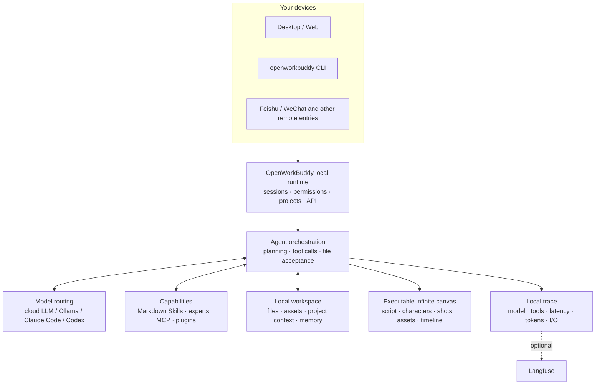

<p align="center">
 
</p>

<h1 align="center">OpenWorkBuddy</h1>

<p align="center">
 <b>An AI office assistant that runs on your own machine.</b><br>
 Ask for something once; it plans, does the work, checks it, and leaves a real<br>
 PPT / Word / Excel / web page on your disk — <b>a file you can open, not a chat log.</b>
</p>

<p align="center">
 <sub><a href="README.md"><b>中文</b></a> · English</sub>
</p>

<p align="center">
 <a href="#run-it-in-three-minutes"><b>▶&nbsp;Run it in three minutes</b></a>
 &nbsp;·&nbsp; <a href="https://github.com/CatCatUncle/openworkbuddy/releases">Download</a>
 &nbsp;·&nbsp; <a href="docs/功能清单.md">Feature list (zh)</a>
 &nbsp;·&nbsp; <a href="#docs">Docs</a>
 &nbsp;·&nbsp; <a href="README.md#交流群">Feishu group</a>
 &nbsp;·&nbsp; <a href="CHANGELOG.en.md">Changelog</a>
</p>

<p align="center">
 <a href="https://github.com/CatCatUncle/openworkbuddy/stargazers"></a>
 <a href="LICENSE"></a>
 <a href="docs/功能清单.md"></a>
 <a href="docs/功能清单.md"></a>
 <a href="docs/功能清单.md"></a>
 <a href="docs/功能清单.md"></a>
</p>

<p align="center">
 <sub>Free for personal, learning and non-profit use. Commercial use needs a license — <a href="#license">one sentence below ↓</a></sub>
</p>

<p align="center">
 
</p>

---

## You say it, it hands you the file

| You say | You get |
|---|---|
| "Build a Q3 review deck from this spreadsheet" | reads → computes → a `.pptx` you can present |
| "Research AI companion apps in China, write a report" | searches → reads each page → Markdown / Word |
| "Turn this material into a page I can read on my phone" | writes HTML → serves it locally → scan the QR |
| "Every day at 9, collect industry news and send it to me on Feishu" | cron + IM push; missed runs catch up |
| "Make a 30-second product promo, vertical and horizontal" | a form for length, aspect and sound → voice-over, motion, compositing → `.mp4` |

<p align="center">
 
</p>

> [!NOTE]
> Also: parallel tasks, goal-based acceptance, 👍👎 feedback that feeds self-evolution, two-layer memory, permission tiers, remote control over Feishu / WeChat, a desktop pet… Full list (Chinese): **[功能清单](docs/功能清单.md)**.

## Why this one

<table>
<tr>
<td width="50%" valign="top">

<b>📄 The files are real.</b>

Decks, documents, spreadsheets and pages are actually generated — open them from the output panel and check. Claim a file was written when it isn't on disk and the run gets stopped and redone.

</td>
<td width="50%" valign="top">

<b>🔌 Swap models freely; everything stays yours.</b>

DeepSeek / Qwen / GLM / Kimi / OpenRouter / Ollama switch with one click. Already have <b>Claude Code or Codex</b> on this machine? Use it as the engine — no second token bill. Sessions, files and keys never leave your disk; it listens on <code>127.0.0.1</code> by default.

</td>
</tr>
<tr>
<td width="50%" valign="top">

<b>🧩 Adding a capability = dropping one Markdown file.</b>

Save it as <code>skills/&lt;name&gt;/skill.md</code> and it's live on the next task — no code, no restart, no build.

</td>
<td width="50%" valign="top">

<b>🔍 It's also a readable agent.</b>

Model routing, tool calls, file acceptance, memory, permissions and local traces all live in one repo: for any real task you can see why it did what it did, which model it used, and what it finally handed over.

</td>
</tr>
</table>

## Run it in three minutes

**macOS** (no dialogs at all):

```bash
curl -fsSL https://raw.githubusercontent.com/CatCatUncle/openworkbuddy/main/install-mac.sh | bash
```

**Windows**: grab `-win-setup.exe` from [Releases](https://github.com/CatCatUncle/openworkbuddy/releases) (x64 and ARM); on a locked-down machine use the portable `-win-x64-portable.exe`.

**From source** (Node.js 18+, no build step):

```bash
git clone https://github.com/CatCatUncle/openworkbuddy.git
cd openworkbuddy && npm install
npm run app # desktop app; or npm start → http://localhost:3800
```

Paste a model key, then just say what you want. Your data lives in `~/OpenWorkBuddy` and survives uninstalls. Text size and themes: avatar menu → **Appearance**.

<details open>
<summary><b>Your OS blocks the first launch</b></summary>

<br>

The signing certificate is still pending, so builds are ad-hoc signed: the OS is blocking an unknown developer, not malware.

- **macOS, "could not be verified"**: click Done → System Settings → Privacy & Security → scroll down → **Open Anyway**. Or drag the .app into Applications and run `xattr -dr com.apple.quarantine /Applications/OpenWorkBuddy.app`. The old "right-click → Open" trick only works on macOS 14 and earlier.
- **macOS, "is damaged"**: a cloud drive or unzip tool broke the signature — download again.
- **Windows**: "More info" → "Run anyway".
- **Nothing happens**: check `~/OpenWorkBuddy/logs/boot.log` → [安装与启动](docs/安装与启动.md#双击了没反应) (Chinese)

</details>

## What it looks like

**"Same person, four different scenes, holding a hand-written sign — make it look like a snapshot, not an AI render."**

<p align="center">
 
</p>

The hard part isn't drawing a person — it's keeping the same person across all four and the Chinese on the sign legible. So it generates one, then actually looks at what it just made (a real vision call on its own output, not a claim from memory), and fans the rest out from there.

**"Build me a Hunan travel guide site — all 14 prefectures, no skipping."**

<p align="center">
 <a href="https://hunan-travel.pages.dev/"></a>
</p>

**<https://hunan-travel.pages.dev/>** — it's live, go click around. One HTML file plus a folder of images, no external CDN. Drop it on any static host and it's a site. Not a mockup — the thing it actually handed over.

**"Every morning at seven, send me today's weather and what I should watch out for, on Feishu."**

<p align="center">
 
</p>

One sentence set this up. It runs whether or not anyone is at the machine, and every run keeps its full transcript under Automation → Run history. Feishu / WeCom / DingTalk / Telegram all take the same path.

How it pulled those off → **[三个案例，拆开讲](docs/案例.md)** (Chinese, but the screenshots speak for themselves)

## AI short-drama infinite canvas

Script, characters, scenes, shots, reference images, video, voice and the edit timeline all sit on one canvas. The wires aren't decoration — they are what the next generation actually reads for character, first frame and sound. Change one shot and only that shot re-runs.

<p align="center">
 
</p>

Open "Infinite canvas" in the left sidebar. Drag empty space to pan, `Shift`+drag to marquee-select, `Shift`/`⌘`+click to add or drop nodes from the selection, and `@` any node or asset from the chat box at the bottom.

## Put it on a server for your team

```bash
git clone https://github.com/CatCatUncle/openworkbuddy.git && cd openworkbuddy
bash deploy.sh --domain buddy.example.com # Docker + automatic HTTPS
```

Multi-tenant, with seats, quotas and one-click offboarding. **Register the admin first** — the first account becomes super admin.
→ [部署](docs/部署.md) · [ops handbook](deploy/README.md) · [多人协作](docs/多人协作.md) (Chinese)

## Models

**Settings → Models**: pick a preset (OpenAI / Anthropic / OpenRouter / DeepSeek / Qwen / Zhipu / Kimi / Volcengine Ark / Ollama), paste the key, save — it applies immediately. Image, voice and video models have their own table. Reference → [配置模型](docs/配置模型.md) (Chinese)

> [!IMPORTANT]
> Keys live only in `config.json`, which is already in `.gitignore`. Don't commit it.

## Command line

`openworkbuddy` shares **one** set of config, skills, memory, connectors and sessions with the desktop app — start something in the terminal and you can watch it and chime in from your phone; stop halfway on the desktop and `openworkbuddy resume` picks it up.

```bash
npm link # once: install the global command (or just run `node cli.js …`)

openworkbuddy "write my weekly report" # one-shot: runs and exits
openworkbuddy # interactive: type / for the command menu
cat error.log | openworkbuddy "what is this" # pipe: stdin becomes material
openworkbuddy -q "write my weekly report" > report.md # just the report, no progress bars
```

One-shot and pipe mode **never** ask you questions, so scripts and cron don't hang. Exit codes mean something: `0` success, `1` task failed, `2` bad arguments, `130` Ctrl+C — so `openworkbuddy doctor && npm start` stops a misconfigured machine before it starts.

`sessions` / `resume` / `engines` / `doctor` / `pair` (QR-pair your phone) / `worktree`, plus `--mode` `--perm` `-C` `-f` `--json` and the rest → **[命令行用法](docs/命令行用法.md)** (Chinese)

## How it's put together



The diagram doubles as a reading order: start at `server.js`, then see how `agent.js` orchestrates models and tools. Details → [实现细节](docs/实现细节.md) (Chinese)

## What's new

- **Sep 27** Video: say "make a 30-second promo", pick length, aspect ratio and sound in a form, and get voice-over, motion and a finished mp4; paid steps stay off unless you tick them
- **Sep 27** Ready-made recipes: promo video, product demo, Xiaohongshu carousel, multi-platform posting; web demos can be screen-recorded, with local details masked before anything is published
- **Sep 27** The library gains a Workspace tab you can click through folder by folder, so every workspace file is findable; "this turn's output" lists deeply nested files too
- **Sep 27** Feishu: mp4s go out as video, compressed first if too big; the card shows what the run cost, or "price unknown" when there is no official price; IM file errors no longer leak local paths
- **Sep 25** Multi-line input in the CLI: pastes wait for Enter, `\` + Enter or `Ctrl+J` adds a line, `Ctrl+G` opens your editor, `Ctrl+R` searches history; the running line shows time and tokens, and Esc stops the run
- **Sep 25** CLI: after a plan, pick "go" or "keep editing"; `!command` runs shell and hands the output to the agent; with nobody at the terminal approvals are denied at once (`--allow` approves ahead); AGENTS.md / CLAUDE.md read up to the repo root
- **Sep 25** Any file an answer mentions is clickable if it exists in the workspace, not just the ones made in that turn
- **Sep 24** CLI approvals are picked with ↑↓ and Enter; tool calls show as `● Shell(command)` with `└ output` beneath, like Claude Code
- **Sep 24** Canvas video: a job the provider already accepted is no longer retried automatically, so you are not charged twice; it sends the card's length, aspect ratio and resolution
- **Sep 24** Chatting on the canvas shows up in task history right away, marked running; the input box hints `@` to reference files and `/` for skills

Older entries → **[Changelog](CHANGELOG.en.md)**.

## ⚠️ This agent has a shell

It runs commands, edits files and goes online, so there are command approvals, file blocklists, a URL allowlist, an audit log and four permission levels. Third-party skills get a static check before install and risky ones are refused by default — but it isn't antivirus; read the `skill.md` yourself.
**Read [安全](docs/安全.md) before exposing it to the internet** — defaults are tuned for local use.

## Contributing

- **Something broke? [Open an issue](https://github.com/CatCatUncle/openworkbuddy/issues/new)**, even if it's one line of error text. Scrub your API keys first.
- **10 minutes** — write a skill: one Markdown file at `skills/<name>/skill.md`, live on save. [Template](CONTRIBUTING.md#提交一个技能3-分钟)
- **One evening** — pick an issue: `npm install && npm start` runs it, `npm test` goes green without any API key

Project layout, tests and PR conventions are in [CONTRIBUTING.md](CONTRIBUTING.md). No need to open an issue first — send the PR.

## Coming from another tool

Looking for an **open-source alternative to Claude Cowork, Codex, WorkBuddy, Doubao or Qwen office features**, or a **DeepSeek agent harness**? Each has an honest comparison page, including when the other product is the better fit:

| You use / you're looking for | Comparison |
|---|---|
| Claude Cowork | [Open-source Claude Cowork alternative — self-hosted, any model](https://catcatuncle.github.io/openworkbuddy/alternatives/claude-cowork/) |
| Codex | [Codex alternative for office work — and it can drive the Codex CLI](https://catcatuncle.github.io/openworkbuddy/alternatives/codex/) |
| WorkBuddy | [Open-source WorkBuddy alternative — local AI office agent](https://catcatuncle.github.io/openworkbuddy/alternatives/workbuddy/) |
| Doubao | [Doubao office alternative — still runs Doubao models](https://catcatuncle.github.io/openworkbuddy/alternatives/doubao/) |
| Qwen | [Qwen office alternative — runs Qwen via DashScope or Ollama](https://catcatuncle.github.io/openworkbuddy/alternatives/qwen/) |
| DeepSeek | [DeepSeek agent harness — paste a key and it works](https://catcatuncle.github.io/openworkbuddy/alternatives/deepseek-agent/) |

OpenWorkBuddy is an independent open-source project, not affiliated with any of these companies.

## Docs

Most docs are in Chinese; the code and comments are the source of truth.

| Doc | What's in it | Doc | What's in it |
|---|---|---|---|
| [功能清单](docs/功能清单.md) | Every capability, skill and tool | [部署](docs/部署.md) | Server / Docker / reverse proxy |
| [案例](docs/案例.md) | How the pictures above were made | [多人协作](docs/多人协作.md) | Multi-tenant, accounts, quotas |
| [安装与启动](docs/安装与启动.md) | Installers, source, common snags | [安全](docs/安全.md) | Approval gates, allowlists, audit |
| [配置模型](docs/配置模型.md) | base_url / model names per provider | [数据同步与搬家](docs/数据同步与搬家.md) | Where data lives, moving machines |
| [命令行用法](docs/命令行用法.md) | CLI flags, pipes, `--json`, cron | [开源与商业版边界](docs/开源与商业版边界.md) | What a licence actually buys |
| [扩展](docs/扩展.md) | Skills, MCP, plugins, experts | [路线图](docs/路线图.md) | What's next, what counts as done |
| [IM与定时任务](docs/IM与定时任务.md) | Feishu / QQ / WeCom / WeChat / DingTalk | [实现细节](docs/实现细节.md) | How the agent loop actually runs |
| [安全基线](docs/安全基线.md) | Where data lands, who can read it, what isn't covered | [远程访问](docs/远程访问.md) | Reaching your machine from outside; both switches off by default |

## Also by the same author

- **[toolward](https://github.com/CatCatUncle/toolward)** — a static safety check for agent skills and MCP connectors: 37 rules in six families, zero runtime dependencies, Node 20.10+. Run `npm i -g toolward` and OpenWorkBuddy picks it up as a second ruler automatically; skip it and nothing changes. Like this project it is PolyForm Noncommercial.

## License

**Free for personal, learning and non-profit use; making money with it (including internal company use) needs a commercial license.**
[PolyForm Noncommercial 1.0.0](LICENSE); commercial terms in [COMMERCIAL-LICENSE.md](COMMERCIAL-LICENSE.md). A license unlocks no features — there is only this one codebase. Deploy configs, scripts and skill templates are also MIT ([LICENSE-ECOSYSTEM.md](LICENSE-ECOSYSTEM.md)).

Copyright (c) 2026 开发者猫叔

## Disclaimer

An independent open-source project, not affiliated with Tencent or its WorkBuddy product, containing none of its code or assets; IM integrations use public APIs only. Borrowed ideas are credited in [NOTICE.md](NOTICE.md). Concerns → [Issues](https://github.com/CatCatUncle/openworkbuddy/issues).

## Support this project

<p align="center">
 <a href="https://github.com/CatCatUncle/openworkbuddy">
 
 </a>
</p>

<p align="center">
 <a href="https://github.com/CatCatUncle/openworkbuddy"></a>
</p>

<p align="center">
 <sub>Pass it to one colleague who hand-builds decks, weekly reports and meeting notes — worth more than a hundred impressions.</sub>
</p>

## Contributors

Thanks to everyone who has changed something here. Want to join them: [CONTRIBUTING.md](CONTRIBUTING.md).

<p align="center">
<a href="https://github.com/CatCatUncle/openworkbuddy/graphs/contributors">
 
</a>
</p>

## Star history

<p align="center">
<a href="https://star-history.com/#CatCatUncle/openworkbuddy&Date">
 <picture>
 <source media="(prefers-color-scheme: dark)" srcset="https://api.star-history.com/svg?repos=CatCatUncle/openworkbuddy&type=Date&theme=dark">
 
 </picture>
</a>
</p>

## About the author · Work with us

Former big-tech Agent engineer with extensive hands-on experience shipping Agents in production.

- ✔️ AI solutions delivered for cross-border e-commerce, manufacturing, AI startups, private funds, major consumer brands and state-owned enterprises
- ✔️ Corporate AI training ｜ Private deployment ｜ Industry agents ｜ End-to-end AI transformation ｜ AI search optimization (GEO) ｜ Agent project delivery

Based in Shenzhen — visits and conversations welcome.

For FDE (forward-deployed engineering), Agent projects or other enterprise AI work, email [contact@aijentra.com](mailto:contact@aijentra.com).
