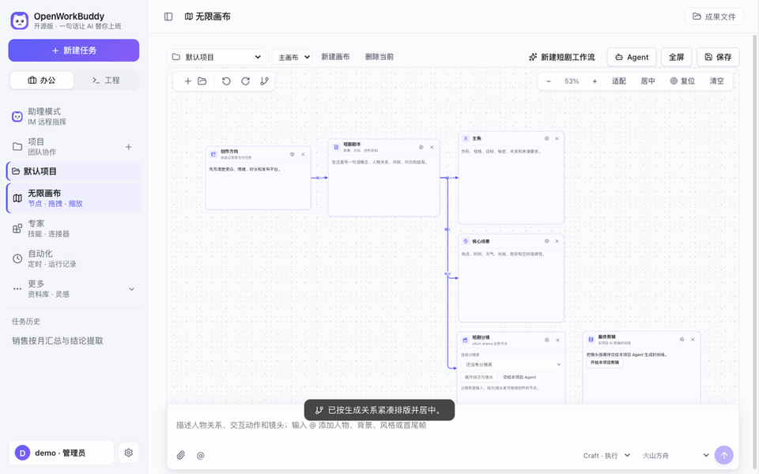
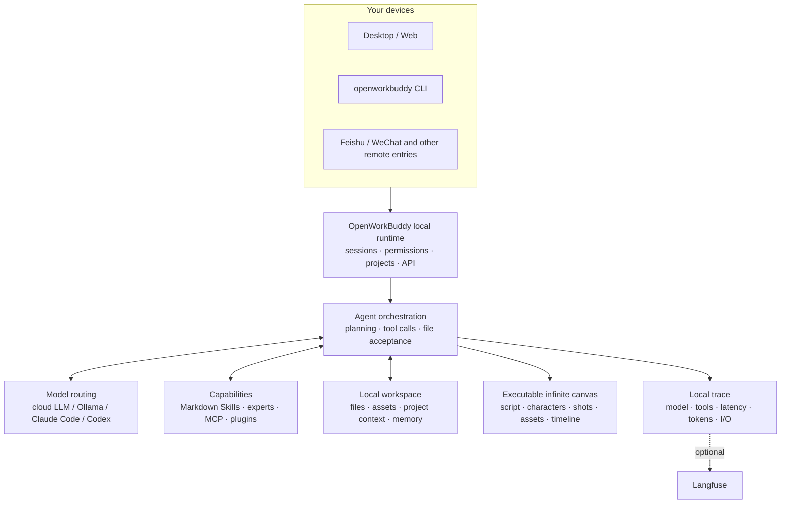

<p align="center">
  
</p>

<h1 align="center">OpenWorkBuddy</h1>

<p align="center">
  <b>An AI office assistant that runs on your own machine.</b><br>
  Ask for something once; it plans, does the work, checks it, and leaves a real<br>
  PPT / Word / Excel / web page on your disk — <b>a file you can open, not a chat log.</b>
</p>

<p align="center">
  <sub><a href="README.md"><b>中文</b></a> · English</sub>
</p>

<p align="center">
  <a href="https://github.com/CatCatUncle/openworkbuddy/releases"><b>⬇&nbsp;Download</b></a>
  &nbsp;·&nbsp; <a href="#run-it-in-three-minutes">Run it in three minutes</a>
  &nbsp;·&nbsp; <a href="docs/功能清单.md">Feature list (zh)</a>
  &nbsp;·&nbsp; <a href="#docs">Docs</a>
  &nbsp;·&nbsp; <a href="README.md#交流群">Feishu group</a>
  &nbsp;·&nbsp; <a href="CHANGELOG.en.md">Changelog</a>
</p>

<p align="center">
  <a href="https://github.com/CatCatUncle/openworkbuddy/stargazers"></a>
  <a href="LICENSE"></a>
  <a href="docs/功能清单.md"></a>
  <a href="docs/功能清单.md"></a>
  <a href="docs/功能清单.md"></a>
  <a href="docs/功能清单.md"></a>
</p>

<p align="center">
  <sub>Free for personal, learning and non-profit use. Commercial use needs a license — <a href="#license">one sentence below ↓</a></sub>
</p>

<p align="center">
  
</p>

---

## You say it, it hands you the file

<p align="center">
  
</p>

| You say | You get |
|---|---|
| "Build a Q3 review deck from this spreadsheet" | reads → computes → a `.pptx` you can present |
| "Research AI companion apps in China, write a report" | searches → reads each page → Markdown / Word |
| "Turn this material into a page I can read on my phone" | writes HTML → serves it locally → scan the QR |
| "Every day at 9, collect industry news and send it to me on Feishu" | cron + IM push; missed runs catch up |

> [!NOTE]
> Also: parallel tasks, goal-based acceptance, 👍👎 feedback that feeds self-evolution, two-layer memory, permission tiers, remote control over Feishu / WeChat, a desktop pet… Full list (Chinese): **[功能清单](docs/功能清单.md)**.

## Why this one

<table>
<tr>
<td width="50%" valign="top">

<b>📄 The files are real.</b>

Decks, documents, spreadsheets and pages are actually generated — open them from the output panel and check. Claim a file was written when it isn't on disk and the run gets stopped and redone.

</td>
<td width="50%" valign="top">

<b>🔌 Swap models freely; everything stays yours.</b>

DeepSeek / Qwen / GLM / Kimi / OpenRouter / Ollama switch with one click. Already have <b>Claude Code or Codex</b> on this machine? Use it as the engine — no second token bill. Sessions, files and keys never leave your disk; it listens on <code>127.0.0.1</code> by default.

</td>
</tr>
<tr>
<td width="50%" valign="top">

<b>🧩 Adding a capability = dropping one Markdown file.</b>

Save it as <code>skills/&lt;name&gt;/skill.md</code> and it's live on the next task — no code, no restart, no build.

</td>
<td width="50%" valign="top">

<b>🔍 It's also a readable agent.</b>

Model routing, tool calls, file acceptance, memory, permissions and local traces all live in one repo: for any real task you can see why it did what it did, which model it used, how long each step took, and what it finally handed over.

</td>
</tr>
</table>

## What it looks like

**"Same person, four different scenes, holding a hand-written sign — make it look like a snapshot, not an AI render."**

<p align="center">
  
</p>

The hard part isn't drawing a person — it's keeping **the same** person across all four and the Chinese on the sign legible. So it generates one, then actually looks at what it just made (a real vision call on its own output, not a claim from memory), confirms the light and skin came out right, and fans the rest out from there.

**"Build me a Hunan travel guide site — all 14 prefectures, no skipping."**

<p align="center">
  <a href="https://hunan-travel.pages.dev/"></a>
</p>

That's two screens — the landing and the province index. Below them sit 14 city cards, each with ticket prices, opening hours, how long to budget, what to eat and which trap to skip, plus three ready-made 3 / 5 / 7-day routes.

**<https://hunan-travel.pages.dev/>** — it's live, go click around. One HTML file plus a folder of images: layout, motion and palette all live in that one file, no external CDN. Drop it on any static host and it's a site. Not a mockup — the thing it actually handed over.

How it pulled those off → **[三个案例，拆开讲](docs/案例.md)** (Chinese, but the screenshots speak for themselves)

## AI short-drama infinite canvas

Script, characters, scenes, shots, reference images, video, voice and the edit timeline all sit on one canvas. The wires aren't decoration — they are what the next generation actually reads for character, first frame and sound. Change one shot and only that shot re-runs.

<p align="center">
  
</p>

Open "Infinite canvas" in the left sidebar. Drag empty space to pan, `Shift`+drag to marquee-select, and `@` any node or asset from the chat box at the bottom.

## Run it in three minutes

All three routes are the full product; none of them is a cut-down edition:

| 🖥️ On your own machine | 🐳 On a server for your team | 🏢 Rolling it out at a company |
|---|---|---|
| Download, double-click, five-step wizard. Data stays local. | One VPS + Docker, one command, HTTPS included. | You also need SSO, audit export, air-gapped install, SLA. |
| [Download ↓](https://github.com/CatCatUncle/openworkbuddy/releases) | [Deploy guide →](docs/部署.md) | [Commercial license →](COMMERCIAL-LICENSE.md) |

<details>
<summary><b>Which file to download · what to do when your OS blocks the first launch</b></summary>

<br>

| OS | File |
|---|---|
| macOS · Apple Silicon | `OpenWorkBuddy-*-mac-arm64.dmg` |
| macOS · Intel | `OpenWorkBuddy-*-mac-x64.dmg` |
| Windows 10/11 (one installer for x64 and ARM64) | `OpenWorkBuddy-*-win-setup.exe` |
| Windows portable (**only if you cannot install software** — every launch unpacks the whole app into `%TEMP%`, so the first start can take minutes) | `OpenWorkBuddy-*-win-x64-portable.exe` |

**Your OS will block the first launch**: the build has no code-signing certificate (Apple charges $99/year, Windows a few thousand — this is a free open-source project). It is not malware.

- **Windows**: in the SmartScreen dialog click the small grey "More info" → "Run anyway".
- **macOS**: move the app to `/Applications`, then run `xattr -dr com.apple.quarantine /Applications/OpenWorkBuddy.app`, or System Settings → Privacy & Security → "Open Anyway" (right-click → Open only works on macOS 14 and earlier).
- Your data lives in `~/OpenWorkBuddy` and survives uninstall. Moving machines → [数据同步与搬家](docs/数据同步与搬家.md) (Chinese).
- Double-clicked and nothing happened? The boot log is at `~/OpenWorkBuddy/logs/boot.log` — walk through [安装与启动](docs/安装与启动.md#双击了没反应) (Chinese).

</details>

**From source** (Node.js 18+, no build step, no framework — edit, refresh, done):

```bash
git clone https://github.com/CatCatUncle/openworkbuddy.git
cd openworkbuddy && npm install
npm run app     # desktop app; or `npm start` and open http://localhost:3800
```

> [!TIP]
> Then type something like "make a slide deck introducing OpenWorkBuddy".
> Appearance is yours: avatar menu → **Appearance** for language (中文 / English), theme, six skins, font size and family. In English the assistant answers in English and writes its files in English too.

Mirrors, one-line install script, port conflicts → [安装与启动](docs/安装与启动.md) (Chinese).

## Put it on a server for your team

One command on a clean VPS that already has Docker:

```bash
git clone https://github.com/CatCatUncle/openworkbuddy.git && cd openworkbuddy
bash deploy.sh --domain buddy.example.com   # automatic HTTPS, reachable from outside
```

It **waits for the health check to actually pass** before claiming success; if it won't start you get the logs, not a happy message. All data sits in `./openworkbuddy-data` — delete the container freely, keep that directory.

> [!IMPORTANT]
> **Register the admin account first thing.** The first account to register becomes the admin, and self-registration closes right after. An empty instance on a public IP means whoever gets there first is your admin.

**Multi-tenant + admin console**: one process serves several companies. Output files, sessions, accounts, seats, usage ledgers and audit logs are invisible across tenants. Avatar menu → **Admin console**.

**Onboarding and offboarding in one action.** New hires are created from a department template (role, monthly credits). When someone leaves, one click closes five doors at once: paired phones/tablets, **their scheduled jobs** (disabling an account does nothing to these — the scheduler doesn't go through the login gate, so their "email last month's receivables to the boss every Monday 8am" keeps running on the company's credits), invite codes they issued that haven't been used up, the 2FA bound to their phone, and tasks still running. **Revoke access, keep the data** — their tasks, spend, and output files stay exactly as they were, and you get a receipt you can paste straight into the handover doc.

**Logging and alerting are built in.** One metrics snapshot per minute (tasks, failure rate, p95 duration, token spend, free disk, per-channel failure streaks); breach a threshold and it pushes to WeCom / DingTalk. Structured logs are browsable by day, level and keyword in the console. To scrape it with your existing monitoring, hit `/api/ops/metrics.prom` — **that endpoint is behind the platform-owner check like every other one**, not open (this also ships as a desktop app; an extra unauthenticated port would be a world-readable hole on a user's own machine).

Reverse proxy, upgrades, migration, security checklist → [deploy/README.md](deploy/README.md) (Chinese)

## Models

**Settings → Models**: pick a provider preset (OpenAI / Anthropic / OpenRouter / Volcano Ark / Bailian / DeepSeek / GLM / Kimi / Ollama), the base URL and protocol are filled in, paste a key, save — hot reload, no restart. Reasoning models can have thinking turned off or dialed down from the UI. Per-provider table → [配置模型](docs/配置模型.md) (Chinese).

> [!IMPORTANT]
> `config.json` is the only file holding API keys and is already in `.gitignore`. Don't commit it.

**A mispasted key is caught on save.** Copying a key out of a web page or a chat usually drags a stray space, newline or full-width quote along with it — it tells you which character is wrong the moment you save, instead of handing you an unreadable 401 later.

**Image / speech / video models** have their own table. Video is one branch per vendor across five protocols (Tongyi Wanxiang · Volcano Ark Seedance · GLM CogVideoX · MiniMax Hailuo · SiliconFlow): submit paths, parameter names and polling agree on nothing, so if it cannot tell which vendor it is, **it does not send the request** — video bills per clip and a wasted call takes minutes to fail.

## Command line

`openworkbuddy` shares **one** set of config, skills, memory, connectors and sessions with the desktop app — a run you start in the terminal shows up on your phone and takes interjections; start something on the desktop and `openworkbuddy resume` picks it up mid-thread.

```bash
npm link      # once: install openworkbuddy globally (or just run `node cli.js …`)
```

### Three ways to use it

```bash
openworkbuddy "write this week's status report"       # ① one-shot: runs, exits, clean context each time
openworkbuddy                                         # ② interactive: type / for the command menu
cat error.log | openworkbuddy "what's going wrong"    # ③ pipe: stdin becomes attached material
```

One-shot and pipe mode **never ask you anything** — they decide and keep going, so scripts and cron never hang. Interactive mode does ask at real forks ("Word or PDF?"), spelling out what each choice means.

### Subcommands

| Command | What it does |
| --- | --- |
| `openworkbuddy sessions [n]` | List the last n sessions (desktop ones included) |
| `openworkbuddy resume [id] ["keep going…"]` | Resume a session; with no id, **the most recently touched one**, desktop or terminal |
| `openworkbuddy engines` / `openworkbuddy engines use <id>` | See what this machine can run as the engine, or switch to it |
| `openworkbuddy doctor` | Run this first when nothing works: Node / deps / port / config / engine |
| `openworkbuddy pair` | Connect a phone or second machine: scan a QR, no password typed across |
| `openworkbuddy completion <shell>` | Generate Tab completion (bash / zsh / fish) |

### Options

| Option | What it does |
| --- | --- |
| `--mode craft\|goal\|plan\|ask` | Execution mode (default `craft`) |
| `--perm plan\|ask\|auto\|full` | How much it may do **this run only** — never writes to the config file |
| `-C, --workspace <dir>` | Work in this directory for this run only |
| `-f, --file <path>` | Attach a file/image; repeat for more |
| `-c, --continue` | Resume the last CLI session |
| `--session <id>` | Resume a specific session |
| `--list [n]` | List the last n CLI sessions (default 10) |
| `--json` | Emit events as NDJSON on stdout, for scripts |
| `-q, --quiet` | Final answer only, no progress (use this when redirecting to a file) |
| `--raw` | Print the answer as plain Markdown, unrendered |
| `--no-mcp` | Skip MCP connectors, start faster |
| `--ask-remote` | Let it ask even with nobody at the terminal — answer from your phone |
| `-V, --version` / `-h, --help` | Version / help |
| `--` | Everything after this is task text (for tasks starting with a dash) |

### Slash commands in interactive mode

Type `/` for the menu, Tab to complete. A typo is caught rather than silently sent to the model:

`/help` `/mode` `/perm` `/model` `/new` `/session` `/status` `/cd` `/files` `/open` `/paste` `/drop` `/clear` `/exit`

Worth calling out: `/model` switches who does this run (a local engine or any model you configured), `/paste` pulls a **screenshot** or a wall of text straight off the clipboard, `/open` opens a deliverable in its native app (SVG, Excel, video — things a terminal can't show). You can also drag files into the window, or type `@` for path completion.

### Exit codes mean something

```bash
openworkbuddy -q "write the weekly report" > report.md                  # just the report, no progress lines
openworkbuddy -q "check src/ for null-deref risks" && git commit        # won't proceed when it fails
openworkbuddy --json "sort these logs" | jq -j 'select(.type=="text") | .delta'
```

`0` success, `1` the task failed, `2` bad arguments, `130` Ctrl+C. `openworkbuddy doctor && npm start` will actually stop a misconfigured box.

Full reference → [CLI usage](docs/命令行用法.md)

## How it's put together



The diagram doubles as a reading order: start at `server.js`, then see how `agent.js` orchestrates models and tools.

## What's new

- **Sep 17** A finished task asks before it leaves a mess behind: the hundreds of extracted frames, the separated audio stems, the build output - clear them out? The cut and the report are never touched. The "Give me the work" home screen carries the same entry with the figure you would get back written on it, plus a per-task breakdown of where the space actually went and a way to tidy just one of them. Delete means delete - nothing is moved to a trash folder to go on occupying the disk
- **Sep 17** The library no longer hands you a screen of rows that answer "this file no longer exists" when you click them: files the upgrade swept into the dated archive folder are followed to their new path and open properly, while the hundreds of intermediate frames a task cleaned up after itself stay hidden by default — a line underneath says how many, and one click brings them back
- **Sep 17** Every API the company buys now goes through one door: the real keys are entered once in the admin page, what goes out is a virtual key, and the wire protocol is plain OpenAI — nobody's code changes, only the `base_url`. Chat, embeddings, images, video, speech, transcription and web search all pass the same gate, and each key has its own capability switches: an image-only key that calls speech gets a 401
- **Sep 17** The relay bills the way each vendor actually sells, and the quota is a gate rather than a report: images per picture, video per second, speech per thousand characters, transcription per minute — over the cap is a 402 on the spot, not a surprise on next month's invoice. Three levels of cap (organisation / department / single key), and **what your staff run from the UI comes out of that same budget**
- **Sep 17** Open a `.mjs` or `.py` in the workspace and it reads as code now: line numbers, five-colour highlighting, and no wrapping. Minified bundler output — one line of fifty thousand characters — is laid out for you by default, with "show original" one click away
- **Sep 17** Skills get screened before they're installed: `curl | bash`, reading `id_rsa` and their kind are blocked outright; outbound hosts and dependency installs show you the actual lines and ask again. It reads combinations, not keywords, so "never use `curl | bash`" is not treated as an attack — and what it misses is written down too
- **Sep 17** If [toolward](https://github.com/CatCatUncle/toolward) is installed on the machine, installing a skill or saving a connector picks up a second ruler for free: both sets of findings merge into one list, and merging only ever tightens. It is never a dependency and never `npx`-ed for you, a missing or crashed binary counts as "it never ran", and connector keys and tokens stay home — only variable names are handed over, with every value replaced by `***`
- **Sep 17** The film can carry a music bed: drop an "Audio" node on the canvas, set its purpose to "BGM", and compose gains a checkbox. The music ducks while someone speaks, and the dialogue doesn't lose a dB
- **Sep 17** The licence question, settled: the copy you install has every feature — a commercial licence buys the right to make money with it, not an unlock. Deployment configs, CI, scripts and the eval set are MIT, take them
- **Sep 17** The terminal asks you questions too now — "Word or PDF?"; `openworkbuddy -f` attaches files and images, and typing `/` drops down the command menu
- **Sep 17** Video generation speaks five protocols (Tongyi Wanxiang / Seedance / CogVideoX / Hailuo / SiliconFlow) — and refuses to send when it cannot tell which one, because per-clip billing makes a wasted call expensive
- **Sep 17** Paste a key with a stray space or a full-width comma in it and it names the offending character on save, instead of a 401 later
- **Sep 17** The home screen's scenes are regrouped by what you get back; the infinite canvas moved up the sidebar; `[report](report.md)` links in an answer now open the file
- **Sep 17** Moving to a new machine: back up on the old one, import and restore on the new one — sessions, memory, accounts and the skills you wrote yourself all travel
- **Sep 17** Say something while a task is running and you choose: cut in, or queue it until the task finishes (and a queued line can be taken back)
- **Sep 14** An AI short-drama infinite canvas: script, characters, shots, assets and the cut, all on one canvas
- **Sep 13** It can shoot video: shot list → you approve → character stills → first frame → video → voice → subtitled cut. Change one shot, only that shot costs again

Older entries → **[Changelog](CHANGELOG.en.md)**.

## ⚠️ This agent has a shell

> [!WARNING]
> It runs commands, reads and writes files and reaches the network — so the gates are real: command approval, a file blacklist, a URL allowlist, audit logs and four permission tiers.
> **Read [安全](docs/安全.md) (Chinese) before exposing it to the internet**; the defaults are tuned for local use only.

### Skills get screened before they're installed

A "skill" is a directory with a `skill.md` in it, and that file is **instructions written for the agent**. So installing one really means **wiring a stranger's instructions into something that can run commands on your machine**. That is not the same as `npm install`: an npm package only runs once you `require` it, whereas a skill is something the agent reads and follows on its own. There is no second gate after the install.

So installing from GitHub — or pasting a skill into the editor — first runs a static pass (34 rules) and then **shows you what it saw**:

```
Skill "xxx" — 3 things you should look at (not proof of anything; these are the
parts only you can judge):
  · references/setup.md:62  Pipes a download straight into a shell. What you
                            reviewed and what actually runs need not be the same file.
      powershell -ExecutionPolicy Bypass -c "irm https://astral.sh/uv/install.ps1 | iex"
  Hosts it will contact: astral.sh, github.com
```

The choices behind it, including what each one costs:

- **No score, three outcomes.** A 0–100 score teaches people that "42 is probably fine". There is only: install, look-then-install, and not-by-default.
- **Only 10 rules actually block** (reverse shells, `curl | bash`, reading SSH private keys, wiping disks, fork bombs, clearing shell history, Unicode bidi characters disguising a filename…). The other 24 are laid out for you to read. **A block can be overridden by the platform owner**, and that override is written to the system log and to `.install.json` in the skill's directory — who, when, from which repo and commit, and which finding they waved through. Without that escape hatch people route around the tool entirely: copying a directory into `skills/` is something nothing can stop.
- **Combinations, not keywords.** `curl` is fine. `printenv` is fine. Reading a secret *and* sending it out from the same file is the complete shape of exfiltration.
- **A hit inside frontmatter is escalated one level**, because that `description` line goes into the system prompt of **every** task whether or not the skill is used. An injection in the body waits to be loaded; one in the frontmatter is always on.
- **Skills are one directory for the whole machine**, so installing, editing and deleting are platform-owner only. Before this gate, any newly registered colleague could hand every user's agent a set of instructions.

**What it does and does not do:** the job is *say what's in it before you install it*, not antivirus. On a public labelled corpus, static rules alone detect about three quarters of real malicious skills (74.9% detected, 60.1% correctly told not to install) — **roughly one in four gets through**. In the other direction, measured against the 34 real skills shipped in this repo, 2 were blocked (5.9%), and both are genuine rule matches rather than rule bugs: one document really does contain `irm … | iex`, and the other is a news-aggregation skill whose cached article *describes* this attack. The same sentence is an attack in instructions and a news story in cached data, and a regex cannot tell them apart. That ceiling is exactly why the override has to exist.

**Want a second ruler? If it's on the machine, it gets used.** [toolward](https://github.com/CatCatUncle/toolward) is another project by the same author, built for exactly this job: 37 rules in six families (prompt injection and tool poisoning, supply chain, secrets, execution and permissions, network and exfiltration, governance). If it's installed, every skill install and every saved connector gets a second pass, both sets of findings land in one list with the source labelled on each line, and merging **only ever tightens**: what it blocks is blocked, what it doesn't mention keeps the original verdict — bolting it on can never turn a block into a pass. **It is not a dependency, and it will never `npx` one for you**: `npm i -g toolward` is yours to run, and not installed, crashed or timed out all mean "it never ran", with the install flow byte-for-byte unchanged. Not auto-fetching is the point rather than laziness — pulling an unaudited version on the fly while auditing the supply chain is precisely what its own TW2xx family flags. Like this project it is PolyForm Noncommercial 1.0.0: free for personal, teaching, academic, charity and government use, **a company needs a separate licence** (see the LICENSE in the toolward repo), which is why we cannot put it into your `package.json` for you. On the connector side it only advises, never blocks — and **the keys and tokens you typed stay on your machine**: only variable names are handed over, every value is replaced with `***`, and addresses are cut back to their path with everything after the `?` dropped.

And the one that matters more than every rule above: **read the `skill.md` yourself before installing.** It's Markdown, not a binary.

## Contributing

- **Something broke? [Open an issue](https://github.com/CatCatUncle/openworkbuddy/issues/new)**, even if it's one line of error text. Scrub your API keys first.
- **10 minutes** — write a skill: one Markdown file at `skills/<name>/skill.md`, live on save. [Template](CONTRIBUTING.md#提交一个技能3-分钟)
- **One evening** — pick an issue: `npm install && npm start` runs it, `npm test` goes green without any API key

Project layout, tests and PR conventions are in [CONTRIBUTING.md](CONTRIBUTING.md). No need to open an issue first — send the PR.

## Docs

Most docs are in Chinese; the code and comments are the source of truth.

| Doc | What's in it | Doc | What's in it |
|---|---|---|---|
| [功能清单](docs/功能清单.md) | Every capability, skill and tool | [部署](docs/部署.md) | Server / Docker / reverse proxy |
| [案例](docs/案例.md) | How the pictures above were made | [多人协作](docs/多人协作.md) | Multi-tenant, accounts, quotas |
| [安装与启动](docs/安装与启动.md) | Installers, source, common snags | [安全](docs/安全.md) | Approval gates, allowlists, audit |
| [配置模型](docs/配置模型.md) | base_url / model names per provider | [数据同步与搬家](docs/数据同步与搬家.md) | Where data lives, moving machines |
| [命令行用法](docs/命令行用法.md) | CLI flags, pipes, `--json`, cron | [开源与商业版边界](docs/开源与商业版边界.md) | What a licence actually buys |
| [扩展](docs/扩展.md) | Skills, MCP, plugins, experts | [路线图](docs/路线图.md) | What's next, what counts as done |
| [IM与定时任务](docs/IM与定时任务.md) | Feishu / QQ / WeCom / WeChat / DingTalk | [实现细节](docs/实现细节.md) | How the agent loop actually runs |
| [安全基线](docs/安全基线.md) | Where data lands, who can read it, what isn't covered | [远程访问](docs/远程访问.md) | Reaching your machine from outside; both switches off by default |

## Also by the same author

- **[toolward](https://github.com/CatCatUncle/toolward)** — a static safety check for agent skills and MCP connectors: 37 rules in six families (prompt injection and tool poisoning, supply chain, secrets, execution and permissions, network and exfiltration, governance), zero runtime dependencies, Node 20.10+. Run `npm i -g toolward` and OpenWorkBuddy picks it up as a second ruler automatically (the skill-screening section above explains how the two verdicts are merged); skip it and nothing changes. Like this project it is PolyForm Noncommercial: free for personal, teaching, academic, charity and government use, a company needs a separate licence.

## License

In one sentence: **personal, learning and non-profit use is free; making money with it (including internal productivity at a company) needs a commercial license from the author.**
The license is [PolyForm Noncommercial 1.0.0](LICENSE); what counts as commercial and how to get one: [COMMERCIAL-LICENSE.md](COMMERCIAL-LICENSE.md).

**A commercial license unlocks nothing.** There is one codebase — this repo — and what you see is all of it: the agent loop, 40+ tools, the short-drama canvas, IM remote control, execution traces, memory and self-evolution, multi-tenancy and the admin console included. No feature flags, no trial countdown, no greyed-out "available in the commercial edition" buttons. What you buy is three other things: **a licence to make money with it, the door to trademark and white-labelling, and a person who picks up the phone.** Where the line runs → [开源与商业版边界](docs/开源与商业版边界.md).

**Part of it isn't even restricted to non-commercial use.** Deployment configs, CI workflows, helper scripts, the evaluation task set, the skill template and the code samples in the docs are additionally MIT-licensed — take them → [LICENSE-ECOSYSTEM.md](LICENSE-ECOSYSTEM.md). And **skills, plugins and connector configs you write yourself are your own work**, not derivatives of this project.

This license grants **no** rights to any third-party product, trademark, logo, brand asset or screenshot — those belong to their respective owners.

Copyright (c) 2026 开发者猫叔

## Disclaimer

**What this is.** OpenWorkBuddy (repository `CatCatUncle/openworkbuddy`) is an independent open-source project written from scratch by 开发者猫叔 (CatCatUncle); all source is public here. The architecture, tool protocol, permission model, memory and self-evolution are original work; external projects that were studied are listed one by one in [NOTICE.md](NOTICE.md), section 4.

**Where the name comes from.** `Work` + `Buddy` are two ordinary English words (office + companion) and `Open-` is the usual open-source prefix. Together they plainly describe what the project does: an open-source work buddy.

**Relationship to third parties: none.** This project has no affiliation with, authorization from, sponsorship by or endorsement from Tencent or its WorkBuddy product, and contains none of its code, assets, UI resources or non-public information. If "WorkBuddy" is someone's registered trademark, the rights are theirs; third-party names appear in these docs only to describe compatibility or draw a factual distinction (nominative use). Integrations with Feishu, WeCom, QQ and others use each platform's **publicly published** open APIs only; no reverse engineering is involved.

**If you hold a right and think something here is wrong**, contact me through [Issues](https://github.com/CatCatUncle/openworkbuddy/issues) or the address in [COMMERCIAL-LICENSE.md](COMMERCIAL-LICENSE.md). I'll verify and fix it quickly — faster than any other route.

## Support this project

<p align="center">
  <a href="https://github.com/CatCatUncle/openworkbuddy">
    
  </a>
</p>

<p align="center">
  <a href="https://github.com/CatCatUncle/openworkbuddy"></a>
</p>

<p align="center">
  <sub>And pass it to one person who still hand-builds decks, weekly reports and meeting notes — worth more than a hundred impressions.</sub>
</p>

## Contributors

<p align="center">
<a href="https://github.com/CatCatUncle/openworkbuddy/graphs/contributors">
  
</a>
</p>

## Star history

<p align="center">
<a href="https://star-history.com/#CatCatUncle/openworkbuddy&Date">
  <picture>
    <source media="(prefers-color-scheme: dark)" srcset="https://api.star-history.com/svg?repos=CatCatUncle/openworkbuddy&type=Date&theme=dark">
    
  </picture>
</a>
</p>
