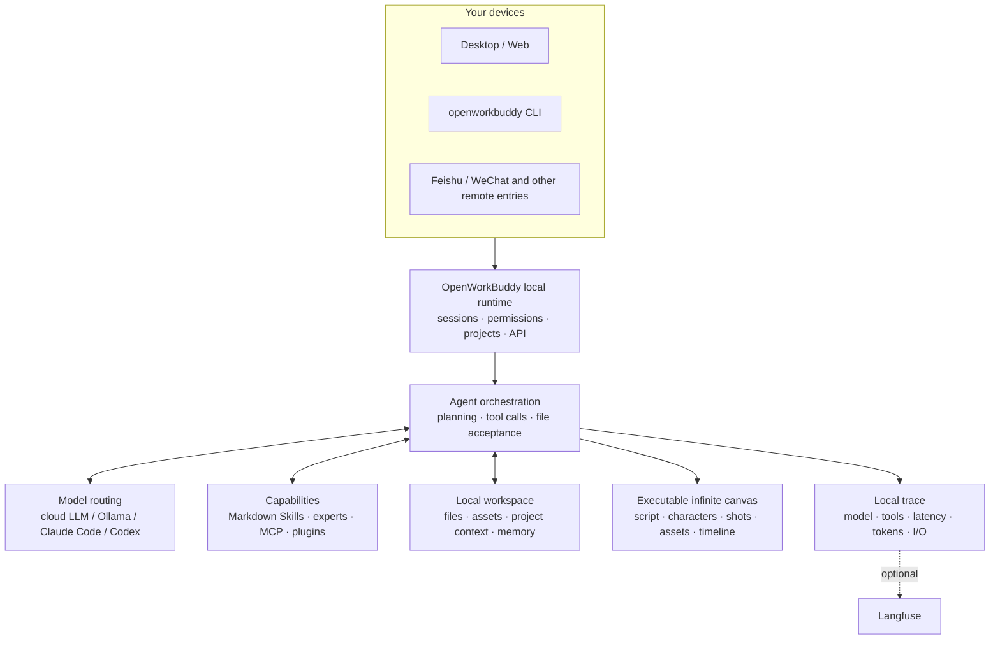

<p align="center">
 
</p>

<h1 align="center">OpenWorkBuddy</h1>

<p align="center">
 <b>An AI office assistant that runs on your own machine.</b><br>
 Ask for something once; it plans, does the work, checks it, and leaves a real<br>
 PPT / Word / Excel / web page on your disk — <b>a file you can open, not a chat log.</b>
</p>

<p align="center">
 <sub><a href="README.md"><b>中文</b></a> · English</sub>
</p>

<p align="center">
 <a href="#run-it-in-three-minutes"><b>▶&nbsp;Run it in three minutes</b></a>
 &nbsp;·&nbsp; <a href="https://github.com/CatCatUncle/openworkbuddy/releases">Download</a>
 &nbsp;·&nbsp; <a href="docs/功能清单.md">Feature list (zh)</a>
 &nbsp;·&nbsp; <a href="#docs">Docs</a>
 &nbsp;·&nbsp; <a href="README.md#交流群">Feishu group</a>
 &nbsp;·&nbsp; <a href="CHANGELOG.en.md">Changelog</a>
</p>

<p align="center">
 <a href="https://github.com/CatCatUncle/openworkbuddy/stargazers"></a>
 <a href="LICENSE"></a>
 <a href="docs/功能清单.md"></a>
 <a href="docs/功能清单.md"></a>
 <a href="docs/功能清单.md"></a>
 <a href="docs/功能清单.md"></a>
</p>

<p align="center">
 <sub>Free for personal, learning and non-profit use. Commercial use needs a license — <a href="#license">one sentence below ↓</a></sub>
</p>

<p align="center">
 
</p>

---

## You say it, it hands you the file

| You say | You get |
|---|---|
| "Build a Q3 review deck from this spreadsheet" | reads → computes → a `.pptx` you can present |
| "Research AI companion apps in China, write a report" | searches → reads each page → Markdown / Word |
| "Turn this material into a page I can read on my phone" | writes HTML → serves it locally → scan the QR |
| "Every day at 9, collect industry news and send it to me on Feishu" | cron + IM push; missed runs catch up |

<p align="center">
 
</p>

> [!NOTE]
> Also: parallel tasks, goal-based acceptance, 👍👎 feedback that feeds self-evolution, two-layer memory, permission tiers, remote control over Feishu / WeChat, a desktop pet… Full list (Chinese): **[功能清单](docs/功能清单.md)**.

## Why this one

<table>
<tr>
<td width="50%" valign="top">

<b>📄 The files are real.</b>

Decks, documents, spreadsheets and pages are actually generated — open them from the output panel and check. Claim a file was written when it isn't on disk and the run gets stopped and redone.

</td>
<td width="50%" valign="top">

<b>🔌 Swap models freely; everything stays yours.</b>

DeepSeek / Qwen / GLM / Kimi / OpenRouter / Ollama switch with one click. Already have <b>Claude Code or Codex</b> on this machine? Use it as the engine — no second token bill. Sessions, files and keys never leave your disk; it listens on <code>127.0.0.1</code> by default.

</td>
</tr>
<tr>
<td width="50%" valign="top">

<b>🧩 Adding a capability = dropping one Markdown file.</b>

Save it as <code>skills/&lt;name&gt;/skill.md</code> and it's live on the next task — no code, no restart, no build.

</td>
<td width="50%" valign="top">

<b>🔍 It's also a readable agent.</b>

Model routing, tool calls, file acceptance, memory, permissions and local traces all live in one repo: for any real task you can see why it did what it did, which model it used, and what it finally handed over.

</td>
</tr>
</table>

## Run it in three minutes

All three routes are the full product; none of them is a cut-down edition.

**macOS, one line** (downloads, installs into `/Applications`, strips the quarantine flag, opens it):

```bash
curl -fsSL https://raw.githubusercontent.com/CatCatUncle/openworkbuddy/main/install-mac.sh | bash
```

> ⚠️ **If you download the dmg by hand, the first launch will be blocked**: *"OpenWorkBuddy" Not Opened — Apple could not verify …*, with only **Done** and **Move to Trash** on the dialog.
> That is Apple's blanket block on apps without a paid certificate, not a verdict about this build — the certificate is being applied for, and this step disappears once it comes through.
> **Click Done → System Settings → Privacy & Security → scroll to the bottom → Open Anyway → enter your login password.** Once, and never again.
> The `curl` line above has no dialog at all. Full three-route walkthrough below, under "Your OS blocks the first launch".

**Windows / manual download**: grab `-win-setup.exe` from [Releases](https://github.com/CatCatUncle/openworkbuddy/releases) (one installer for x64 and ARM64) and double-click; on a locked-down work machine take the portable build, `-win-x64-portable.exe` (`arm64` on ARM).

**From source** (Node.js 18+, no build step, no framework — edit, refresh, done):

```bash
git clone https://github.com/CatCatUncle/openworkbuddy.git
cd openworkbuddy && npm install
npm run app # desktop app; or `npm start` and open http://localhost:3800
```

Paste a model API key on first launch, then type something like "make a slide deck introducing OpenWorkBuddy".
Everything you own lives in `~/OpenWorkBuddy` — config, sessions, output files, skills. **Uninstalling doesn't delete it**; moving machines is a folder copy.

Text too small, or want a different skin? Avatar menu, top right → **Appearance**: four text sizes, five themes and UI density all live on that page.

<details open>
<summary><b>Your OS blocks the first launch · double-clicked and nothing happened</b></summary>

<br>

The code-signing certificate is still being applied for (Apple charges $99/year, Windows a few thousand), so today's builds are ad-hoc signed. What the OS blocks is *"I have never seen this developer"* — **not** *"this file is malware"*. The signature inside the build is intact; `codesign --verify --deep --strict` confirms it.

**macOS — pick one of three**

1. **Without touching a terminal (recommended)**: double-click → click **Done** on the dialog (*not* Move to Trash) → open **System Settings → Privacy & Security** → scroll all the way down to the **Security** section, where it says *"OpenWorkBuddy" was blocked to protect your Mac* → click **Open Anyway** → enter your login password → confirm with **Open**. Once, and never again.
2. **One command**: **first drag the .app out of the dmg into Applications** (the dmg is a read-only volume, so running this inside it fails), then
   ```bash
   xattr -dr com.apple.quarantine /Applications/OpenWorkBuddy.app
   ```
3. **No dialog at all**: use the `curl` line at the top. A browser-downloaded file gets tagged `com.apple.quarantine`; a curl-fetched one doesn't, so Gatekeeper never enters the picture.

> **Don't follow the old "right-click → Open" tutorials.** That route only works on macOS 14 and earlier — Apple removed it in macOS 15 (Sequoia), and the right-click dialog no longer has a second **Open** button, which is exactly why it reads as "it just won't open".
>
> If the message says **"is damaged and can't be opened"** rather than *could not be verified*, the signature really was corrupted — cloud drives, sync folders and some unzip tools all do this. Download again, or re-sign in place with `codesign --force --deep --sign - /Applications/OpenWorkBuddy.app`.

**Windows**: in the SmartScreen dialog click the small grey "More info" → "Run anyway".
- **Nothing happened**: the boot log is at `~/OpenWorkBuddy/logs/boot.log` — wherever it stops is the problem. Running from source, try `node cli.js doctor` first. Walk-through → [安装与启动](docs/安装与启动.md#双击了没反应) (Chinese)

</details>

Mirrors, port conflicts, moving the data directory → [安装与启动](docs/安装与启动.md)　|　moving machines → [数据同步与搬家](docs/数据同步与搬家.md) (Chinese)

## What it looks like

**"Same person, four different scenes, holding a hand-written sign — make it look like a snapshot, not an AI render."**

<p align="center">
 
</p>

The hard part isn't drawing a person — it's keeping the same person across all four and the Chinese on the sign legible. So it generates one, then actually looks at what it just made (a real vision call on its own output, not a claim from memory), and fans the rest out from there.

**"Build me a Hunan travel guide site — all 14 prefectures, no skipping."**

<p align="center">
 <a href="https://hunan-travel.pages.dev/"></a>
</p>

**<https://hunan-travel.pages.dev/>** — it's live, go click around. One HTML file plus a folder of images, no external CDN. Drop it on any static host and it's a site. Not a mockup — the thing it actually handed over.

**"Every morning at seven, send me today's weather and what I should watch out for, on Feishu."**

<p align="center">
 
</p>

One sentence set this up. It runs whether or not anyone is at the machine, and every run keeps its full transcript under Automation → Run history. Feishu / WeCom / DingTalk / Telegram all take the same path.

How it pulled those off → **[三个案例，拆开讲](docs/案例.md)** (Chinese, but the screenshots speak for themselves)

## AI short-drama infinite canvas

Script, characters, scenes, shots, reference images, video, voice and the edit timeline all sit on one canvas. The wires aren't decoration — they are what the next generation actually reads for character, first frame and sound. Change one shot and only that shot re-runs.

<p align="center">
 
</p>

Open "Infinite canvas" in the left sidebar. Drag empty space to pan, `Shift`+drag to marquee-select, `Shift`/`⌘`+click to add or drop nodes from the selection, and `@` any node or asset from the chat box at the bottom.

## Put it on a server for your team

One command on a clean VPS that already has Docker:

```bash
git clone https://github.com/CatCatUncle/openworkbuddy.git && cd openworkbuddy
bash deploy.sh --domain buddy.example.com # automatic HTTPS, reachable from outside
```

It **waits for the health check to actually pass** before claiming success; if it won't start you get the logs. All data sits in `./openworkbuddy-data`.

> [!IMPORTANT]
> **Register the admin account first thing.** The first account to register becomes the super admin (one per org, transferable but never issuable), and self-registration closes right after. An empty instance on a public IP means whoever gets there first owns it.

One process serves several companies, invisible to each other. Avatar menu → **Admin console**: orgs, seats, usage, security policy. New hires are created from a department template (role and monthly credits in one go); when someone leaves, one click closes five doors at once — paired devices, **their scheduled jobs** (the scheduler doesn't go through the login gate, so disabling the account alone leaves them running on the company's credits), unused invite codes, 2FA, and tasks still running. **Revoke access, keep the data**, and you get a receipt you can paste into the handover doc.

One metrics snapshot per minute, threshold breaches pushed to WeCom / DingTalk, and `/api/ops/metrics.prom` for your existing monitoring — behind the platform-owner check like every other endpoint.

Reverse proxy, upgrades, migration, security checklist → [部署](docs/部署.md)　|　[deploy/README.md](deploy/README.md)　|　[多人协作](docs/多人协作.md) (Chinese)

## Models

**Settings → Models**: pick a provider preset (OpenAI / Anthropic / OpenRouter / Volcano Ark / Bailian / DeepSeek / GLM / Kimi / Ollama), the base URL and protocol are filled in, paste a key, save — hot reload, no restart. A mispasted key is caught on save and it tells you which character is wrong, instead of handing you an unreadable 401 later. Reasoning models can have thinking turned off or dialed down from the UI.

Image / speech / video models have their own table; video spans five protocols (Tongyi Wanxiang · Volcano Ark Seedance · GLM CogVideoX · MiniMax Hailuo · SiliconFlow), and if it cannot tell which vendor it is, **it does not send the request** — video bills per clip and a wasted call takes minutes to fail.

There is also the **Jev decision model** (TypeSafe System One): it writes no prose, only yes/no, single-choice or score answers plus a confidence — which is why it is **not in the model dropdown** (it has no `/chat/completions`, so it would 400 every time). **If you already have an OpenRouter key there is nothing to fill in.**

Four ways in: the CLI (`openworkbuddy jev`), `/api/decide`, the “test” button on its provider card, and **the agent’s own `decide` tool** — up to 32 questions per round trip, and anything below the confidence threshold gets handed back to you rather than treated as settled. Four things already run on it: goal-mode acceptance (each criterion is a yes/no question, ticked only at 70%+); the **triage skill** for batch sorting (ticket routing, résumé screening, feedback categorisation) — calibrate on a dozen items, run the batch, deliver two lists: what can proceed, and what a human needs to see; and a **second opinion on green scheduled runs** — the success check stops looking once a report runs long, so an agent can spend two thousand words explaining that it failed and still get a tick. This asks one yes/no question about exactly that band, and only ever adds a note: the run stays green. And a **gate before auto-continue** — hitting the step or time limit is treated as "not finished yet", so a fresh full budget is spent on another round, even when the run only spent its last steps tidying up. One yes/no question first: is anything the user asked for still undone? A confident "no" ends it there (off by default, same settings page; never asked when PROGRESS.md still has unticked items, since that answer is already known). Roughly $0.00005 per question.

Per-provider table → [配置模型](docs/配置模型.md) (Chinese)

> [!IMPORTANT]
> `config.json` is the only file holding API keys and is already in `.gitignore`. Don't commit it.

## Command line

`openworkbuddy` shares **one** set of config, skills, memory, connectors and sessions with the desktop app — start something in the terminal and you can watch it and chime in from your phone; stop halfway on the desktop and `openworkbuddy resume` picks it up.

```bash
npm link # once: install the global command (or just run `node cli.js …`)

openworkbuddy "write my weekly report" # one-shot: runs and exits
openworkbuddy # interactive: type / for the command menu
cat error.log | openworkbuddy "what is this" # pipe: stdin becomes material
openworkbuddy -q "write my weekly report" > report.md # just the report, no progress bars
```

One-shot and pipe mode **never** ask you questions, so scripts and cron don't hang. Exit codes mean something: `0` success, `1` task failed, `2` bad arguments, `130` Ctrl+C — so `openworkbuddy doctor && npm start` stops a misconfigured machine before it starts.

`sessions` / `resume` / `engines` / `doctor` / `pair` (QR-pair your phone) / `worktree`, plus `--mode` `--perm` `-C` `-f` `--json` and the rest → **[命令行用法](docs/命令行用法.md)** (Chinese)

## How it's put together



The diagram doubles as a reading order: start at `server.js`, then see how `agent.js` orchestrates models and tools. Details → [实现细节](docs/实现细节.md) (Chinese)

## What's new

- **Sep 22** **The release page didn't say what changed in this version**: just an install guide and a compare link, so finding out meant reading twenty commits. That sentence already existed — it is this very list. The release body now opens with the entries added in that version, mined by tag range (not by date: two patches on the same day would reprint the previous version's changes), and writes nothing at all when there is nothing to mine
- **Sep 22** **A long session has to be compacted first, and for those ten-odd seconds the screen said nothing**: compaction is itself a model call, and it sits between pressing send and the first token — with nothing on screen you only see a spinner, and you are left guessing whether the model is stuck or the network is down. It now announces itself with a ticking line: "compacting the earlier 20 messages into one summary… 8s so far (this turn starts after it finishes; the originals are archived, not deleted)". There is no real progress to report and a bar crawling at a constant rate would be a lie, so it states only the two things it can state accurately: what is being compacted, and how long you have waited. **Announcing a start obliges an ending** — succeeded, failed, or an empty summary all replace the text of that same line rather than stacking a second one; a failure names the error, says nothing earlier was touched, and points at where to raise the budget
- **Sep 22** **The "vision model" slot in settings was pushing aside a main model that could already see**: the old rule had one condition — is that slot filled — and a filled slot always bypassed the main model. So a real configuration held the same model id in both places, reached through two channels: a second key, a second rate-limit budget, 429 after 429 on the dedicated one while the main model answered first try. What settings has always said is now what the code does: **the dedicated vision model is for people whose main model cannot see.** If yours can, it gets the image, and the answer says "didn't route to your `X`" — bypassing something configured by hand without saying so makes it vanish. A wrong capability tick doesn't cost you the image either: on a 400 "doesn't support images", the dedicated channel takes over
- **Sep 22** **The image you dragged in for it to look at came back out as "produced this turn"**: attachments upload before the message is sent, but on a new conversation the session id wasn't minted until you pressed send — so the upload carried `null` and the file landed one directory above the task folder. The agent couldn't find it in its own working directory, went looking and copied it in, and that copy is a file written this turn, so the **input** was faithfully recorded as output. The id is minted when the attachment goes up now
- **Sep 22** **Once you hit send, which image you just dragged in is reduced to a file name**: the thumbnails above the composer only exist before sending; the bubble kept a single paperclip chip that didn't respond to clicks. Images now render as real thumbnails above the bubble (aligned to its right edge, 220px on the long side) while files stay named chips — you recognise a picture by its picture and a file by its name. Both open the preview panel, which carries "download" and "reveal in folder". One that can't be read degrades to a grey chip with the name and the reason, never an empty grey box
- **Sep 21** **Hit "quote" and 400 characters of someone else's words landed in your input box; drop an image and a `【图片 1：xxx.png】` line landed there too**: both are protocol the model reads, yet both were being poured into the box a human types in — after quoting you had to scroll past your own quote to keep writing, and deleting one character of that image line broke the anchor. Now it works the way Feishu and ChatGPT do: a quote is pinned above the composer as a card (who said it · two lines max · × to drop it · click to jump back to the original), and selecting a passage inside a reply pops a "quote this" button right there; images become a row of 64px thumbnails above the composer, while files stay as wide named chips. The protocol is assembled at the moment you press send — the bytes the model receives are unchanged, so old sessions replay exactly as before. The bubble folds both away as well — except an anchor written mid-sentence, which is left alone: folding it would turn "put 【图片 1：a.png】 on the left" into "put on the left"
- **Sep 21** **To find out whether the Claude Code / Codex on your machine works, you had to switch to it and use it first**: the one honest control, "test connection", lived inside the expanded area, which only renders for the engine already selected. Now every installed card can be tried in place, and a successful `--version` no longer earns a green "installed" — until something actually runs, the badge just says "found 2.1.278 on this machine"
- **Sep 21** **"This turn's output" filled up with file names you'd seen somewhere else**: nothing crossed between conversations — a bundle of 122 copied files had been unpacked into one card each, squeezing the plan the task actually produced down to a single slot. The bundle now folds into one folder card, and the change list below it is untouched
- **Sep 21** **The address in the phone-pairing QR code was a guess**: the old rule took the first private IP it found, and a proxy tunnel or a Docker bridge can easily come ahead of the real interface. Interfaces are ranked now, the endpoint returns up to 3 candidates, and the screen says "doesn't open? try another address"
- **Sep 21** **One row in the shortcut table only ever popped up "not supported yet"**: ⌘D voice recording was never implemented, yet it sat among the other 18 looking exactly like them. Removed, plus a gate that catches placeholder actions, empty actions and rows with no action behind them
- **Sep 21** **Search knew three vendors — Jina, Tavily, Brave — so users in China had to tunnel out first**: eight now, domestic ones first — Bocha, Zhipu, Qiniu, then Tavily / Serper / Jina / Brave, plus a **custom** slot (POST a JSON, get an array back; your own SearXNG works). It falls through however many you configured when one is down, and only then to the keyless free channel; the bill records the vendor that actually answered, not the one picked in settings.
- **Sep 21** **A turn whose process died mid-run spins "running…" in the history forever, with nothing anywhere to stop it**: replay closes a turn when it reaches the matching answer record, so a question with no answer after it never gets an end drawn — and at that point the session is not in runningSessions, so there is no stop button on screen either. It now closes as interrupted: "Interrupted · 1 step", with the reason on the header.
- **Sep 21** **A fork you already answered asks again every time you open that conversation**: the `done` class carried two meanings at once — "not clickable any more" and "the verdict is already painted". Replay set it for the first and thereby blocked the second. Split into two marks, the same conversation replays as "You settled this fork · you chose …".

Older entries → **[Changelog](CHANGELOG.en.md)**.

## ⚠️ This agent has a shell

> [!WARNING]
> It runs commands, reads and writes files and reaches the network — so the gates are real: command approval, a file blacklist, a URL allowlist, audit logs and four permission tiers.
> **Read [安全](docs/安全.md) (Chinese) before exposing it to the internet**; the defaults are tuned for local use only.

**Skills get screened before they're installed.** A skill is a set of instructions written for an agent, handed to something that can run commands on your machine — unlike `npm install`, where a package only runs when you `require` it; a skill is read and followed on its own. So an install runs 34 static rules first and shows you what it found, in three buckets: install / look first / don't install by default (no score — a score just teaches people that "42 looks fine"). Ten of the rules actually block (reverse shells, `curl | bash`, reading SSH private keys, wiping disks, erasing traces); an admin can force past them, and that goes into `.install.json`.

**It is not antivirus.** On a public labelled set, pure static rules catch about three quarters — one in four gets through. Install [toolward](https://github.com/CatCatUncle/toolward) and it's used as a second ruler automatically, merging in a direction that only ever tightens. And the one that matters more than every rule above: **read the `skill.md` yourself before installing.** It's Markdown, not a binary.

How the call is made, and why the force-install hatch stays → [安全](docs/安全.md)　|　[安全基线](docs/安全基线.md) (Chinese)

## Contributing

- **Something broke? [Open an issue](https://github.com/CatCatUncle/openworkbuddy/issues/new)**, even if it's one line of error text. Scrub your API keys first.
- **10 minutes** — write a skill: one Markdown file at `skills/<name>/skill.md`, live on save. [Template](CONTRIBUTING.md#提交一个技能3-分钟)
- **One evening** — pick an issue: `npm install && npm start` runs it, `npm test` goes green without any API key

Project layout, tests and PR conventions are in [CONTRIBUTING.md](CONTRIBUTING.md). No need to open an issue first — send the PR.

## Docs

Most docs are in Chinese; the code and comments are the source of truth.

| Doc | What's in it | Doc | What's in it |
|---|---|---|---|
| [功能清单](docs/功能清单.md) | Every capability, skill and tool | [部署](docs/部署.md) | Server / Docker / reverse proxy |
| [案例](docs/案例.md) | How the pictures above were made | [多人协作](docs/多人协作.md) | Multi-tenant, accounts, quotas |
| [安装与启动](docs/安装与启动.md) | Installers, source, common snags | [安全](docs/安全.md) | Approval gates, allowlists, audit |
| [配置模型](docs/配置模型.md) | base_url / model names per provider | [数据同步与搬家](docs/数据同步与搬家.md) | Where data lives, moving machines |
| [命令行用法](docs/命令行用法.md) | CLI flags, pipes, `--json`, cron | [开源与商业版边界](docs/开源与商业版边界.md) | What a licence actually buys |
| [扩展](docs/扩展.md) | Skills, MCP, plugins, experts | [路线图](docs/路线图.md) | What's next, what counts as done |
| [IM与定时任务](docs/IM与定时任务.md) | Feishu / QQ / WeCom / WeChat / DingTalk | [实现细节](docs/实现细节.md) | How the agent loop actually runs |
| [安全基线](docs/安全基线.md) | Where data lands, who can read it, what isn't covered | [远程访问](docs/远程访问.md) | Reaching your machine from outside; both switches off by default |

## Also by the same author

- **[toolward](https://github.com/CatCatUncle/toolward)** — a static safety check for agent skills and MCP connectors: 37 rules in six families, zero runtime dependencies, Node 20.10+. Run `npm i -g toolward` and OpenWorkBuddy picks it up as a second ruler automatically; skip it and nothing changes. Like this project it is PolyForm Noncommercial.

## License

In one sentence: **personal, learning and non-profit use is free; making money with it (including internal productivity at a company) needs a commercial license from the author.**
The license is [PolyForm Noncommercial 1.0.0](LICENSE); what counts as commercial and how to talk about it is in [COMMERCIAL-LICENSE.md](COMMERCIAL-LICENSE.md).

**A license does not unlock features.** There is one codebase — this repo — and you are looking at all of it: the agent loop, 40+ tools, the drama canvas, IM remote control, execution traces, self-evolution and memory, multi-tenancy and the admin console included. No feature flags, no trial countdown, no greyed-out buttons. A license buys three other things: the right to make money with it, trademark and white-label room, and someone to reach → [开源与商业版边界](docs/开源与商业版边界.md) (Chinese)

**Some of it isn't even non-commercial.** Deployment configs, CI pipelines, scripts, the eval set, skill templates and sample code in the docs are additionally released under MIT → [LICENSE-ECOSYSTEM.md](LICENSE-ECOSYSTEM.md). And **skills, plugins and connector configs you write are your own work**, not derivatives of this project.

This license grants **no** rights to any third-party product, trademark, logo, brand asset or screenshot; those belong to their respective owners.

Copyright (c) 2026 开发者猫叔

## Disclaimer

**What this is.** OpenWorkBuddy (repo `CatCatUncle/openworkbuddy`) is an independent open-source project written from scratch by 开发者猫叔; all source is in this repo. Architecture, tool protocol, permission model, memory and self-evolution are original work; projects studied along the way are listed one by one in section 4 of [NOTICE.md](NOTICE.md). The name is `Work` + `Buddy` — two ordinary English words — with the `Open-` prefix common to open-source projects.

**Relationship with third parties: none.** This project is not affiliated with, authorised, sponsored or endorsed by Tencent or its WorkBuddy product, and contains none of its code, assets, UI resources or non-public information. If "WorkBuddy" is someone's registered trademark, the rights belong to its owner; third-party names appear here only to describe compatibility or draw a factual distinction (nominative use). Feishu, WeCom, QQ and the rest are integrated through their own **publicly published** open APIs; no reverse engineering is involved.

**If a rights holder thinks something here is wrong**, reach me through [Issues](https://github.com/CatCatUncle/openworkbuddy/issues) or the contact in [COMMERCIAL-LICENSE.md](COMMERCIAL-LICENSE.md) and it will be fixed once verified.

## Support this project

<p align="center">
 <a href="https://github.com/CatCatUncle/openworkbuddy">
 
 </a>
</p>

<p align="center">
 <a href="https://github.com/CatCatUncle/openworkbuddy"></a>
</p>

<p align="center">
 <sub>Pass it to one colleague who hand-builds decks, weekly reports and meeting notes — worth more than a hundred impressions.</sub>
</p>

## Contributors

Thanks to everyone who has changed something here. Want to join them: [CONTRIBUTING.md](CONTRIBUTING.md).

<p align="center">
<a href="https://github.com/CatCatUncle/openworkbuddy/graphs/contributors">
 
</a>
</p>

## Star history

<p align="center">
<a href="https://star-history.com/#CatCatUncle/openworkbuddy&Date">
 <picture>
 <source media="(prefers-color-scheme: dark)" srcset="https://api.star-history.com/svg?repos=CatCatUncle/openworkbuddy&type=Date&theme=dark">
 
 </picture>
</a>
</p>
