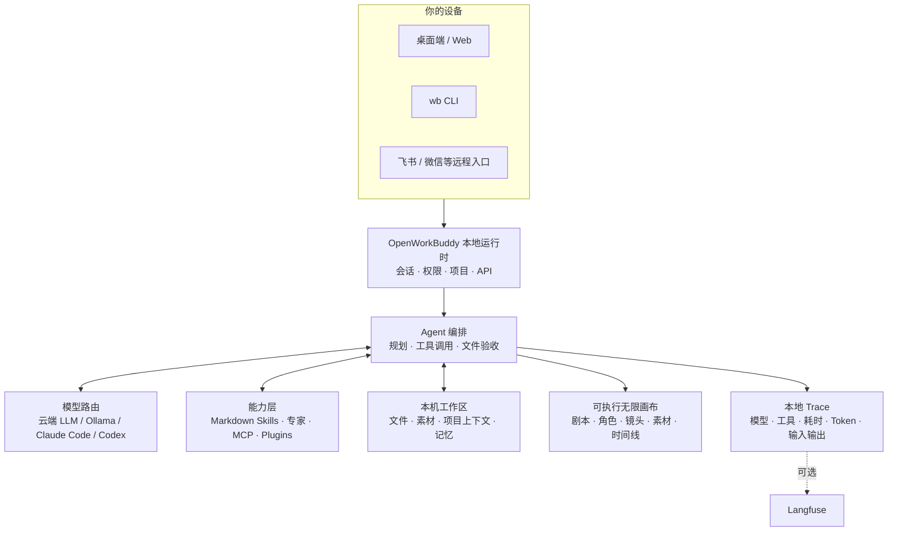

<p align="center">
  
</p>

<h1 align="center">OpenWorkBuddy</h1>

<p align="center">
  <b>跑在你自己电脑上的 AI 办公助理。</b><br>
  交代一句话，它自己规划、动手、验收，把 PPT / Word / Excel / 网页落到你硬盘上。<br>
  <b>给你的是能打开的文件，不是一段聊天记录。</b>
</p>

<p align="center">
  <sub>A local-first AI office agent that hands you files, not chat logs. · <a href="README.en.md"><b>English</b></a></sub>
</p>

<p align="center">
  <a href="https://github.com/CatCatUncle/openworkbuddy/releases"><b>⬇&nbsp;下载安装包</b></a>
  &nbsp;·&nbsp; <a href="#三分钟跑起来">三分钟跑起来</a>
  &nbsp;·&nbsp; <a href="docs/功能清单.md">功能清单</a>
  &nbsp;·&nbsp; <a href="#文档">文档</a>
  &nbsp;·&nbsp; <a href="#交流群">交流群</a>
  &nbsp;·&nbsp; <a href="CHANGELOG.md">变更记录</a>
</p>

<p align="center">
  <a href="https://github.com/CatCatUncle/openworkbuddy/stargazers"></a>
  <a href="LICENSE"></a>
  <a href="docs/功能清单.md"></a>
  <a href="docs/功能清单.md"></a>
  <a href="docs/功能清单.md"></a>
  <a href="docs/功能清单.md"></a>
</p>

<p align="center">
  <sub>自己用、学习用、非营利用 <b>免费</b>；公司里用要授权，<a href="#协议">一句话讲清 ↓</a></sub>
</p>

<p align="center">
  
</p>

---

## 你说一句，它交给你

<p align="center">
  
</p>

| 你说一句 | 它交给你 |
|---|---|
| 帮我出一份 Q3 复盘 PPT，数据用这个 Excel | 读表 → 算 → 一个能直接放的 `.pptx` |
| 调研国内 AI 陪伴产品，出一份报告 | 联网搜 → 逐个打开读 → Markdown / Word |
| 把这份材料做成手机上能看的网页 | 写 HTML → 起本机服务 → 扫码就能看（[成品](https://hunan-travel.pages.dev/)） |
| 每天 9 点抓行业新闻，做成晨报发我飞书 | 定时任务 + IM 推送，错过了会补跑 |

> [!NOTE]
> 多任务并行、目标验收、👍👎 进自进化、双层记忆、权限档位、IM 远程指挥、桌面宠物…… 全部能力见 **[功能清单](docs/功能清单.md)**。

## 为什么是它

<table>
<tr>
<td width="50%" valign="top">

<b>📄 文件是真的。</b>

PPT / Word / Excel / 网页都真生成，成果面板里点开就能验收。说写了文件却不在磁盘上，当场拦下重做。

</td>
<td width="50%" valign="top">

<b>🔌 模型随便换，东西全在你手里。</b>

DeepSeek / 通义 / 智谱 / Kimi / OpenRouter / Ollama 界面点一下就切；本机装了 <b>Claude Code / Codex</b> 的，一键拿它当发动机，不用另买 token。会话、文件、Key 全在本机，默认只听 <code>127.0.0.1</code>。

</td>
</tr>
<tr>
<td width="50%" valign="top">

<b>🧩 加个能力 = 丢一个 Markdown 文件。</b>

存成 <code>skills/&lt;名字&gt;/skill.md</code>，存盘后下一条任务就生效——不改代码、不重启、不打包。

</td>
<td width="50%" valign="top">

<b>🔍 也适合拿来读懂 Agent。</b>

模型路由、工具调用、文件验收、记忆、权限、本地 Trace 全在同一个仓库里：一条真实任务，从它为什么这么做到最后交了什么，你都看得见。

</td>
</tr>
</table>

## 长这样

**「同一个人，换四个场景，手里举块写着字的牌子——要像随手拍的，别像 AI 图」**

<p align="center">
  
</p>

难的不是画人，是**四张里得是同一个人**、牌子上的中文不能糊。它先出一张，再用看图工具真去读自己刚生的那张（不是凭记忆吹），确认了才照这个方向铺开其余三张。

**「做个湖南旅游攻略网站，14 个市州一个都不能少」**

<p align="center">
  <a href="https://hunan-travel.pages.dev/"></a>
</p>

点开就能逛：**<https://hunan-travel.pages.dev/>**。单页 HTML，不挂任何外部 CDN，扔到静态托管上就是一个站——这不是截图拼的示意图，是它交出来的那个文件本身。

怎么做到的、本机 Claude Code 当发动机长什么样 → **[三个案例，拆开讲](docs/案例.md)**

## AI 短剧无限画布

剧本、角色、场景、分镜、参考图、视频、配音、时间线摆在同一张图上。连线不是装饰——它表示下一步生成真会去读的角色、首帧和声音。改哪个镜头，只有那个镜头重跑。

<p align="center">
  
</p>

左侧点「无限画布」就能开始。空白处拖拽平移，`Shift`+拖拽框选，底部对话框里能 `@` 引用任意节点和素材。

## 三分钟跑起来

三条路都是完整功能，没有哪条是阉割版：

| 🖥️ 装在自己电脑上 | 🐳 放服务器给团队用 | 🏢 公司要落地 |
|---|---|---|
| 下个包双击，五步向导，数据全在本机 | 一台 VPS + Docker，一条命令，自带 HTTPS | 还要 SSO、审计外送、内网部署、SLA |
| [下载安装包 ↓](https://github.com/CatCatUncle/openworkbuddy/releases) | [部署文档 →](docs/部署.md) | [商业授权 →](COMMERCIAL-LICENSE.md) |

<details>
<summary><b>下哪个包 · 第一次打开被系统拦住怎么办</b></summary>

<br>

| 系统 | 下哪个 |
|---|---|
| macOS · Apple 芯片 | `OpenWorkBuddy-*-mac-arm64.dmg` |
| macOS · Intel | `OpenWorkBuddy-*-mac-x64.dmg` |
| Windows 10/11（x64 与 ARM 同一个包） | `OpenWorkBuddy-*-win-setup.exe` |
| Windows 免安装版（**装不了软件时才用**，每次启动要先解压到 `%TEMP%`，第一次可能等几分钟） | `OpenWorkBuddy-*-win-x64-portable.exe` |

**第一次打开会被系统拦一下**，因为这个包没买代码签名证书（苹果一年 99 美元、Windows 一年几千块，这是个免费开源项目），不是有毒。

- **Windows**：弹窗里点灰色小字「更多信息」→「仍要运行」。
- **macOS**：拖进「应用程序」后终端跑 `xattr -dr com.apple.quarantine /Applications/OpenWorkBuddy.app`，或 系统设置 → 隐私与安全性 →「仍要打开」（右键「打开」那条路 macOS 15 起被苹果取消了）。
- 数据在 `~/OpenWorkBuddy`，卸载不删，换电脑整个搬走 → [数据同步与搬家](docs/数据同步与搬家.md)。
- 双击没反应？启动日志在 `~/OpenWorkBuddy/logs/boot.log`，对照 [安装与启动](docs/安装与启动.md#双击了没反应) 排查。

</details>

**从源码跑**（Node.js 18+，零构建零框架，改完刷新就生效）：

```bash
git clone https://github.com/CatCatUncle/openworkbuddy.git
cd openworkbuddy && npm install
npm run app     # 桌面版；或 npm start 走浏览器 http://localhost:3800
```

> [!TIP]
> 起来之后在输入框里说人话就行，比如「帮我做一份介绍 OpenWorkBuddy 的 PPT」。
> 看着不顺眼就改：头像菜单 → **外观**，中文 / English、主题、六套皮肤、字号字体，点一下立刻生效。

镜像、一键脚本、端口占用 → [安装与启动](docs/安装与启动.md)

## 放服务器给团队用

一台干净的 VPS，装好 Docker 之后一条命令：

```bash
git clone https://github.com/CatCatUncle/openworkbuddy.git && cd openworkbuddy
bash deploy.sh --domain buddy.example.com   # 自动 HTTPS，起来就对外能用
```

脚本会**等健康检查真的通过**才说成功，起不来就把日志打给你，不假装。
数据全在 `./wb-data` 一个目录里，容器随便删，那个目录别删。

> [!IMPORTANT]
> **起来第一件事是注册管理员。** 第一个注册的就是管理员，之后默认不再允许别人自建账号——空实例挂在公网上，等于谁先访问谁是管理员。

一个进程能同时给多家公司用：成果、会话、账号、席位、用量、审计各租户互相看不见。管理员头像菜单 → **企业管理后台**，建组织、分席位、看用量、配组织级安全策略。

反代、升级迁移、安全清单 → [部署](deploy/README.md)

## 配模型

**设置 → 模型**，挑渠道预设（OpenAI / Anthropic / OpenRouter / 火山方舟 / 百炼 / DeepSeek / 智谱 / Kimi / Ollama），地址和协议自动填好，只差粘 Key，保存即热生效。带 reasoning 的模型能在界面里关掉思考或调档。对照表 → [配置模型](docs/配置模型.md)

> [!IMPORTANT]
> `config.json` 是唯一存 API Key 的文件，已经在 `.gitignore` 里，**别手滑提交**。

## 命令行也能用

`wb` 跟桌面版共用同一份配置、技能、记忆和连接器，答案落到 stdout，能塞进任何管道和 cron：

```bash
npm link                                   # 一次性：把 wb 装成全局命令
wb "帮我写一份本周周报"                     # 跑完就退，退出码 0/1 说实话
cat error.log | wb "这是什么问题"           # 管道内容当材料一起送进去
wb --json "整理会议纪要" | jq -j 'select(.type=="text") | .delta'
wb engines && wb engines use claude-code   # 本机的 Claude Code / Codex 当底层
```

全部参数 → [命令行用法](docs/命令行用法.md)

## 它是怎么搭的



这张图也是读代码的路线：从 `server.js` 进去，再看 `agent.js` 怎么编排模型和工具。细节 → [实现细节](docs/实现细节.md)

## 最新动态

- **09-17** 换电脑能搬家了：旧机器点备份下载走，新机器导入再恢复，会话、记忆、账号、自己写的技能一起过去
- **09-17** 它干活的时候你再说话，自己选插队还是排队；排错了的那条能撤下来
- **09-17** 生图、配音这类按次收费的接口有额度闸门了，企业后台按人按天看得出账
- **09-14** 多了个 AI 短剧无限画布：剧本、角色、分镜、素材、成片摆在同一张画布上改
- **09-13** 能拍片了：分镜先给你点头，再定妆照 → 首帧 → 视频 → 配音 → 带字幕的成片；改哪镜只有那镜再花钱
- **09-13** 配一条 SMTP 就能发邮件、定时任务说一句就定下、录音和会议视频直接转文字
- **09-11** 侧栏分「办公 / 工程」两条线；终端里 `wb` 起的活儿，手机上看得见、插得上话
- **09-10** 一条命令部署到服务器，带 HTTPS；多租户 + 企业后台
- **09-08** 本机的 Claude Code / Codex 能直接当引擎使

更早的看 **[变更记录](CHANGELOG.md)**。

## ⚠️ 这个 agent 手里有 shell

> [!WARNING]
> 它能执行命令、读写文件、访问网络——所以闸门是真拦的：命令审批、文件黑名单、URL 白名单、审计日志、四档权限。
> **放到公网前务必先读 [安全](docs/安全.md)**，默认配置只为本机使用而调。

## 交流群

用崩了、有想法、想一起改，进飞书群直接说：

<p align="center">
  
</p>

## 一起把它做下去

- **用崩了、卡住了，开个 [issue](https://github.com/CatCatUncle/openworkbuddy/issues/new)**，哪怕只贴一句报错——你以为「只有我遇到」的坑，多半所有人都在踩。贴之前扫一眼，别把 API Key 带上。
- **10 分钟** 写个技能：一个 Markdown 存成 `skills/<名字>/skill.md`，存盘即生效，[模板在这](CONTRIBUTING.md#提交一个技能3-分钟)
- **一晚上** 挑个 issue 改：`npm install && npm start` 就跑起来，`npm test` 不用 API Key 也能全绿

项目结构、测试、PR 规范都在 [参与贡献](CONTRIBUTING.md)。不用先开 issue 问，直接发 PR。

## 文档

| 文档 | 一句话 | 文档 | 一句话 |
|---|---|---|---|
| [功能清单](docs/功能清单.md) | 全部能力、技能与工具 | [部署](docs/部署.md) | 服务器 / Docker / 反代 |
| [案例](docs/案例.md) | 上面那几张图怎么做出来的 | [多人协作](docs/多人协作.md) | 多租户、账号、权限、额度 |
| [安装与启动](docs/安装与启动.md) | 安装包、源码、常见卡壳 | [安全](docs/安全.md) | 审批闸门、黑白名单、审计 |
| [配置模型](docs/配置模型.md) | 各家 base_url / 模型名对照 | [数据同步与搬家](docs/数据同步与搬家.md) | 数据存哪、换电脑怎么搬 |
| [命令行用法](docs/命令行用法.md) | CLI 参数、管道、`--json`、cron | [开源与商业版边界](docs/开源与商业版边界.md) | 哪些开源、哪些收费 |
| [扩展](docs/扩展.md) | 写技能、接 MCP、装插件、建专家 | [路线图](docs/路线图.md) | 接下来做什么、怎么算做完 |
| [IM 与定时任务](docs/IM与定时任务.md) | 飞书 / QQ / 企微 / 微信 / 钉钉 | [变更记录](CHANGELOG.md) | 一句话一条，最新在上 |
| [实现细节](docs/实现细节.md) | agent 主循环怎么转的 | [参与贡献](CONTRIBUTING.md) | 项目结构、测试、提 PR |

## 协议

一句话：**自己用、学习用、非营利机构用——免费；拿去赚钱（公司内部提效也算）——找作者买商业授权。**
协议是 [PolyForm Noncommercial 1.0.0](LICENSE)，哪些算商用、怎么谈见 [COMMERCIAL-LICENSE.md](COMMERCIAL-LICENSE.md)。

**开源版有没有被砍过？没有。** 你在这个仓库里看到的就是全部能力：Agent 主循环、40+ 工具、短剧画布、IM 远程指挥、执行追踪、自进化与记忆，连多租户和企业管理后台都在里面，没有一处功能开关、试用倒计时或者「此功能需商业版」的灰按钮。商业授权卖的是另一类东西——SSO、审计外送、内网离线部署、白标、SLA。线是怎么划的 → [开源与商业版边界](docs/开源与商业版边界.md)

这份协议**不授予**任何第三方产品、商标、logo、品牌素材或截图的权利，那些归各自权利人。向本仓库提交素材时，只提交你有权提交的东西。

Copyright (c) 2026 开发者猫叔

## 免责与边界

**这是什么。** OpenWorkBuddy（仓库 `CatCatUncle/openworkbuddy`）是 开发者猫叔 从零写起的独立开源项目，源码全在本仓库。架构、工具协议、权限模型、记忆与自进化都是自行设计实现；借鉴过的外部项目在 [NOTICE.md](NOTICE.md) 第四节逐条列了（看过、学过、没抄）。

**名字怎么来的。** `Work` + `Buddy` 是两个通用英文词（办公 + 搭档），`Open-` 前缀沿用开源项目的通行做法，合起来直白描述这个项目做的事：一个开源的办公搭档。

**与第三方的关系：没有。** 本项目与腾讯公司及其 WorkBuddy 产品无任何关联、授权、赞助或背书，不含其任何代码、素材、界面资源或非公开信息。「WorkBuddy」若为他人注册商标，权利归各自权利人；文档中提及第三方名称时仅为说明兼容性或做事实区分（指示性使用）。对接飞书、企业微信、QQ 等一律走各自**公开发布**的开放接口，不涉及逆向工程。

**权利人若觉得哪里不妥**，请通过 [Issues](https://github.com/CatCatUncle/openworkbuddy/issues) 或 [COMMERCIAL-LICENSE.md](COMMERCIAL-LICENSE.md) 里的方式直接联系我，核实后尽快改——这比走别的路都快。

## 支持这个项目

<p align="center">
  <a href="https://github.com/CatCatUncle/openworkbuddy">
    
  </a>
</p>

<p align="center">
  <a href="https://github.com/CatCatUncle/openworkbuddy"></a>
</p>

<p align="center">
  <sub>顺手把它转给一个天天手搓 PPT、周报、会议纪要的同事，比一百次曝光管用。</sub>
</p>

## 贡献者

感谢每一个动手改过这个项目的人。想加入他们：[参与贡献](CONTRIBUTING.md)。

<p align="center">
<a href="https://github.com/CatCatUncle/openworkbuddy/graphs/contributors">
  
</a>
</p>

## Star 历史

<p align="center">
<a href="https://star-history.com/#CatCatUncle/openworkbuddy&Date">
  <picture>
    <source media="(prefers-color-scheme: dark)" srcset="https://api.star-history.com/svg?repos=CatCatUncle/openworkbuddy&type=Date&theme=dark">
    
  </picture>
</a>
</p>
