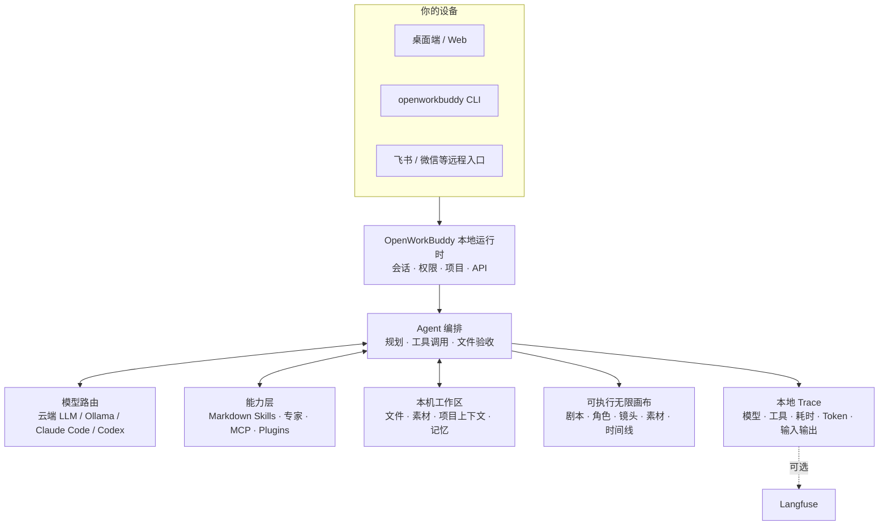

<p align="center">
 
</p>

<h1 align="center">OpenWorkBuddy</h1>

<p align="center">
 <b>跑在你自己电脑上的 AI 办公助理。</b><br>
 交代一句话，它自己规划、动手、验收，把 PPT / Word / Excel / 网页落到你硬盘上。<br>
 <b>给你的是能打开的文件，不是一段聊天记录。</b>
</p>

<p align="center">
 <sub>A local-first AI office agent that hands you files, not chat logs. · <a href="README.en.md"><b>English</b></a></sub>
</p>

<p align="center">
 <a href="#三分钟跑起来"><b>▶&nbsp;三分钟跑起来</b></a>
 &nbsp;·&nbsp; <a href="https://github.com/CatCatUncle/openworkbuddy/releases">下载安装包</a>
 &nbsp;·&nbsp; <a href="docs/功能清单.md">功能清单</a>
 &nbsp;·&nbsp; <a href="#文档">文档</a>
 &nbsp;·&nbsp; <a href="#交流群">交流群</a>
 &nbsp;·&nbsp; <a href="CHANGELOG.md">变更记录</a>
</p>

<p align="center">
 <a href="https://github.com/CatCatUncle/openworkbuddy/stargazers"></a>
 <a href="LICENSE"></a>
 <a href="docs/功能清单.md"></a>
 <a href="docs/功能清单.md"></a>
 <a href="docs/功能清单.md"></a>
 <a href="docs/功能清单.md"></a>
</p>

<p align="center">
 <sub>自己用、学习用、非营利用 <b>免费</b>；公司里用要授权，<a href="#协议">一句话讲清 ↓</a></sub>
</p>

<p align="center">
 
</p>

---

## 你说一句，它交给你

| 你说一句 | 它交给你 |
|---|---|
| 帮我出一份 Q3 复盘 PPT，数据用这个 Excel | 读表 → 算 → 一个能直接放的 `.pptx` |
| 调研国内 AI 陪伴产品，出一份报告 | 联网搜 → 逐个打开读 → Markdown / Word |
| 把这份材料做成手机上能看的网页 | 写 HTML → 起本机服务 → 扫码就能看（[成品](https://hunan-travel.pages.dev/)） |
| 每天 9 点抓行业新闻，做成晨报发我飞书 | 定时任务 + IM 推送，错过了会补跑 |

<p align="center">
 
</p>

> [!NOTE]
> 多任务并行、目标验收、👍👎 进自进化、双层记忆、权限档位、IM 远程指挥、桌面宠物…… 全部能力见 **[功能清单](docs/功能清单.md)**。

## 为什么是它

<table>
<tr>
<td width="50%" valign="top">

<b>📄 文件是真的。</b>

PPT / Word / Excel / 网页都真生成，成果面板里点开就能验收。说写了文件却不在磁盘上，当场拦下重做。

</td>
<td width="50%" valign="top">

<b>🔌 模型随便换，东西全在你手里。</b>

DeepSeek / 通义 / 智谱 / Kimi / OpenRouter / Ollama 界面点一下就切；本机装了 <b>Claude Code / Codex</b> 的，一键拿它当发动机，不用另买 token。会话、文件、Key 全在本机，默认只听 <code>127.0.0.1</code>。

</td>
</tr>
<tr>
<td width="50%" valign="top">

<b>🧩 加个能力 = 丢一个 Markdown 文件。</b>

存成 <code>skills/&lt;名字&gt;/skill.md</code>，存盘后下一条任务就生效——不改代码、不重启、不打包。

</td>
<td width="50%" valign="top">

<b>🔍 也适合拿来读懂 Agent。</b>

模型路由、工具调用、文件验收、记忆、权限、本地 Trace 全在同一个仓库里：一条真实任务，从它为什么这么做到最后交了什么，你都看得见。

</td>
</tr>
</table>

## 三分钟跑起来

三条路都是完整功能，没有哪条是阉割版。

**macOS 一句话装好**（下载 → 装进「应用程序」→ 摘掉隔离标记 → 打开）：

```bash
curl -fsSL https://raw.githubusercontent.com/CatCatUncle/openworkbuddy/main/install-mac.sh | bash
```

> ⚠️ **手动下 dmg 的话，第一次打开一定会弹「未打开“OpenWorkBuddy”· Apple 无法验证…」，弹窗里只有「完成 / 移到废纸篓」。**
> 这是苹果对没买证书的应用的统一拦截，不是包有毒——证书正在申请，批下来这一步就消失了。
> **点「完成」→ 系统设置 → 隐私与安全性 → 滚到最下面 → 点「仍要打开」→ 输开机密码**，只需要做这一次。
> 上面那句 `curl` 全程一个弹窗都没有，嫌麻烦直接走它。三条路的详细步骤在下面「第一次打开被系统拦住」那一段。

**Windows / 手动下包**：去 [Releases](https://github.com/CatCatUncle/openworkbuddy/releases) 拿 `-win-setup.exe`（x64 和 ARM 同一个），双击即装；公司电脑不让装软件的拿免安装版 `-win-x64-portable.exe`（ARM 机器换成 `arm64`）。

**从源码跑**（Node.js 18+，零构建零框架，改完刷新就生效）：

```bash
git clone https://github.com/CatCatUncle/openworkbuddy.git
cd openworkbuddy && npm install
npm run app # 桌面版；或 npm start 走浏览器 http://localhost:3800
```

起来之后填一个模型 API Key，然后在输入框里说人话就行，比如「帮我做一份介绍 OpenWorkBuddy 的 PPT」。
你的东西都在 `~/OpenWorkBuddy`：配置、会话、成果文件、技能，**卸载不删**，换电脑整个搬走。

嫌字小、想换个皮肤：右上角头像 →「外观」，字号四档、五套主题、界面密度都在那一页。

<details open>
<summary><b>第一次打开被系统拦住 · 双击了没反应</b></summary>

<br>

代码签名证书还在申请（苹果一年 99 美元、Windows 一年几千块），所以现在发出去的包是 ad-hoc 签名的。
系统拦的是「这个开发者我没见过」，**不是「这个文件有毒」**——包里的签名本身完好，用 `codesign --verify --deep --strict` 自己验得出来。

**macOS · 三条路，挑一条**

1. **不想碰终端（推荐）**：双击 → 弹窗点**「完成」**（别点「移到废纸篓」）→ 打开**「系统设置 → 隐私与安全性」**→ 一直滚到最下面的「安全性」那一段，会看到「已阻止使用"OpenWorkBuddy"，因为它来自身份不明的开发者」→ 点**「仍要打开」**→ 输开机密码 → 再弹一次点**「打开」**。只需要做这一次。
2. **一句命令**：**先把 .app 从 dmg 拖进「应用程序」**（dmg 是只读卷，在里面跑这条会失败），然后
   ```bash
   xattr -dr com.apple.quarantine /Applications/OpenWorkBuddy.app
   ```
3. **一个弹窗都不想见**：用最上面那句 `curl`。浏览器下载的文件会被打上 `com.apple.quarantine` 标记，curl 下的不会——整条路径上没有 Gatekeeper。

> **别照着网上「右键 → 打开」的教程点。** 那条路只在 macOS 14 及更早有效，macOS 15 (Sequoia) 起苹果把它取消了，右键弹窗里已经没有第二个「打开」按钮——照着点会以为「就是打不开」。
>
> 如果提示的是**「已损坏，应将它移到废纸篓」**（而不是「无法验证」），那是签名真的被弄坏了——网盘、同步盘、某些解压工具都会干这事。重下一次，或者跑 `codesign --force --deep --sign - /Applications/OpenWorkBuddy.app` 就地重签。

**Windows**：弹「Windows 已保护你的电脑」时点灰色小字「更多信息」→「仍要运行」。
- **双击没反应**：启动日志在 `~/OpenWorkBuddy/logs/boot.log`，停在哪儿问题就在哪儿；源码跑的先来一句 `node cli.js doctor`。对照表 → [安装与启动](docs/安装与启动.md#双击了没反应)

</details>

镜像、端口占用、换数据目录 → [安装与启动](docs/安装与启动.md)　|　换电脑搬家 → [数据同步与搬家](docs/数据同步与搬家.md)

## 长这样

**「同一个人，换四个场景，手里举块写着字的牌子——要像随手拍的，别像 AI 图」**

<p align="center">
 
</p>

难的不是画人，是四张里得是同一个人、牌子上的中文不能糊。它先出一张，再用看图工具真去读自己刚生的那张（不是凭记忆吹），确认了才照这个方向铺开其余三张。

**「做个湖南旅游攻略网站，14 个市州一个都不能少」**

<p align="center">
 <a href="https://hunan-travel.pages.dev/"></a>
</p>

**<https://hunan-travel.pages.dev/>** —— 点开就能逛。一个 HTML 加一个图片文件夹，不挂任何外部 CDN，扔到静态托管上就是一个站。这不是截图拼的示意图，是它交出来的那份东西本身。

**「每天早上七点，把今天的天气和该注意的事发到我飞书」**

<p align="center">
 
</p>

一句话排出来的定时任务，人不在电脑前也照跑；每趟调了哪些工具、为什么这么说，都在「自动化 → 运行记录」里点得开。飞书 / 企微 / 钉钉 / Telegram 同一条路。

怎么做到的、本机 Claude Code 当发动机长什么样 → **[三个案例，拆开讲](docs/案例.md)**

## AI 短剧无限画布

剧本、角色、场景、分镜、参考图、视频、配音、时间线摆在同一张图上。连线不是装饰——它表示下一步生成真会去读的角色、首帧和声音。改哪个镜头，只有那个镜头重跑。

<p align="center">
 
</p>

左侧点「无限画布」就能开始。空白处拖拽平移，`Shift`+拖拽框选，`Shift`/`⌘` 点节点加选减选，底部对话框里能 `@` 引用任意节点和素材。

## 放服务器给团队用

一台干净的 VPS，装好 Docker 之后一条命令：

```bash
git clone https://github.com/CatCatUncle/openworkbuddy.git && cd openworkbuddy
bash deploy.sh --domain buddy.example.com # 自动 HTTPS，起来就对外能用
```

脚本会**等健康检查真的通过**才说成功，起不来就把日志打给你。数据全在 `./openworkbuddy-data` 一个目录里。

> [!IMPORTANT]
> **起来第一件事是注册管理员。** 第一个注册的就是超级管理员（每个组织只有一个，只能转让不能增发），之后默认不再允许别人自建账号——空实例挂在公网上，等于谁先访问谁是超管。

一个进程能同时给多家公司用，各租户互相看不见。管理员头像菜单 → **企业管理后台**：建组织、分席位、看用量、配安全策略。新人按部门模板开号（角色和月额度一次配好），人走了点一下，扫码连上的设备、他名下的定时任务、没用完的邀请码、二次验证、在跑的任务一起关——**关权限，不删数据**，完事出一张能贴进离职交接单的回执。

指标每分钟落一行，命中阈值推企业微信 / 钉钉，要接现成监控就抓 `/api/ops/metrics.prom`（和别的接口一样锁在平台管理员后面）。

反代、升级迁移、安全清单 → [部署](docs/部署.md)　|　[运维手册](deploy/README.md)　|　[多人协作](docs/多人协作.md)

## 配模型

**设置 → 模型**，挑渠道预设（OpenAI / Anthropic / OpenRouter / 火山方舟 / 百炼 / DeepSeek / 智谱 / Kimi / Ollama），地址和协议自动填好，只差粘 Key，保存即热生效。Key 粘歪了当场就说是第几个字符不对，不用等发出去收一个看不懂的 401。带 reasoning 的模型能在界面里关掉思考或调档。

生图 / 配音 / 生视频另配一张表，视频认五家协议（通义万相 · 火山方舟 Seedance · 智谱 CogVideoX · MiniMax 海螺 · 硅基流动）；认不准是哪家就不发那一趟——视频按条计费，白发一趟得等好几分钟才看见错。

对照表 → [配置模型](docs/配置模型.md)

> [!IMPORTANT]
> `config.json` 是唯一存 API Key 的文件，已经在 `.gitignore` 里，**别手滑提交**。

## 命令行也能用

`openworkbuddy` 跟桌面版**共用同一份**配置、技能、记忆、连接器和会话——终端里起的活儿，手机和网页上看得见、插得上话；桌面上做到一半，终端里 `openworkbuddy resume` 接着往下走。

```bash
npm link # 一次性：装成全局命令（也可以直接 node cli.js …）

openworkbuddy "帮我写一份本周周报" # 单发：跑完就退
openworkbuddy # 交互：连续对话，打一个 / 出命令菜单
cat error.log | openworkbuddy "这是什么问题" # 管道：管道内容当材料送进去
openworkbuddy -q "生成本周周报" > 周报.md # 文件里只有周报，没有进度条

openworkbuddy engines use claude-code # 换执行引擎：跑在你已经付过钱的订阅上，不烧 API 额度
```

单发和管道模式下**不会**反问你，脚本和 cron 里不会卡住。退出码说实话：`0` 成功、`1` 任务失败、`2` 参数写错、`130` Ctrl+C，所以 `openworkbuddy doctor && npm start` 拦得住没配好的机器。

`sessions` / `resume` / `engines` / `doctor` / `pair`（扫码把手机连上来）/ `worktree`，以及 `--mode` `--perm` `-C` `-f` `--json` 等全部参数 → **[命令行用法](docs/命令行用法.md)**

## 它是怎么搭的



这张图也是读代码的路线：从 `server.js` 进去，再看 `agent.js` 怎么编排模型和工具。细节 → [实现细节](docs/实现细节.md)

## 最新动态

- **09-21** **新建完一个文件夹，找不到地方删**：删除只在「列表」这一种摆法里活着，图标和画廊上写着 `display:none`，搜索那条路压根没画。三种摆法现在都有，搜出来的也删得掉；站在文件夹里面时，「删掉这个文件夹」就摆在「新建文件夹」旁边，删完退回上一级。本地产物照样不给——那是任务写在工作目录里的。非空文件夹那颗钮也从「知道了」改成「进去清空」，按下去进那一层
- **09-21** **工作台切成 English，点进企业管理后台还是满屏中文**：这个后台从头到尾没引过 i18n.js。词典补 494 条 + 28 条模式句，侧栏底下加了中 / 英切换；组织名、部门名、渠道名、模型名不翻——那是数据不是界面。数字跟着语言走，切语言把当前页整个重画（「万」和千分位是渲染时算的，翻 DOM 翻不到）
- **09-21** **手还按在卡上，同步来一趟，卡自己弹回原处**：跟下一条同一个根因（铺快照是整图重来）。现在「同步让路」覆盖打字和拖卡，时效从最后一下动作算起，撒手没被接住也不会把同步卡死
- **09-21** **正打着字，同步来一趟，刚敲的半句就没了**：属性面板整块重画，输入框换了新的，光标掉回 body，接着敲的字进了空气，节点里的文字还被对面那份盖了回去。现在同步给打字让路，手停 10 秒才补上；面板重画也把光标放回原处
- **09-21** **删掉的连线，同步一下、重开一次、按下撤销都会自己回来**：「对面没有连线就沿用我这边的」和「一个镜头 + 一个起过名的场景就替它补上线」两处本来是护着老画布的，可「没有连线」也可能是人刚删的。现在存盘标版本 2——连线照实记，空就是空；版本 1 的老文件照旧补线，他删一下就升成 2
- **09-21** **删掉的画布会借尸还魂，清空的画布自己长东西**：删画布只删了服务器那份，本机副本按画布名留着，再建一张同名的就原样长回来、还被存回服务器；起手那两张卡的判据是「现在是空的」，于是自己清空的画布每打开一次就长回来两张。现在删 / 建画布都把本机副本一起清掉，起手卡只给「从来没人动过」的画布——新建出来的 `updatedAt` 留 0，此后任何一次保存（清空也算）都盖时间戳
- **09-20** **换个项目打开，画布上是上一个项目的东西**：本机那份副本的键上只有画布名，两个项目的 `main` 共用一格，铺上去之后还会存一次盘、把新项目自己的画布顶掉；切画布同理，存盘攒 240 毫秒再发，发的时候才去读「现在是哪张」。现在键上带项目名、切之前先把欠的那趟写完、写出去之前再核一次「这份是写给谁的」
- **09-20** **无限画布三处静默丢数据**：标题叫「开始工作」「开始创作」的节点，加载和同步时一律被丢掉、连着的线一起扔（三个节点两条线进去只剩 1 个节点 0 条线，本机和服务器那两份一起变瘦）；同步拉回来的快照铺完又原样发回去，两个标签页会每 1.8 秒互相顶一轮、各拷一份 .bak；框选 3 个之后来一趟同步只剩 1 个还选着，下一下 Delete 删的就不是那一片。画布原来一条测试都没有，新写的 test/canvas.js 修之前 6 过 / 9 挂、修完 16 过 / 0 挂
- **09-20** **英文界面上资料库整页是中文**，v0.7.0 的安装包也因此一个都没出——发版卡在测试那一步，CI 那台是英文机器，界面照英文渲染，断言却是照中文文案写的。词典补上这一页（22 段正文 + 15 处属性，含「新建文件夹是干嘛的」那段说明），另加一道闸：页面渲染出来切成英文，数屏幕上还剩几个汉字
- **09-20** **资料库能删了，「新建文件夹」是干嘛的这一页也说得出来了**：它原来把「你传进来的参考资料」和「任务写出来的产物」混在一起摆，新建 / 上传两颗钮浮在两段最上面，人自然以为管的是下面全部。现在两段分开，钮挪进「参考资料」那一段，空状态直说——项目设置里只挂其中一个文件夹，这个项目的 AI 就只看得见那一块，不会翻到隔壁客户的材料。文件夹和资料各挂一个垃圾桶（产物那段故意没有），确认框焦点在「算了」上，非空文件夹不给「删掉」这颗钮
- **09-20** **企业后台还剩三处回包是按人头长的，一趟 678 / 491 / 631 KB 缩到 11 / 12 / 9 KB**：用量明细捎带一张「按人分组」的汇总，中转 Key 页捎带「每人单独的 API 上限」那张表，数据统计只要「几个人」一个整数却把全员的角色、额度、余额都算了一遍。成员用量和每人上限各拆出一条接口，一页 50 个，筛、排、翻页全在服务端
- **09-20** **一个租户的日常操作，能把另一个租户的审计记录整个挤掉**：全部组织的审计条目挤在同一个数组里、存盘时砍到 1000 条，实测乙公司的 21 条被甲公司 1200 条正常操作挤得一条不剩，后台显示「0 条」——跟「从来没发生过事」长得一模一样。现在一个组织一本 `data/audit/<组织 id>.jsonl`，谁也挤不掉谁，顺带把 `getOrg()` 从 45.57ms 拉回 0.02ms（审计以前躺在热路径上，37 处调用每次都要整本 parse）。界面上那两句假话也改了：存满了会说「已到保留上限」而不是继续写「全部」，导出按钮真按筛选导全量而不是只导屏幕上这 50 条
- **09-20** **读 Office 文档的九个静默错漏**：Excel 表尾整行整列丢（`actualRowCount` 数的是非空行数不是末行下标），而且还报「没截断」；公式格一片空白；合并格的标题横着重复四遍；PPT 用 `addChart` 做的页读回来整页是空的；Word 的有序列表和项目符号分不开、超链接地址整个丢、页眉页脚从来不读。顺带只认 http/https/mailto，外面发进来的 `.docx` 里那句 `javascript:` 超链接不再是可点的入口
- **09-20** **启动失败那一页，现在右键复制得动**：它写着「把这行贴到 issue 里」，可右键菜单当初挂在服务端 require 后面——而启动失败时那句 require 就是抛出点，于是最该能复制的一页反倒复制不了，只能手抄。「提 issue」也改成去你自己的浏览器，不再是应用里另开一个没地址栏的窗；显卡那条建议也给出 `config.json` 的真实路径，不再让你猜用户目录在哪
- **09-20** **打不开的时候，屏幕上写的是该怎么修，不是「去提 issue」**：缺依赖就写 `npm install`、装机版少文件就写去 Releases 重下、Node 太老就写去下 LTS——这三样闸门本来就诊断出来了，以前却在窗口那边拿英文关键字重猜一遍，三种死法全落进「把这行贴到 issue 里」那句兜底
- **09-20** **少装一个包，现在报得出是哪个、一共少几个**：依赖清单不再手写（手写那份停在 3 个，`package.json` 里是 13 个），超过三个就跟上总数——「整体没装成」和「就差一个包」以前在屏幕上长得一模一样，可这两种该做的事不一样
- **09-20** 设置页里**问完渠道一个模型都没有时，不再是一行字凭空消失**：本机 Ollama 会告诉你去终端 `ollama pull` 哪一句、大概多大，拉完回来重开下拉框会真去问一次（那趟空清单不再被缓住）；云端渠道回空是另一回事，照实说；连请求都没发出去也得说一句
- **09-20** 抓网页**不再是一道多余的选择题**：`render_page` 并回 `fetch_url` 的 `render:"force"`——它俩本来就是同一段代码，清单里摆两个名字只会让模型每次先挑一遍。老名字照样调得动，外部 CLI 引擎那边也照常借得到
- **09-20** 接**本机 Ollama 时能自己选模型了**：向导直接问你那台机器装了哪些（`/v1/models`），列成下拉框；模板里的默认值只在你真装了的时候才选中，列表里没有就「自己填…」。Ollama 没起来会告诉你先 `ollama serve` 再 `ollama pull`，拉完点「重新问一次」。选中的型号会真拿去验活，验不过不许改动你原来能用的那条。连不上时的兜底也从 `qwen3:14b`（约 9GB）换成 `qwen3:8b`（约 5GB）
- **09-20** 装了包的 macOS 用户点升级，**不再被推回去下一个新 dmg**（那样第一次打开又撞「Apple 无法验证」）：第一条给的是零弹窗那句 `curl`，单独画成一行等宽字加一颗「复制这条命令」，而且只在真有新版时才露出来
- **09-20** 往输入框里**拖文件、粘贴文件，松手那一瞬间就有卡片**（以前要等上传回来，4MB 的片子空窗 124ms，人会以为没拖进去再拖一次）；卡片上写着体积、删除和打开都是真按钮、点名字直接打开那份素材；传失败会把文字锚点撤回来并留一颗重试键，还在传的时候点发送会被拦住；重复文件、文件夹这两种以前的静默失败现在都当面说清楚
- **09-20** macOS 上**「Apple 无法验证」那个死胡同弹窗，现在处处都告诉你怎么放行**：dmg 窗口里就画着「点完成 → 系统设置 → 隐私与安全性 → 滚到底 → 仍要打开」，README、安装文档和线上 7 个 release 的正文也都补齐了，不开终端的那条路排第一。签名还在申请，批下来就没这一步
- **09-20** 卡片上的字**不再被挡住、也不再被横切**：连不上的原因原来当标签胶囊塞着，只露中间一截，现在整块红字、三行封顶、点一下看全文；命令原文、画布节点正文这类「先给你看几行」的框，封顶一律落在整行上，不再把最后一行拦腰切断；右上角那颗角标也不再压着标题和状态字
- **09-20** **内置技能 35 条、连接器 52 个**：竞品监控、市场调研、表格分析、一稿多投、用户反馈、SEO 简报、财务测算、播客、信息图、销售开发信十条新技能；连接器补上 Linear、Jira / Confluence、Sentry、Vercel、Figma、Airtable、Asana、Canva、Apify、YouTube、AntV 图表、EdgeOne 一键部署、B 站
- **09-20** 用完真浏览器之后**它会自己走了**：闲置十分钟自动关、进程退出时带走、也能手动关，而且是整个进程组一起收。之前留下过一个挂十个半小时、GPU 进程 160% CPU 的
- **09-20** macOS 上下载的包双击打不开，现在多一条命令绕过去：`curl -fsSL .../install-mac.sh | bash`——curl 下的文件不带隔离标记，全程零弹窗
- **09-20** 无限画布**能一次选一片了**：Shift / ⌘ 加选减选、工具条上一个「框选」开关、⌘A 全选、Delete 一起删。之前框也框得出来、也高亮着，按 Delete 就是没反应——焦点从来没落到画布上
- **09-20** 画图表**不再只出 SVG 不出 PNG**（飞书文档和 Word 只收 PNG）：图两秒就写到盘上了，只是 Chrome 之后挂着不退，旧写法等满超时就把那张好图一起丢了
- **09-20** 短剧进度带展开后**不再压住画布**，浮在上面的工具条也跟着让位，剧本和定妆那两格终于露得出来
- **09-20** 「N 个角色的定妆照在画布上写着、盘上已经没有了」**不再冤枉人**：判文件在不在改成挨个去问一次盘，路径认不出来的宁可不喊
- **09-19** 跑自动评测**不再动你的真记忆、真偏好、真额度账本**；题库补上长任务、多轮、记忆召回三种单轮题考不出来的题形
- **09-19** 两条任务同时改一个代码仓库时，**后到的那条进自己的 git worktree**——你眼前那份工作区一个字不动
- **09-19** 权限按 **RBAC** 重做，补上超级管理员这一档：只能管比自己低的那一档，发管理员的四条路堵在同一道闸上

更早的看 **[变更记录](CHANGELOG.md)**。

## ⚠️ 这个 agent 手里有 shell

> [!WARNING]
> 它能执行命令、读写文件、访问网络——所以闸门是真拦的：命令审批、文件黑名单、URL 白名单、审计日志、四档权限。
> **放到公网前务必先读 [安全](docs/安全.md)**，默认配置只为本机使用而调。

**装别人的技能之前，它会先体检一遍。** 一个技能就是一份给 agent 看的指令，接到一个能在你机器上敲命令的东西上——这跟 `npm install` 不一样，npm 包要你 `require` 才跑，技能是它自己会去读、会照着做的。所以装之前先过 34 条静态规则，然后把看到的摊开给你，落到三档：直接装 / 看一眼再装 / 默认不装（不打分，分数只会让人养成「42 分应该还行」的习惯）。其中 10 条真拦（反弹 shell、`curl | bash`、读 SSH 私钥、抹盘、抹痕迹……），管理员能强装，但那一下会记进 `.install.json`。

**它不是杀毒。** 公开标注集上纯静态规则大概七成五，四个漏一个。本机装了 [toolward](https://github.com/CatCatUncle/toolward) 就自动当第二把尺子用，合的规矩是只严不松。最后这条比上面所有规则都重要：**装之前自己读一眼 `skill.md`**，它是 Markdown，不是二进制。

怎么判的、为什么留强装口子 → [安全](docs/安全.md)　|　[安全基线](docs/安全基线.md)

## 交流群

用崩了、有想法、想一起改，进飞书群直接说：

<p align="center">
 
</p>

## 一起把它做下去

- **用崩了、卡住了，开个 [issue](https://github.com/CatCatUncle/openworkbuddy/issues/new)**，哪怕只贴一句报错——你以为「只有我遇到」的坑，多半所有人都在踩。贴之前扫一眼，别把 API Key 带上。
- **10 分钟** 写个技能：一个 Markdown 存成 `skills/<名字>/skill.md`，存盘即生效，[模板在这](CONTRIBUTING.md#提交一个技能3-分钟)
- **一晚上** 挑个 issue 改：`npm install && npm start` 就跑起来，`npm test` 不用 API Key 也能全绿

项目结构、测试、PR 规范都在 [参与贡献](CONTRIBUTING.md)。不用先开 issue 问，直接发 PR。

## 文档

| 文档 | 一句话 | 文档 | 一句话 |
|---|---|---|---|
| [功能清单](docs/功能清单.md) | 全部能力、技能与工具 | [部署](docs/部署.md) | 服务器 / Docker / 反代 |
| [案例](docs/案例.md) | 上面那几张图怎么做出来的 | [多人协作](docs/多人协作.md) | 多租户、账号、权限、额度 |
| [安装与启动](docs/安装与启动.md) | 安装包、源码、常见卡壳 | [安全](docs/安全.md) | 审批闸门、黑白名单、审计 |
| [配置模型](docs/配置模型.md) | 各家 base_url / 模型名对照 | [数据同步与搬家](docs/数据同步与搬家.md) | 数据存哪、换电脑怎么搬 |
| [命令行用法](docs/命令行用法.md) | CLI 参数、管道、`--json`、cron | [开源与商业版边界](docs/开源与商业版边界.md) | 买授权到底买到什么 |
| [扩展](docs/扩展.md) | 写技能、接 MCP、装插件、建专家 | [路线图](docs/路线图.md) | 接下来做什么、怎么算做完 |
| [IM 与定时任务](docs/IM与定时任务.md) | 飞书 / QQ / 企微 / 微信 / 钉钉 | [变更记录](CHANGELOG.md) | 一句话一条，最新在上 |
| [实现细节](docs/实现细节.md) | agent 主循环怎么转的 | [参与贡献](CONTRIBUTING.md) | 项目结构、测试、提 PR |
| [安全基线](docs/安全基线.md) | 数据落在哪、谁看得见、哪些没做到 | [远程访问](docs/远程访问.md) | 手机/外网连本机，两个开关默认关着 |

## 同一个作者的其他项目

- **[toolward](https://github.com/CatCatUncle/toolward)** —— 给 agent 用的技能 / MCP 连接器静态安检：37 条规则分六族，零运行时依赖。`npm i -g toolward` 装上，OpenWorkBuddy 自动把它当第二把尺子用，不装也完全不影响。同样是 PolyForm Noncommercial。

## 协议

一句话：**自己用、学习用、非营利机构用——免费；拿去赚钱（公司内部提效也算）——找作者买商业授权。**
协议是 [PolyForm Noncommercial 1.0.0](LICENSE)，哪些算商用、怎么谈见 [COMMERCIAL-LICENSE.md](COMMERCIAL-LICENSE.md)。

**买授权不解锁功能。** 只有一份代码，就是这个仓库，你看到的就是全部：Agent 主循环、40+ 工具、短剧画布、IM 远程指挥、执行追踪、自进化与记忆，连多租户和企业管理后台都在里面——没有功能开关，没有试用倒计时，没有灰按钮。买的是另外三样：一张允许你拿它赚钱的许可证、商标与白标的口子、能找到人的支持 → [开源与商业版边界](docs/开源与商业版边界.md)

**有一部分连非商业限制都没有。** 部署配置、CI 流水线、脚本、评测集、技能模板、文档里的示例代码，额外按 MIT 发布 → [LICENSE-ECOSYSTEM.md](LICENSE-ECOSYSTEM.md)。而**你自己写的技能、插件、连接器配置是你自己的作品**，跟这份协议无关。

这份协议**不授予**任何第三方产品、商标、logo、品牌素材或截图的权利，那些归各自权利人。

Copyright (c) 2026 开发者猫叔

## 免责与边界

**这是什么。** OpenWorkBuddy（仓库 `CatCatUncle/openworkbuddy`）是 开发者猫叔 从零写起的独立开源项目，源码全在本仓库。架构、工具协议、权限模型、记忆与自进化都是自行设计实现；借鉴过的外部项目在 [NOTICE.md](NOTICE.md) 第四节逐条列了。名字是 `Work` + `Buddy` 两个通用英文词加开源项目通行的 `Open-` 前缀，直白描述这个项目做的事。

**与第三方的关系：没有。** 本项目与腾讯公司及其 WorkBuddy 产品无任何关联、授权、赞助或背书，不含其任何代码、素材、界面资源或非公开信息。「WorkBuddy」若为他人注册商标，权利归各自权利人；文档中提及第三方名称时仅为说明兼容性或做事实区分（指示性使用）。对接飞书、企业微信、QQ 等一律走各自**公开发布**的开放接口，不涉及逆向工程。

**权利人若觉得哪里不妥**，请通过 [Issues](https://github.com/CatCatUncle/openworkbuddy/issues) 或 [COMMERCIAL-LICENSE.md](COMMERCIAL-LICENSE.md) 里的方式直接联系我，核实后尽快改。

## 支持这个项目

<p align="center">
 <a href="https://github.com/CatCatUncle/openworkbuddy">
 
 </a>
</p>

<p align="center">
 <a href="https://github.com/CatCatUncle/openworkbuddy"></a>
</p>

<p align="center">
 <sub>顺手把它转给一个天天手搓 PPT、周报、会议纪要的同事，比一百次曝光管用。</sub>
</p>

## 贡献者

感谢每一个动手改过这个项目的人。想加入他们：[参与贡献](CONTRIBUTING.md)。

<p align="center">
<a href="https://github.com/CatCatUncle/openworkbuddy/graphs/contributors">
 
</a>
</p>

## Star 历史

<p align="center">
<a href="https://star-history.com/#CatCatUncle/openworkbuddy&Date">
 <picture>
 <source media="(prefers-color-scheme: dark)" srcset="https://api.star-history.com/svg?repos=CatCatUncle/openworkbuddy&type=Date&theme=dark">
 
 </picture>
</a>
</p>
