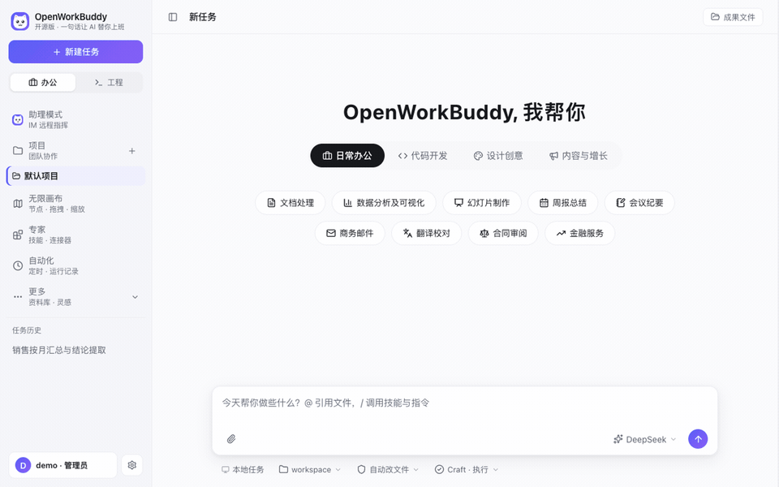
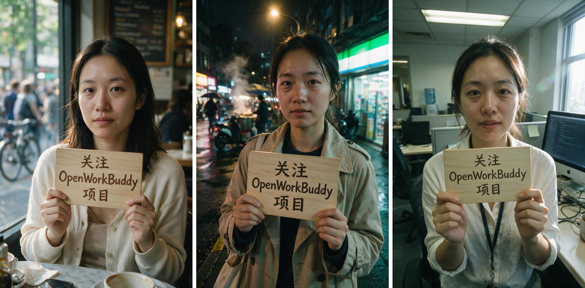
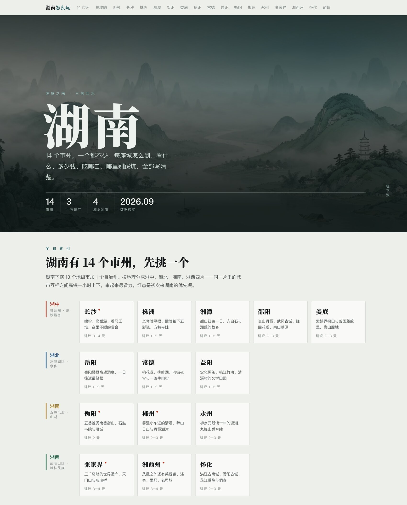
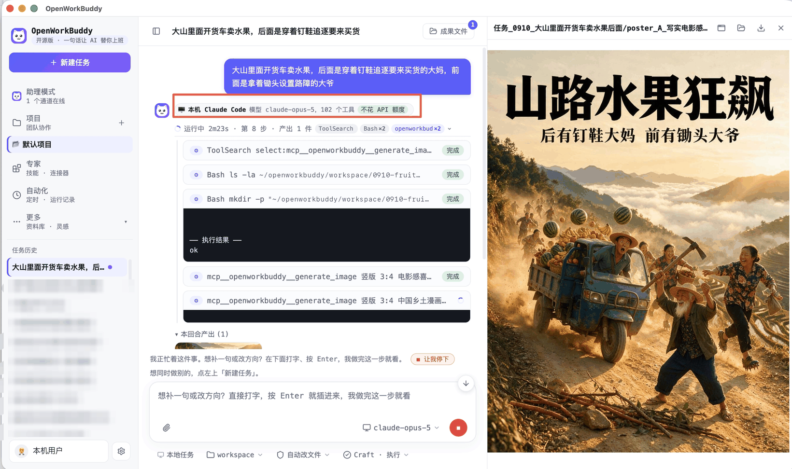

<p align="center">
  
</p>

<h1 align="center">OpenWorkBuddy</h1>

<p align="center">
  <b>一个真吐文件的本机 AI 办公 agent。</b><br>
  说一句人话，它自己规划、动手、验收——交给你的是能直接打开的 PPT / Word / Excel / 网页，<b>不是一段聊天记录</b>。
</p>

<p align="center">
  <sub>A local-first AI office agent that hands you files, not chat logs. → <a href="README.en.md"><b>English README</b></a></sub>
</p>

<p align="center">
  <a href="#跑起来"><b>⚡ 30 秒跑起来</b></a> ·
  <a href="https://github.com/CatCatUncle/openworkbuddy/releases">下载安装包</a> ·
  <a href="#最新动态">最新动态</a> ·
  <a href="#交流群">飞书交流群</a> ·
  <a href="docs/功能清单.md">功能清单</a>
</p>

<p align="center">
  <a href="https://github.com/CatCatUncle/openworkbuddy/stargazers"></a>
  <a href="https://github.com/CatCatUncle/openworkbuddy/forks"></a>
  
  
  <a href="LICENSE"></a>
</p>

<p align="center">
  <b>⭐ 觉得有用就点个 Star</b> —— 这个项目没有推广预算，能不能被搜到，基本取决于这个数字。<br>
  <sub>个人、学习、非营利用途<b>免费</b>；公司里用需要授权，<a href="#协议">一句话讲清 ↓</a></sub>
</p>

<p align="center">
  
</p>

---

## 为什么是它

**交付的是文件，不是聊天记录。** PPT / Word / Excel / 网页都是真生成的，成果面板里点开就能验收。声称写了文件却不在磁盘上，会被当场拦下重做。

**不绑任何一家模型，东西都在你手里。** DeepSeek / 通义 / 智谱 / Kimi / OpenRouter / Ollama 本地模型界面点一下就切；本机装了 **Claude Code / Codex** 的，一键拿它当发动机，不再另买 token。自托管，会话、文件、Key 全在本机，默认只监听 `127.0.0.1`。

**加一个能力 = 丢一个 Markdown 文件。** 放进 `skills/`，存盘后下一条任务就生效——不改代码、不重启、不打包。往外接 MCP 连接器和 [Agent Plugins](https://agent-plugins.org) 开放标准，别人的插件粘个 GitHub 地址就装。

## 它替你做完的事

| 你说一句 | 它交给你 |
|---|---|
| 帮我出一份 Q3 复盘 PPT，数据用这个 Excel | 读表 → 算 → 一个能直接放的 `.pptx` |
| 调研国内 AI 陪伴产品，出一份报告 | 联网搜 → 逐个打开读 → Markdown / Word |
| 把这份材料做成手机上能看的网页 | 写 HTML → 起本机服务 → 扫码就能看（[成品长这样](https://hunan-travel.pages.dev/)） |
| 每天 9 点抓行业新闻，做成晨报发我飞书 | 定时任务 + IM 推送，错过了会补跑 |

> 还有多任务并行、Goal 目标验收、👍👎 反馈进自进化、双层记忆、权限档位、IM 远程指挥、桌面宠物……全部能力见 **[功能清单](docs/功能清单.md)**。

## 长这样

**「同一个人，换四个场景，手里举一块写着字的牌子——要像随手拍的，别像 AI 图」**

<p align="center">
  
</p>

难的从来不是画个人，是**四张里得是同一个人**、木牌上的中文不能糊、皮肤得有毛孔和油光而不是磨皮。它的做法是：先出一张，再用看图工具真去读自己刚生的那张（不是凭记忆吹），说出「这版光线对了、皮肤质感对了」，然后照这个方向一次铺开其余场景。图上不带任何 AI 生成水印。

**「做一个湖南旅游攻略网站，14 个市州一个都不能少」**

<p align="center">
  <a href="https://hunan-travel.pages.dev/"></a>
</p>

站在这儿，点开就能逛：**<https://hunan-travel.pages.dev/>**。14 个市州逐一拆开写（到达方式、门票与开放时间、吃什么、怎么玩、哪里别踩坑），外加 3/5/7 天三条线路，单页 HTML、不挂任何外部 CDN，扔到静态托管上就是一个站。这不是截图拼的示意图，是它交出来的那个文件本身。

**本机装了 Claude Code / Codex 的，一键拿它当发动机——不再另买 token。**

<p align="center">
  
</p>

红框里那枚牌子是真机截图：这一趟走的是本机的 `claude-opus-5`，挂了 102 个工具，不花 API 额度——界面上直说，不用猜。中间每一步折成一行摆着，想看细节再点开，任务结束只把结论留在外面。


## 跑起来

**装包**：去 [Releases](https://github.com/CatCatUncle/openworkbuddy/releases) 下对应的包，打开后**五步向导**带你注册账号、粘 Key（当场验活）、选引擎——三分钟内说出第一句话。

| 系统 | 下哪个 |
|---|---|
| macOS · Apple 芯片 | `OpenWorkBuddy-*-mac-arm64.dmg` |
| macOS · Intel | `OpenWorkBuddy-*-mac-x64.dmg` |
| Windows 10/11（x64 与 ARM 同一个包，装时自动选） | `OpenWorkBuddy-*-win-setup.exe` |
| Windows 免安装版（**只在装不了软件时才用**） | `OpenWorkBuddy-*-win-x64-portable.exe` / `-win-arm64-portable.exe`（原理是自解压：每次启动要把整包解压到 `%TEMP%`，第一次可能要等好几分钟，期间只有进程没有窗口）|

> 第一次打开会被系统拦一下，因为这个包没有代码签名证书（苹果一年 99 美元、Windows 一年几千块，这是个免费开源项目），不是有毒。
> **Windows**：弹窗里点灰色小字「更多信息」→「仍要运行」。**macOS**：右键图标 → 打开，或 `xattr -cr /Applications/OpenWorkBuddy.app`。
> 你的数据在 `~/OpenWorkBuddy`，卸载不会删。
>
> **双击了没反应？** 启动日志在 `~/OpenWorkBuddy/logs/boot.log`，对照 [安装与启动 · 双击了没反应？](docs/安装与启动.md#双击了没反应) 逐条排查。

**从源码**（Node.js 18+，零构建零框架，改完刷新即生效）：

```bash
git clone https://github.com/CatCatUncle/openworkbuddy.git
cd openworkbuddy && npm install
npm run app     # 桌面版；或 npm start 走浏览器 http://localhost:3800
```

然后在输入框里说人话，比如「帮我做一份介绍 OpenWorkBuddy 的 PPT」。看着不顺眼就改：头像菜单 → **外观**，语言（中文 / English）/ 主题 / 六套皮肤 / 字号四档 / 字体 / 紧凑密度，点一下立刻生效。切成 English 后 AI 的回答和它写给你的文件也跟着用英文；首次开箱向导右上角就能切。（v1 只翻界面：服务端推过来的步骤标题、飞书/微信里的回复暂时还是中文。）

镜像、一键脚本、端口占用、启动卡住 → [安装与启动](docs/安装与启动.md)

## 放服务器给团队用

一台干净的 VPS，装好 Docker 之后一条命令：

```bash
git clone https://github.com/CatCatUncle/openworkbuddy.git && cd openworkbuddy
bash deploy.sh                              # 起在 127.0.0.1:3800
bash deploy.sh --domain buddy.example.com   # 或者：带自动 HTTPS，直接对外能用
```

脚本会构建镜像、起容器、**等健康检查真的通过**才说成功；起不来就把日志打给你，不假装。
数据全在 `./wb-data` 一个目录里（配置 / 账号 / 成果文件 / 技能 / 备份），容器随便删，那个目录别删。

起来之后**第一件事是注册管理员**——第一个注册的就是管理员，注册完默认不再允许别人自建账号；
空实例挂在公网上等于谁先访问谁是管理员。

**多租户 + 企业管理后台**：一个进程同时给多家公司用。成果文件、会话、账号、席位、用量账本、
审计各租户互相看不见；引擎和 API Key 归平台管理员。管理员登录后头像菜单 → **企业管理后台**，
建组织、分席位、看用量、配组织级安全策略。

组织级那四个开关是**真的会拦人**的：关掉 `allow_shell`，`run_shell` / `run_node` 在工具定义层
就被摘掉了，模型压根看不见；`net_allow` / `net_deny` 管得住 agent 能访问哪些域名（域名比对带点
边界，白名单 `example.com` 不会顺带放行 `evilexample.com`）；`session_days` 是在读 token 时判
过期的，改小了已经发出去的 cookie 当场作废。

细节、反代配置、升级迁移、安全清单 → [部署](deploy/README.md)

## 配模型

**设置 → 模型**，选渠道预设（OpenAI / Anthropic / OpenRouter / 火山方舟 / 百炼 / DeepSeek / 智谱 / Kimi / Ollama），地址和协议自动填好，只差粘 Key，保存即热生效。对照表见 [配置模型](docs/配置模型.md)。带 reasoning 的模型能在界面里**关掉思考或调档**。

> `config.json` 是唯一存着 API Key 的文件，已在 `.gitignore` 里，**别手滑提交**。

## 命令行也能用

`wb` 跟桌面版共用同一份配置、技能、记忆和连接器，答案落到 stdout，能塞进任何管道、脚本和 cron：

```bash
npm link                                   # 一次性：把 wb 装成全局命令
wb "帮我写一份本周周报"                     # 单发：跑完就退，退出码 0/1 说实话
cat error.log | wb "这是什么问题"           # 管道：内容当附加材料一起送进去
wb --json "整理会议纪要" | jq -j 'select(.type=="text") | .delta'   # NDJSON 事件流给脚本用
wb engines && wb engines use claude-code   # 本机装了 Claude Code / Codex？一键拿它当底层
```

`-q` 只要答案、`-c` 续上一轮、`-C <目录>` 指定工作目录、`wb sessions` 列会话。全部参数 → [命令行用法](docs/命令行用法.md)。

## 最新动态

- **09-11** **「检查更新」对装了包的人说了句用不上的话**：判「你是源码跑的还是装了包」只看路径里有没有 `app.asar`，而这个项目的 asar 是关着的（`tools.js` 要把 node_modules 软链进工作区，asar 是压缩包不是真目录），装机包里代码住在 `<Resources>/app/`。于是**每一个**下了 dmg / exe 的人点「检查更新」，拿到的升级建议都是 `git pull && npm install`——他机器上根本没有这个仓库。现在改判「代码在不在 Electron 的 resources 目录底下」，asar 开着关着都认；顺手补了三条反向对照：从源码跑 electron 时 `resourcesPath` 也有值但不含本目录、`Resources-old` 不许被 `Resources` 前缀误伤、纯 node 跑压根没这个字段
- **09-11** **「下载了打不开」不该是一声不吭的**：翻了一遍启动路径，找到五处会静默死在半路的地方——数据目录建不起来（公司电脑把用户目录重定向到离线网络盘）、主进程未捕获异常、窗口建出来了但显卡画不出来、旧进程占着单实例锁、`localhost` 解析到 IPv6 而服务端只听 IPv4。以前它们统一表现为「任务管理器里有进程、屏幕上什么都没有」；现在每一种都有窗口或弹框说清原因和解法，还有一份 `~/OpenWorkBuddy/logs/boot.log` 记着每段耗时（这个文件夹都建不了就退到系统临时目录写）。另配两个不用改代码的逃生门：`OPENWORKBUDDY_DISABLE_GPU=1` 和 `OPENWORKBUDDY_HOME`。同批还修了第六种：`PORT` 环境变量只有服务端认、桌面壳不认，设了它就是服务端听 3810、壳去连 3800，窗口永远等不到人
- **09-11** **装机包瘦了 139 MB**：生产依赖里 source map 占 116.8 MB、类型声明占 35 MB，运行时一个字节都不读，但 Windows 免安装版每次启动都要把它们解压到 `%TEMP%` 再让 Defender 逐个扫一遍——这正是「等了半天没反应」的一大来源。整包 594 MB / 12780 个文件 → 455 MB / 10025 个文件。打包时新加两道闸门：逐个 `require` 生产依赖（删过头的包不许被签得漂漂亮亮发出去）、反查瘦身有没有真生效（glob 写错会静默什么都不删）。中途按目录名删过一次，@iconify/utils 的运行时代码住在 `lib/emoji/test/` 下、exceljs 的核心在 `lib/doc/` 下，当场炸——省 1 MB 换整包打不开，那条规则已经删掉
- **09-10** **任务历史不是丢了，是被一个凭空编出来的项目滤没了**：给团队成员看的项目列表以前会凭空编一个叫「本组织工作目录」的项目顶上，侧栏因此多一个点不动的 tab；更要命的是任务历史按项目过滤，这个名字跟老会话记的对不上，整排历史当场被滤空——磁盘上一条都没丢。现在服务端如实说「你这儿没有项目这回事」，那一栏整块不画、也不过滤。顺带补了第二道防线：侧栏那份列表以前只活在浏览器里，清缓存 / 换台机器 / 改用户名都会让它空掉，现在登录后跟服务端那份并一次——只补不删，本地刚建还没落盘的新任务原样留着
- **09-10** **点「立即使用」不再只丢半句话**：以前点完输入框里只多了「用「xxx」技能帮我：」，等于把一张空白页原样还给你。现在先从技能说明书的「适用场景」里摆出几件它真能干的事，挑一件才带着格式进任务框。只在那一节里挖——试过退回全文，挖出来的是颜色码、包名、字段名这类东西，比空着更糟；没写这一节的说明书宁可一条不给
- **09-10** **挂了反代，防连打的闸会变成全公司互相锁死**：反代一挡，所有请求在应用看来都来自同一个 IP——注册闸 5 次/15 分钟会变成「第 6 个同事注册不了」，登录闸会变成「有人输错几次密码全公司一起进不去」。现在认 `X-Forwarded-For`，但**从右边往左数**（左边那几跳是客户端自己就能写进去的，正好是想当然的实现会去读的那一跳），而且只有紧挨着的那一跳是内网/环回地址才认。开关 `WB_TRUST_PROXY` 默认 0，只有 `deploy.sh --domain` 自带 caddy 时才自动打开——「填了却没挂反代」比「没填」更糟，那等于把限流闸直接拆给外网
- **09-10** **打包清单不许再手写着手写着就过期**：v0.1.1 装机版打不开，根因就是打包白名单漏了 `engines/`。现在有一道闸门去爬全部源码里按路径引用的运行时资源，跟 electron-builder 的白名单逐条对，对不上当场挂——包括 `"*.js"` **只匹配顶层**这个坑（v0.1.1 就是栽在这个「只」字上）。三种漏法各造一次假故障验证，全被抓住
- **09-10** **一条命令部署到服务器**：`bash deploy.sh` 查环境 → 建 `.env` → 构建 → 起容器 → 等健康检查真通过才报成功，`--domain` 直接带自动 HTTPS；数据收进 `wb-data` 一个目录，容器随便重建。顺手堵了个大洞：以前没有 `.dockerignore`，`COPY . .` 会把 `config.json`（你的 API Key）、`data/`、`workspace/` 一起烤进镜像层——镜像层是只读快照，push 到任何 registry 就是公开，还删不掉
- **09-10** **多租户 + 企业管理后台**：16 个面板（订阅与用量 / 数据统计 / 成员授权 / 企业设置 / 开放与集成），管理员改得动、审计员只能查账、普通成员连入口都看不见；组织级的命令行开关、域名黑白名单、会话有效期四个设置真接进了执行层，不是躺在配置文件里没人读
- **09-10** **不许「没做完就收摊」**：模型说完事之前先过一道收尾闸门——进度档里还有没打勾的条目、或者它自己在结语里承认还有没做的，就把没做的清单原样念回去让它接着做；打回额度用完还没做完就转自动续跑（没立进度档的小任务不拦，免得反复打回烧钱）
- **09-10** **执行过程一行流**：过程区每一步只占一行「动词 + 对象 · 结果量」，原始入参和完整返回一个字没删收在卡里，点开就是；连续的只读工具（搜索 / 抓页面 / 读文件）并发跑，会动文件的仍旧单跑保序
- **09-10** **切到本机引擎那一屏**：模型菜单不再被说明文字撑成一整行、右对齐飞出屏幕把字裁掉——换成一张说明卡讲清「现在谁在跑、花不花钱、想换模型去哪换」，对话里再挂一枚「运行中」的小牌子
- **09-10** **Goal 目标卡做成了**：拆验收标准和对着标准判分都改走你正在用的本机 CLI（不再偷偷走 API 额度，没配 Key 的人也能用），进度条按打勾比例走，拆解 / 验收失败当场在卡上留痕，自动补跑跑满轮数就说清还差哪几项并给一个「接着冲」
- **09-10** **长回复不卡了**：流式正文每帧只重写还在长的那一小截，已经定稿的那部分 DOM 一个节点都不动——十万字的回复，流式期间重建 DOM 从 19.7 秒降到 0.7 秒，最卡的一帧 66ms → 23ms，想选一段字复制也不会每 100ms 被清空一次；本机 CLI 探测加了缓存，开设置页不再每次起子进程问版本（275ms → 0ms）
- **09-10** 微信 / 企微 / 公众号 / QQ 也能收**文件、图片、语音、表情**了（以前只有飞书能收，其他渠道一句「本版暂不下载」就打发了）；飞书补上语音、表情和以前整条丢掉的富文本
- **09-10** 飞书**扫码新建应用**：本机装了 lark-cli 就替你把应用建出来、App ID 自动填回；Secret 被系统钥匙串锁着时给一条直达凭证页的链接（那串 `****` 绝不会被当凭证存下来顶掉你原来的）；顺带修掉「存一次别的渠道就把飞书 secret 冲空」这个连不上的真因
- **09-10** 设置 → 关于 → **检查更新**：按你是源码跑的还是装的包，各说各的升级方式；查不到就说查不到，不假装「已是最新」
- **09-09** 任务完成时不再把右侧预览 / 成果文件面板弹出来抢版面：结论在正文里，产出是一排紧凑 chip（图标 + 名字 + 大小 + 预览/定位/下载），「成果文件」按钮记个角标；只有你本来就开着预览看那个文件才原地刷新
- **09-09** 连接器页新增 **39 个预设一键接入**（搜索 / 数据库 / 飞书 / 高德 / GitHub…），Key 只填值、缺了不让存；专家再加 **15 位 + 4 支专家团**，升级自动补入不覆盖你的改动
- **09-09** 演示录屏自带马赛克层：临时目录 / 用户名 / 主机名 / bot id 在画面里全遮，录前自检
- **09-09** 中英文切换：外观页 / 首次向导一键切，整页即时翻、AI 回复跟着走
- **09-09** 外观页：主题 / 六套皮肤 / 字号四档 / 字体 / 紧凑密度，点一下生效
- **09-08** 首次开箱五步向导：新装打开就带你配好模型、引擎、IM，不用翻文档
- **09-08** 本机 **Claude Code / Codex** 当引擎：记忆、技能、读文件、生图配音全接上；每个引擎可选模型与思考档
- **09-08** 带 reasoning 的模型可以**关掉思考**或调强度，本机 CLI 跟着 app 设置走
- **09-08** 对话轨迹条 + 👍👎 反馈闭环：踩过的坑进自进化提案，人点头才生效
- **09-08** 助理设置页重排：四分区、双栏卡片、每张卡「连接 / 取消连接」
- **09-07** 定时任务加「假绿」裁定：没抛异常不等于干成了
- **09-05** 命令行 `wb`：单发 / 交互 / 管道 / `--json`，退出码说实话
- **09-03** 应用内直接预览 docx / xlsx / pptx / zip / csv
- **08-31** 粘贴、拖拽文件和图片进对话，agent 真能看懂图

完整变更看 [commit 历史](https://github.com/CatCatUncle/openworkbuddy/commits/main)，每条提交信息都写了「为什么」。

## ⚠️ 这个 agent 手里有 shell

它能执行命令、读写文件、访问网络——所以闸门是真拦的：命令审批、文件黑名单、URL 白名单、审计日志、四档权限。**放到公网前务必先读 [安全](docs/安全.md)**，默认配置只为本机使用而调。

## 交流群

用崩了、有想法、想一起改，进飞书群直接说。飞书扫码：

<p align="center">
  
</p>

## 一起把它做下去

**用崩了、卡住了，开个 [issue](https://github.com/CatCatUncle/openworkbuddy/issues/new) —— 哪怕只贴一句报错。** 你以为「只有我遇到」的坑，多半所有人都在踩。贴之前扫一眼，别把 API Key 带上。

**想动手，按投入从小到大三条路：**

- **10 分钟** —— 写个技能。一个 Markdown 文件丢进 `skills/`，存盘即生效，[三分钟模板在这](CONTRIBUTING.md#提交一个技能3-分钟)
- **1 小时** —— 补一个模型渠道预设、修一处文档、给某个文件格式加上预览
- **一晚上** —— 挑个 issue 改。`npm install && npm start` 就跑起来，`npm test` 不需要 API Key 就能全绿

项目结构、测试、PR 规范都在 [参与贡献](CONTRIBUTING.md)。不用先开 issue 问，直接发 PR。

## 文档

| | |
|---|---|
| [功能清单](docs/功能清单.md) | 全部能力、内置技能与工具 |
| [安装与启动](docs/安装与启动.md) | 安装包、源码、Windows、常见卡壳 |
| [配置模型](docs/配置模型.md) | 各服务商 base_url / 模型名对照 |
| [命令行用法](docs/命令行用法.md) | CLI 参数、管道、`--json`、脚本和 cron |
| [扩展](docs/扩展.md) | 写技能、接 MCP、装插件、建专家 |
| [IM 与定时任务](docs/IM与定时任务.md) | 飞书 / QQ / 企微 / 微信 / 钉钉，cron |
| [多人协作](docs/多人协作.md) | 多租户、账号、权限、积分额度 |
| [安全](docs/安全.md) | 审批闸门、黑白名单、审计 |
| [部署](docs/部署.md) | 服务器 / Docker / 反代 |
| [实现细节](docs/实现细节.md) | agent 主循环怎么转的 |
| [参与贡献](CONTRIBUTING.md) | 项目结构、测试、提 PR |

## 协议

一句话：**自己用、学习用、非营利机构用——免费；拿去赚钱（公司内部提效也算）——找作者买商业授权。**
协议是 [PolyForm Noncommercial 1.0.0](LICENSE)，哪些算商用、怎么谈见 [COMMERCIAL-LICENSE.md](COMMERCIAL-LICENSE.md)。

Copyright (c) 2026 开发者猫叔

## 免责

本项目是对腾讯 WorkBuddy 产品形态的独立开源实现，与腾讯没有任何关系，不含其任何代码或资源。「WorkBuddy」是其权利人的商标。
