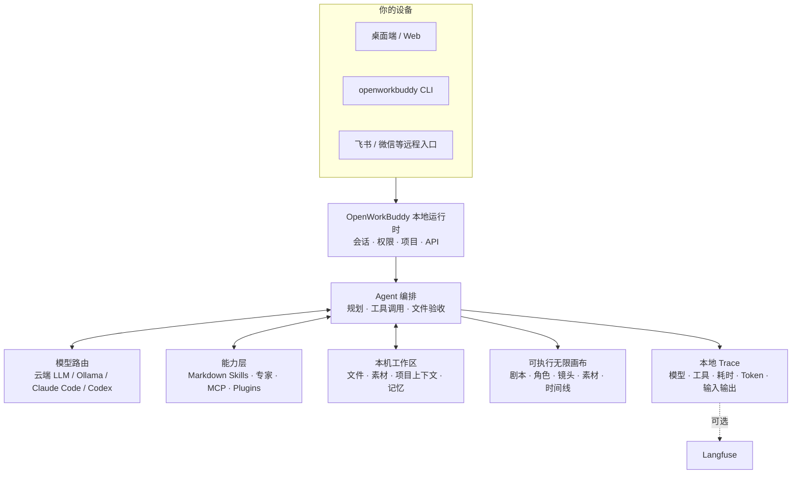

<p align="center">
 
</p>

<h1 align="center">OpenWorkBuddy</h1>

<p align="center">
 <b>跑在你自己电脑上的 AI 办公助理。</b><br>
 交代一句话，它自己规划、动手、验收，把 PPT / Word / Excel / 网页落到你硬盘上。<br>
 <b>给你的是能打开的文件，不是一段聊天记录。</b>
</p>

<p align="center">
 <sub>A local-first AI office agent that hands you files, not chat logs. · <a href="README.en.md"><b>English</b></a></sub>
</p>

<p align="center">
 <a href="#三分钟跑起来"><b>▶&nbsp;三分钟跑起来</b></a>
 &nbsp;·&nbsp; <a href="https://github.com/CatCatUncle/openworkbuddy/releases">下载安装包</a>
 &nbsp;·&nbsp; <a href="docs/功能清单.md">功能清单</a>
 &nbsp;·&nbsp; <a href="#文档">文档</a>
 &nbsp;·&nbsp; <a href="#交流群">交流群</a>
 &nbsp;·&nbsp; <a href="CHANGELOG.md">变更记录</a>
</p>

<p align="center">
 <a href="https://github.com/CatCatUncle/openworkbuddy/stargazers"></a>
 <a href="LICENSE"></a>
 <a href="docs/功能清单.md"></a>
 <a href="docs/功能清单.md"></a>
 <a href="docs/功能清单.md"></a>
 <a href="docs/功能清单.md"></a>
</p>

<p align="center">
 <sub>自己用、学习用、非营利用 <b>免费</b>；公司里用要授权，<a href="#协议">一句话讲清 ↓</a></sub>
</p>

<p align="center">
 
</p>

---

## 你说一句，它交给你

| 你说一句 | 它交给你 |
|---|---|
| 帮我出一份 Q3 复盘 PPT，数据用这个 Excel | 读表 → 算 → 一个能直接放的 `.pptx` |
| 调研国内 AI 陪伴产品，出一份报告 | 联网搜 → 逐个打开读 → Markdown / Word |
| 把这份材料做成手机上能看的网页 | 写 HTML → 起本机服务 → 扫码就能看（[成品](https://hunan-travel.pages.dev/)） |
| 每天 9 点抓行业新闻，做成晨报发我飞书 | 定时任务 + IM 推送，错过了会补跑 |

<p align="center">
 
</p>

> [!NOTE]
> 多任务并行、目标验收、👍👎 进自进化、双层记忆、权限档位、IM 远程指挥、桌面宠物…… 全部能力见 **[功能清单](docs/功能清单.md)**。

## 为什么是它

<table>
<tr>
<td width="50%" valign="top">

<b>📄 文件是真的。</b>

PPT / Word / Excel / 网页都真生成，成果面板里点开就能验收。说写了文件却不在磁盘上，当场拦下重做。

</td>
<td width="50%" valign="top">

<b>🔌 模型随便换，东西全在你手里。</b>

DeepSeek / 通义 / 智谱 / Kimi / OpenRouter / Ollama 界面点一下就切；本机装了 <b>Claude Code / Codex</b> 的，一键拿它当发动机，不用另买 token。会话、文件、Key 全在本机，默认只听 <code>127.0.0.1</code>。

</td>
</tr>
<tr>
<td width="50%" valign="top">

<b>🧩 加个能力 = 丢一个 Markdown 文件。</b>

存成 <code>skills/&lt;名字&gt;/skill.md</code>，存盘后下一条任务就生效——不改代码、不重启、不打包。

</td>
<td width="50%" valign="top">

<b>🔍 也适合拿来读懂 Agent。</b>

模型路由、工具调用、文件验收、记忆、权限、本地 Trace 全在同一个仓库里：一条真实任务，从它为什么这么做到最后交了什么，你都看得见。

</td>
</tr>
</table>

## 三分钟跑起来

三条路都是完整功能，没有哪条是阉割版。

**macOS 一句话装好**（下载 → 装进「应用程序」→ 摘掉隔离标记 → 打开）：

```bash
curl -fsSL https://raw.githubusercontent.com/CatCatUncle/openworkbuddy/main/install-mac.sh | bash
```

> ⚠️ **手动下 dmg 的话，第一次打开一定会弹「未打开“OpenWorkBuddy”· Apple 无法验证…」，弹窗里只有「完成 / 移到废纸篓」。**
> 这是苹果对没买证书的应用的统一拦截，不是包有毒——证书正在申请，批下来这一步就消失了。
> **点「完成」→ 系统设置 → 隐私与安全性 → 滚到最下面 → 点「仍要打开」→ 输开机密码**，只需要做这一次。
> 上面那句 `curl` 全程一个弹窗都没有，嫌麻烦直接走它。三条路的详细步骤在下面「第一次打开被系统拦住」那一段。

**Windows / 手动下包**：去 [Releases](https://github.com/CatCatUncle/openworkbuddy/releases) 拿 `-win-setup.exe`（x64 和 ARM 同一个），双击即装；公司电脑不让装软件的拿免安装版 `-win-x64-portable.exe`（ARM 机器换成 `arm64`）。

**从源码跑**（Node.js 18+，零构建零框架，改完刷新就生效）：

```bash
git clone https://github.com/CatCatUncle/openworkbuddy.git
cd openworkbuddy && npm install
npm run app # 桌面版；或 npm start 走浏览器 http://localhost:3800
```

起来之后填一个模型 API Key，然后在输入框里说人话就行，比如「帮我做一份介绍 OpenWorkBuddy 的 PPT」。
你的东西都在 `~/OpenWorkBuddy`：配置、会话、成果文件、技能，**卸载不删**，换电脑整个搬走。

嫌字小、想换个皮肤：右上角头像 →「外观」，字号四档、五套主题、界面密度都在那一页。

<details open>
<summary><b>第一次打开被系统拦住 · 双击了没反应</b></summary>

<br>

代码签名证书还在申请（苹果一年 99 美元、Windows 一年几千块），所以现在发出去的包是 ad-hoc 签名的。
系统拦的是「这个开发者我没见过」，**不是「这个文件有毒」**——包里的签名本身完好，用 `codesign --verify --deep --strict` 自己验得出来。

**macOS · 三条路，挑一条**

1. **不想碰终端（推荐）**：双击 → 弹窗点**「完成」**（别点「移到废纸篓」）→ 打开**「系统设置 → 隐私与安全性」**→ 一直滚到最下面的「安全性」那一段，会看到「已阻止使用"OpenWorkBuddy"，因为它来自身份不明的开发者」→ 点**「仍要打开」**→ 输开机密码 → 再弹一次点**「打开」**。只需要做这一次。
2. **一句命令**：**先把 .app 从 dmg 拖进「应用程序」**（dmg 是只读卷，在里面跑这条会失败），然后
   ```bash
   xattr -dr com.apple.quarantine /Applications/OpenWorkBuddy.app
   ```
3. **一个弹窗都不想见**：用最上面那句 `curl`。浏览器下载的文件会被打上 `com.apple.quarantine` 标记，curl 下的不会——整条路径上没有 Gatekeeper。

> **别照着网上「右键 → 打开」的教程点。** 那条路只在 macOS 14 及更早有效，macOS 15 (Sequoia) 起苹果把它取消了，右键弹窗里已经没有第二个「打开」按钮——照着点会以为「就是打不开」。
>
> 如果提示的是**「已损坏，应将它移到废纸篓」**（而不是「无法验证」），那是签名真的被弄坏了——网盘、同步盘、某些解压工具都会干这事。重下一次，或者跑 `codesign --force --deep --sign - /Applications/OpenWorkBuddy.app` 就地重签。

**Windows**：弹「Windows 已保护你的电脑」时点灰色小字「更多信息」→「仍要运行」。
- **双击没反应**：启动日志在 `~/OpenWorkBuddy/logs/boot.log`，停在哪儿问题就在哪儿；源码跑的先来一句 `node cli.js doctor`。对照表 → [安装与启动](docs/安装与启动.md#双击了没反应)

</details>

镜像、端口占用、换数据目录 → [安装与启动](docs/安装与启动.md)　|　换电脑搬家 → [数据同步与搬家](docs/数据同步与搬家.md)

## 长这样

**「同一个人，换四个场景，手里举块写着字的牌子——要像随手拍的，别像 AI 图」**

<p align="center">
 
</p>

难的不是画人，是四张里得是同一个人、牌子上的中文不能糊。它先出一张，再用看图工具真去读自己刚生的那张（不是凭记忆吹），确认了才照这个方向铺开其余三张。

**「做个湖南旅游攻略网站，14 个市州一个都不能少」**

<p align="center">
 <a href="https://hunan-travel.pages.dev/"></a>
</p>

**<https://hunan-travel.pages.dev/>** —— 点开就能逛。一个 HTML 加一个图片文件夹，不挂任何外部 CDN，扔到静态托管上就是一个站。这不是截图拼的示意图，是它交出来的那份东西本身。

**「每天早上七点，把今天的天气和该注意的事发到我飞书」**

<p align="center">
 
</p>

一句话排出来的定时任务，人不在电脑前也照跑；每趟调了哪些工具、为什么这么说，都在「自动化 → 运行记录」里点得开。飞书 / 企微 / 钉钉 / Telegram 同一条路。

怎么做到的、本机 Claude Code 当发动机长什么样 → **[三个案例，拆开讲](docs/案例.md)**

## AI 短剧无限画布

剧本、角色、场景、分镜、参考图、视频、配音、时间线摆在同一张图上。连线不是装饰——它表示下一步生成真会去读的角色、首帧和声音。改哪个镜头，只有那个镜头重跑。

<p align="center">
 
</p>

左侧点「无限画布」就能开始。空白处拖拽平移，`Shift`+拖拽框选，`Shift`/`⌘` 点节点加选减选，底部对话框里能 `@` 引用任意节点和素材。

## 放服务器给团队用

一台干净的 VPS，装好 Docker 之后一条命令：

```bash
git clone https://github.com/CatCatUncle/openworkbuddy.git && cd openworkbuddy
bash deploy.sh --domain buddy.example.com # 自动 HTTPS，起来就对外能用
```

脚本会**等健康检查真的通过**才说成功，起不来就把日志打给你。数据全在 `./openworkbuddy-data` 一个目录里。

> [!IMPORTANT]
> **起来第一件事是注册管理员。** 第一个注册的就是超级管理员（每个组织只有一个，只能转让不能增发），之后默认不再允许别人自建账号——空实例挂在公网上，等于谁先访问谁是超管。

一个进程能同时给多家公司用，各租户互相看不见。管理员头像菜单 → **企业管理后台**：建组织、分席位、看用量、配安全策略。新人按部门模板开号（角色和月额度一次配好），人走了点一下，扫码连上的设备、他名下的定时任务、没用完的邀请码、二次验证、在跑的任务一起关——**关权限，不删数据**，完事出一张能贴进离职交接单的回执。

指标每分钟落一行，命中阈值推企业微信 / 钉钉，要接现成监控就抓 `/api/ops/metrics.prom`（和别的接口一样锁在平台管理员后面）。

反代、升级迁移、安全清单 → [部署](docs/部署.md)　|　[运维手册](deploy/README.md)　|　[多人协作](docs/多人协作.md)

## 配模型

**设置 → 模型**，挑渠道预设（OpenAI / Anthropic / OpenRouter / 火山方舟 / 百炼 / DeepSeek / 智谱 / Kimi / Ollama），地址和协议自动填好，只差粘 Key，保存即热生效。Key 粘歪了当场就说是第几个字符不对，不用等发出去收一个看不懂的 401。带 reasoning 的模型能在界面里关掉思考或调档。

生图 / 配音 / 生视频另配一张表，视频认五家协议（通义万相 · 火山方舟 Seedance · 智谱 CogVideoX · MiniMax 海螺 · 硅基流动）；认不准是哪家就不发那一趟——视频按条计费，白发一趟得等好几分钟才看见错。

还接了 **Jev 判断模型**（TypeSafe System One）：它不写字，只回是非 / 单选 / 打分，外加一个「有多确定」——所以它**不在模型下拉里**（它没有 `/chat/completions`，挂上去每趟都是 400）。**配过 OpenRouter 的人什么都不用填**，原来那把 Key 直接能用。

四个入口：命令行 `openworkbuddy jev`、接口 `/api/decide`、渠道卡上那颗认得出它的「测一下」，以及 **agent 手里的 `decide` 工具**——一趟问完 32 道题，低于门槛的那几条它挑出来交给你，不当定论往下走。产品里已经在用八处：目标模式的验收（每条标准一道是非题，过 70% 才打勾）；**triage 技能**的批量分拣（工单分派、简历初筛、反馈归类）——先拿十来条校判准，再跑批，最后交两份：能直接走的，和要人看的；以及定时任务的**「跑绿之后再看一眼」**——判成功那套判据正文一长就主动让路，于是 agent 写两千字解释它没办成也记一个勾，这一问专门盯那一段，只挂疑问不改判（默认关，在 设置 → 智能体设置 里开）；以及**自动续跑之前那道闸**——撞上步数或时间上限就当活儿还没干完、重置预算再来一整轮，可收尾对账也能把步数用光，那一轮买回来的只有一句「我又确认了一遍，都做完了」。续之前先问一句「交代的事还有没有剩的」，说没剩了并且确定度够，就不再续（默认关，同一处开；进度档里还有没打勾的条目时不问，那答案是白买的）。以及**名单外那条命令跑之前先判一句**——命令闸靠四张名单拦人，四张都没命中在「自动」档就是一声不吭直接跑，`git reset --hard`、`cat 模板 > 配置文件`、`docker volume rm` 都从这儿过去，而名单再加也补不完（每加一条都得先有人被坑过）。打开之后这类命令先花一道题问「撤不撤得回来」，说撤不回来、而且拿得准，就弹一张审批卡，批不批还是你说了算；说不准、答不上、问不成一律照旧跑（默认关，在 设置 → 安全中心 里开；只读命令不花钱，run_node 里的代码同样过这一道）。以及**记之前先判一句**——agent 自己调 `remember` 记下的每一条，都会跟着往后每一趟任务进系统提示词，而现在拦它的只有两条正则，认的是措辞：换个说法就拦不住，「这次把第 3 行改成了 8081」这种过程细节更是没固定措辞可认。打开之后写之前先问一句「这句话下个月还用得上吗」，说用不上、而且确定度到 80% 就不收，顺带告诉它该改成怎么记；你自己亲手敲的那份记忆不归它管，说不准、问不成一律照旧记下（默认关，在 设置 → 智能体设置 里开）。以及**定时任务没变化就不推**——一条每天跑的任务一年推 365 条，其中三百多条是「今天没有更新」，第十天群机器人就被静音了，然后真有更新的那天照样没人看：这个功能不是坏掉的，是被静音的。正则去不了这个重（两条「没有更新」中间夹着日期和耗时，字节上永远不一样；而「12.3 涨到 12.4」只差一个字符，却正是该响的那种）。打开之后推之前先问一句「跟上次推给你的那条比有没有新东西」，说没有并且拿得准就不响这一声铃——运行记录里正文一个字不少，旁边写明为什么没推。红的、出错的、挂了疑问的一律照推。比的是上一次**真推出去**的那条，所以判错一次也只是晚一天知道，攒下的变化下次会一起推给你（默认关，同一处开）。以及**打断你之前先判一句**——`ask_user` 是唯一不受循环守卫管的工具，连问四遍也不拦，而该拦它的理由本来就不是「问了几次」，是「这一问值不值得打断你」。打开之后头一问白放行；从第二问起，同一轮字面上问过的直接回上次的答案，没问过的先归一次类——关键信息、岔路、得你拍板照旧弹，只有「汇报进度 / 技术路线 / 自己查得到 / 又问一遍」这四类且确定度到 80% 才拦下，回给 agent 一段回执：按最合理默认继续、最终汇报里注明、判错了再问一次不拦。归类没答上来、问不成、两道题打架一律照旧弹——它只会少弹，不会替你挑答案（默认关，同一处开）。一道题约两万分之一美金。

对照表 → [配置模型](docs/配置模型.md)

> [!IMPORTANT]
> `config.json` 是唯一存 API Key 的文件，已经在 `.gitignore` 里，**别手滑提交**。

## 命令行也能用

`openworkbuddy` 跟桌面版**共用同一份**配置、技能、记忆、连接器和会话——终端里起的活儿，手机和网页上看得见、插得上话；桌面上做到一半，终端里 `openworkbuddy resume` 接着往下走。

```bash
npm link # 一次性：装成全局命令（也可以直接 node cli.js …）

openworkbuddy "帮我写一份本周周报" # 单发：跑完就退
openworkbuddy # 交互：连续对话，打一个 / 出命令菜单
cat error.log | openworkbuddy "这是什么问题" # 管道：管道内容当材料送进去
openworkbuddy -q "生成本周周报" > 周报.md # 文件里只有周报，没有进度条

openworkbuddy engines use claude-code # 换执行引擎：跑在你已经付过钱的订阅上，不烧 API 额度
```

单发和管道模式下**不会**反问你，脚本和 cron 里不会卡住。退出码说实话：`0` 成功、`1` 任务失败、`2` 参数写错、`130` Ctrl+C，所以 `openworkbuddy doctor && npm start` 拦得住没配好的机器。

`sessions` / `resume` / `engines` / `doctor` / `pair`（扫码把手机连上来）/ `worktree`，以及 `--mode` `--perm` `-C` `-f` `--json` 等全部参数 → **[命令行用法](docs/命令行用法.md)**

## 它是怎么搭的



这张图也是读代码的路线：从 `server.js` 进去，再看 `agent.js` 怎么编排模型和工具。细节 → [实现细节](docs/实现细节.md)

## 最新动态

- **09-22** **打 `/` 挑个技能，回车一按话就发出去了**——而人还没写要它做什么。认 `/` 的监听只 `preventDefault()`，拦掉的是换行，拦不住挂在同一个输入框上的那个发送监听；**要掐断的是传播，不是默认行为**。顺带补上 ↑↓ 挑人（以前选中永远钉在第一行，键盘上根本挑不动）。**装完技能得刷新页面才在 `/` 里找得到**也一并修了：那份名单只在开页面那一下拉过一次，现在改成用的时候顺手对一遍，技能中心装的、插件带的、命令行扔的都算
- **09-22** **手机上那排键，手指得贴着连点两三次才中**：390 宽的屏幕上量了一遍，50 个能点的东西里 9 颗不到 36px——发送键 32 见方，附件、侧栏、模型选择器全是 30 高。手指的接触面 8–10mm，落到 390 宽屏幕上就是 40px 上下。**这不是「小了点」，是同一个动作有时管用有时不管用**，而人分不清是自己没点准还是应用没反应。现在触屏上整套键抬到 44（行里夹着的那几颗给 40；chip 上那颗 × 用负外边距把热区从 chip 里溢出来，看着还是 18，点得着 32）。**分档按 pointer 而不是按窗口宽度**：桌面浏览器拉窄了仍然是鼠标在点，没必要为它牺牲密度。量完再量：触屏档 0 颗不到 44、0px 横向溢出，鼠标档一颗没动
- **09-22** **那只桌面宠物默认是开着的，而桌面上什么都没有**：后端三处都写着「没配过就是关」，只有设置页那张卡画成了勾上的——他会去查宠物为什么没出来，而不是去查这个勾为什么是勾上的。**界面替状态撒谎，比状态本身错更难查。** 顺手把开关搬出来：原来它埋在 设置 → 助理 往下滚的一张卡里，**开关存在但找不到，等于没有**。现在右上角头像菜单里紧挨着「语言」那行就是它，「开 / 关」点即切、菜单不关、原地翻，存不下当场翻回来并弹红字。纯服务端模式没有桌面窗口，这一行整个不画
- **09-22** **Release 页不告诉你这一版改了什么**：上面只有安装指南和一条 compare 链接，要知道改了什么得点进去翻二十个 commit。而那句话早就写好了，就是这份「最新动态」里的人话。现在发版正文最上面会自动摆上这一版新增的那几条，按 tag 区间挖（不按日期——同一天发两个 patch 时，日期口径会把上一版的再印一遍），挖不到就一个字不写
- **09-22** **会话太长要先压一压，而压的那十几秒屏幕上什么都没有**：压缩自己也要跟模型说一次话，而它正卡在「按下发送」和「第一个字」中间——一声不吭的话，屏幕上只有一个转不完的圈，人只能猜是模型卡了还是网断了。现在开跑先摆一行「正在把早前 20 条消息压成一份摘要…已等 8 秒（压完这一轮才开跑，原文归档不删）」，秒数跟着走。没有真进度可报，硬画一根匀速爬的进度条是骗人，所以只说能说准的两件事：在压什么、已经等了多久。**报了开头就必须有收尾**——压成了、压崩了、模型回了个空，都把同一行的字换掉而不是再摞一行；压崩了如实说哪一句报错、说清早前的内容一条没动，并指一下去哪调预算
- **09-22** **设置里那个「看图模型」，把本来就会看图的主模型挤掉了**：以前的判据只有一条——那个槽填没填，填了就一律绕开主模型。于是真实配置里，主模型和看图槽填的是同一个型号、只是两条渠道，多一把 Key、多一份限流额度，那条一路 429，主模型这边一次就过。现在按设置页一直写着的那句话走：**单配的看图模型是给「主模型看不了图」的人预备的**；主模型自己会看图就直接用它，并在答案末尾交代一句「没绕到单配的 X」——绕过他亲手配的东西却不说，那条配置在他眼里就是没了。勾错了也不让图白丢：主模型回 400「不支持图片」时，单配的那条自动顶上
- **09-22** **你拖进去让它看的那张图，转头出现在「本回合产出」里**：附件是先传后发的，而新开一条对话时会话 id 要等到按下发送才生成——传图那一刻带过去的是 `null`，图就落在任务目录的上一级。agent 在自己工作目录里翻不到，只好 find 一圈再 cp 一份进来，那份副本是这一轮新写的文件，于是输入被如实记成了产出。现在 id 在传附件那一刻就取
- **09-22** **发出去之后，刚才拖进去的是哪张图，界面上只剩一个文件名**：输入框上那排缩略图是发送前的事，气泡里只剩一颗点不动的回形针 chip。现在图片在气泡上面摆成真缩略图（跟气泡右边缘对齐，最长边 220px），文件仍是带名字的 chip——图看画面、文件看名字；两者点一下都开右边那张预览卡，卡上有「下载」和「打开所在位置」。读不出来的降成一颗写着名字的灰 chip 并说清楚为什么，不给人看一个空灰框
- **09-21** **按「引用」，输入框里多出 400 字别人的话；拖张图，多出一行【图片 1：xxx.png】**：这两样都是发给模型看的协议，却一直往人的输入框里灌——引完得先翻过自己引的那一坨才能接着写，图片那行删错一个字锚点就废了。现在照飞书 / ChatGPT 的做法：引用钉成输入框上的一张卡（谁说的 · 两行封顶 · × 撤掉 · 点一下跳回原文），在回复里拖选一段还会就地冒出「引用这段」；图片变成输入框上面那排 64px 缩略图，文件仍是带名字的宽 chip。协议推迟到按下发送那一刻才拼进正文：发给模型的字节一个没变，老会话回放不差一个字。气泡里也把这两样折起来——但写在句子中间的锚点一个字不动，折掉的话「把【图片 1：a.png】放左边」会变成「把放左边」
- **09-21** **想知道本机的 Claude Code / Codex 能不能用，得先切过去用它一回**：唯一说实话的「测试连接」长在展开区里，而展开区只对已经选中的引擎渲染。现在每张装了的卡上都能当场试；徽章也不再拿 `--version` 当「能用」发绿——没真跑过只说「本机有 2.1.278」，绿留给真跑通的那一次
- **09-21** **「本回合产出」里冒出一堆在别处见过的文件名**：文件没串台，是一包 122 个文件被拆成了一张张卡，真做出来的那份方案反倒被挤到只剩一张卡位。整包现在折成一张文件夹卡，下面的变更清单一条不少
- **09-21** **手机配对的二维码里，那个地址是猜出来的**：老做法翻到第一个私网 IP 就用，而代理隧道、Docker 网桥完全可能排在真网卡前面。现在按网卡排序，一次给最多 3 个候选，界面上写「打不开？换一个地址」
- **09-21** **快捷键表上有一条按下去只会弹「暂未支持」**：⌘D 语音录制从头到尾没实现过，却跟其余 18 条排在一起长得一模一样。删掉，并加一道闸把占位动作、空动作、只在表上的一并拦住
- **09-21** **搜索只认 Jina / Tavily / Brave 三家，国内用户得先翻出去才能搜**：现在八家，国内优先——博查、智谱、七牛云，海外 Tavily / Serper / Jina / Brave，外加一路「自定义」（POST 一个 JSON、回一个结果数组就能接，自建 SearXNG 也行）。配了几家就顺延几家，前面那家挂了自动换下一家，最后才落到不要 Key 的免费通道；账单记的是真正出结果的那家，不是你在设置里选的那家。
- **09-21** **跑到一半进程没了的那一轮，历史里永远转着「运行中…」，还找不到哪儿能停**：回放是拿「回答」那条记录收尾的，一问后面没有回答就没人给它画终点——偏偏这时 runningSessions 里根本没有它，界面上一颗能停的钮都找不到。现在按「断了」收尾：写「中断了 · 1 步」，标题上说清楚为什么。
- **09-21** **答过的岔路，每次打开这条对话都重新问一遍**：`done` 这个类同时担着「不能再点了」和「结论已经画上去了」两件事，回放为了前一件先给它加上，画结论那一步于是被自己人拦住。拆成两个标记之后，同一条对话回放出来是「这个岔路你定过了 · 你选了 XXX」。

更早的看 **[变更记录](CHANGELOG.md)**。

## ⚠️ 这个 agent 手里有 shell

> [!WARNING]
> 它能执行命令、读写文件、访问网络——所以闸门是真拦的：命令审批、文件黑名单、URL 白名单、审计日志、四档权限。
> **放到公网前务必先读 [安全](docs/安全.md)**，默认配置只为本机使用而调。

**装别人的技能之前，它会先体检一遍。** 一个技能就是一份给 agent 看的指令，接到一个能在你机器上敲命令的东西上——这跟 `npm install` 不一样，npm 包要你 `require` 才跑，技能是它自己会去读、会照着做的。所以装之前先过 34 条静态规则，然后把看到的摊开给你，落到三档：直接装 / 看一眼再装 / 默认不装（不打分，分数只会让人养成「42 分应该还行」的习惯）。其中 10 条真拦（反弹 shell、`curl | bash`、读 SSH 私钥、抹盘、抹痕迹……），管理员能强装，但那一下会记进 `.install.json`。

**它不是杀毒。** 公开标注集上纯静态规则大概七成五，四个漏一个。本机装了 [toolward](https://github.com/CatCatUncle/toolward) 就自动当第二把尺子用，合的规矩是只严不松。最后这条比上面所有规则都重要：**装之前自己读一眼 `skill.md`**，它是 Markdown，不是二进制。

怎么判的、为什么留强装口子 → [安全](docs/安全.md)　|　[安全基线](docs/安全基线.md)

## 交流群

用崩了、有想法、想一起改，进飞书群直接说：

<p align="center">
 
</p>

## 一起把它做下去

- **用崩了、卡住了，开个 [issue](https://github.com/CatCatUncle/openworkbuddy/issues/new)**，哪怕只贴一句报错——你以为「只有我遇到」的坑，多半所有人都在踩。贴之前扫一眼，别把 API Key 带上。
- **10 分钟** 写个技能：一个 Markdown 存成 `skills/<名字>/skill.md`，存盘即生效，[模板在这](CONTRIBUTING.md#提交一个技能3-分钟)
- **一晚上** 挑个 issue 改：`npm install && npm start` 就跑起来，`npm test` 不用 API Key 也能全绿

项目结构、测试、PR 规范都在 [参与贡献](CONTRIBUTING.md)。不用先开 issue 问，直接发 PR。

## 文档

| 文档 | 一句话 | 文档 | 一句话 |
|---|---|---|---|
| [功能清单](docs/功能清单.md) | 全部能力、技能与工具 | [部署](docs/部署.md) | 服务器 / Docker / 反代 |
| [案例](docs/案例.md) | 上面那几张图怎么做出来的 | [多人协作](docs/多人协作.md) | 多租户、账号、权限、额度 |
| [安装与启动](docs/安装与启动.md) | 安装包、源码、常见卡壳 | [安全](docs/安全.md) | 审批闸门、黑白名单、审计 |
| [配置模型](docs/配置模型.md) | 各家 base_url / 模型名对照 | [数据同步与搬家](docs/数据同步与搬家.md) | 数据存哪、换电脑怎么搬 |
| [命令行用法](docs/命令行用法.md) | CLI 参数、管道、`--json`、cron | [开源与商业版边界](docs/开源与商业版边界.md) | 买授权到底买到什么 |
| [扩展](docs/扩展.md) | 写技能、接 MCP、装插件、建专家 | [路线图](docs/路线图.md) | 接下来做什么、怎么算做完 |
| [IM 与定时任务](docs/IM与定时任务.md) | 飞书 / QQ / 企微 / 微信 / 钉钉 | [变更记录](CHANGELOG.md) | 一句话一条，最新在上 |
| [实现细节](docs/实现细节.md) | agent 主循环怎么转的 | [参与贡献](CONTRIBUTING.md) | 项目结构、测试、提 PR |
| [安全基线](docs/安全基线.md) | 数据落在哪、谁看得见、哪些没做到 | [远程访问](docs/远程访问.md) | 手机/外网连本机，两个开关默认关着 |

## 同一个作者的其他项目

- **[toolward](https://github.com/CatCatUncle/toolward)** —— 给 agent 用的技能 / MCP 连接器静态安检：37 条规则分六族，零运行时依赖。`npm i -g toolward` 装上，OpenWorkBuddy 自动把它当第二把尺子用，不装也完全不影响。同样是 PolyForm Noncommercial。

## 协议

一句话：**自己用、学习用、非营利机构用——免费；拿去赚钱（公司内部提效也算）——找作者买商业授权。**
协议是 [PolyForm Noncommercial 1.0.0](LICENSE)，哪些算商用、怎么谈见 [COMMERCIAL-LICENSE.md](COMMERCIAL-LICENSE.md)。

**买授权不解锁功能。** 只有一份代码，就是这个仓库，你看到的就是全部：Agent 主循环、40+ 工具、短剧画布、IM 远程指挥、执行追踪、自进化与记忆，连多租户和企业管理后台都在里面——没有功能开关，没有试用倒计时，没有灰按钮。买的是另外三样：一张允许你拿它赚钱的许可证、商标与白标的口子、能找到人的支持 → [开源与商业版边界](docs/开源与商业版边界.md)

**有一部分连非商业限制都没有。** 部署配置、CI 流水线、脚本、评测集、技能模板、文档里的示例代码，额外按 MIT 发布 → [LICENSE-ECOSYSTEM.md](LICENSE-ECOSYSTEM.md)。而**你自己写的技能、插件、连接器配置是你自己的作品**，跟这份协议无关。

这份协议**不授予**任何第三方产品、商标、logo、品牌素材或截图的权利，那些归各自权利人。

Copyright (c) 2026 开发者猫叔

## 免责与边界

**这是什么。** OpenWorkBuddy（仓库 `CatCatUncle/openworkbuddy`）是 开发者猫叔 从零写起的独立开源项目，源码全在本仓库。架构、工具协议、权限模型、记忆与自进化都是自行设计实现；借鉴过的外部项目在 [NOTICE.md](NOTICE.md) 第四节逐条列了。名字是 `Work` + `Buddy` 两个通用英文词加开源项目通行的 `Open-` 前缀，直白描述这个项目做的事。

**与第三方的关系：没有。** 本项目与腾讯公司及其 WorkBuddy 产品无任何关联、授权、赞助或背书，不含其任何代码、素材、界面资源或非公开信息。「WorkBuddy」若为他人注册商标，权利归各自权利人；文档中提及第三方名称时仅为说明兼容性或做事实区分（指示性使用）。对接飞书、企业微信、QQ 等一律走各自**公开发布**的开放接口，不涉及逆向工程。

**权利人若觉得哪里不妥**，请通过 [Issues](https://github.com/CatCatUncle/openworkbuddy/issues) 或 [COMMERCIAL-LICENSE.md](COMMERCIAL-LICENSE.md) 里的方式直接联系我，核实后尽快改。

## 支持这个项目

<p align="center">
 <a href="https://github.com/CatCatUncle/openworkbuddy">
 
 </a>
</p>

<p align="center">
 <a href="https://github.com/CatCatUncle/openworkbuddy"></a>
</p>

<p align="center">
 <sub>顺手把它转给一个天天手搓 PPT、周报、会议纪要的同事，比一百次曝光管用。</sub>
</p>

## 贡献者

感谢每一个动手改过这个项目的人。想加入他们：[参与贡献](CONTRIBUTING.md)。

<p align="center">
<a href="https://github.com/CatCatUncle/openworkbuddy/graphs/contributors">
 
</a>
</p>

## Star 历史

<p align="center">
<a href="https://star-history.com/#CatCatUncle/openworkbuddy&Date">
 <picture>
 <source media="(prefers-color-scheme: dark)" srcset="https://api.star-history.com/svg?repos=CatCatUncle/openworkbuddy&type=Date&theme=dark">
 
 </picture>
</a>
</p>
