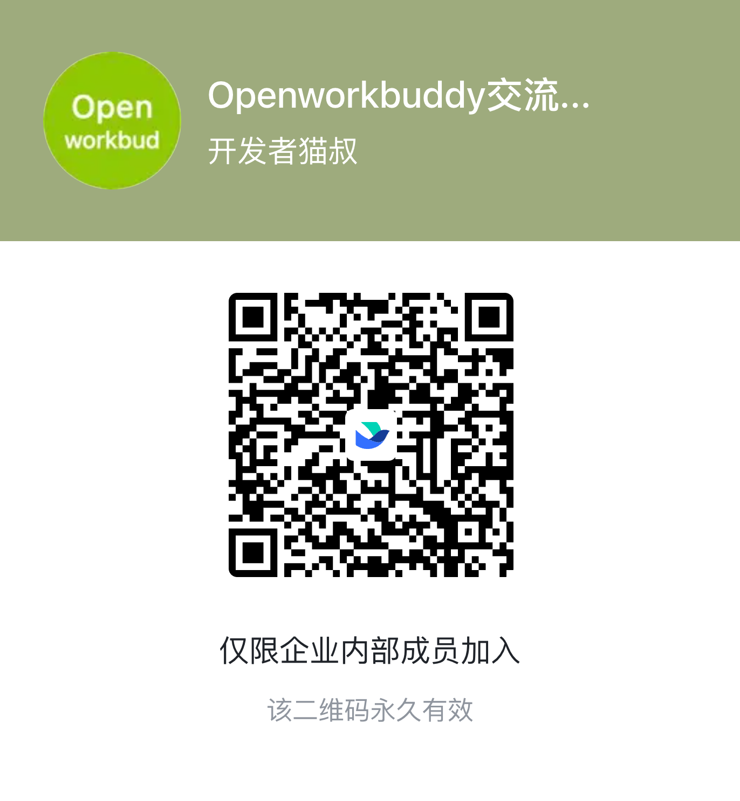

<p align="center">
  
</p>

<h1 align="center">OpenWorkBuddy</h1>

<p align="center">
  <b>一个真吐文件的本机 AI 办公 agent。</b><br>
  说一句人话，它自己规划、动手、验收——交给你的是能直接打开的 PPT / Word / Excel / 网页，<b>不是一段聊天记录</b>。
</p>

<p align="center">
  <sub>A local-first AI office agent that hands you files, not chat logs. → <a href="README.en.md"><b>English README</b></a></sub>
</p>

<p align="center">
  <a href="#跑起来"><b>⚡ 30 秒跑起来</b></a> ·
  <a href="https://github.com/CatCatUncle/openworkbuddy/releases">下载安装包</a> ·
  <a href="#最新动态">最新动态</a> ·
  <a href="#交流群">飞书交流群</a> ·
  <a href="docs/功能清单.md">功能清单</a>
</p>

<p align="center">
  <a href="https://github.com/CatCatUncle/openworkbuddy/stargazers"></a>
  <a href="https://github.com/CatCatUncle/openworkbuddy/forks"></a>
  
  
  <a href="LICENSE"></a>
</p>

<p align="center">
  <b>⭐ 觉得有用就点个 Star</b> —— 这个项目没有推广预算，能不能被搜到，基本取决于这个数字。<br>
  <sub>个人、学习、非营利用途<b>免费</b>；公司里用需要授权，<a href="#协议">一句话讲清 ↓</a></sub>
</p>

---

## 为什么是它

**交付的是文件，不是聊天记录。** PPT / Word / Excel / 网页都是真生成的，成果面板里点开就能验收。声称写了文件却不在磁盘上，会被当场拦下重做。

**不绑任何一家模型，东西都在你手里。** DeepSeek / 通义 / 智谱 / Kimi / OpenRouter / Ollama 本地模型界面点一下就切；本机装了 **Claude Code / Codex** 的，一键拿它当发动机，不再另买 token。自托管，会话、文件、Key 全在本机，默认只监听 `127.0.0.1`。

**加一个能力 = 丢一个 Markdown 文件。** 放进 `skills/`，存盘后下一条任务就生效——不改代码、不重启、不打包。往外接 MCP 连接器和 [Agent Plugins](https://agent-plugins.org) 开放标准，别人的插件粘个 GitHub 地址就装。

## 它替你做完的事

| 你说一句 | 它交给你 |
|---|---|
| 帮我出一份 Q3 复盘 PPT，数据用这个 Excel | 读表 → 算 → 一个能直接放的 `.pptx` |
| 调研国内 AI 陪伴产品，出一份报告 | 联网搜 → 逐个打开读 → Markdown / Word |
| 把这份材料做成手机上能看的网页 | 写 HTML → 起本机服务 → 扫码就能看 |
| 每天 9 点抓行业新闻，做成晨报发我飞书 | 定时任务 + IM 推送，错过了会补跑 |

> 还有多任务并行、Goal 目标验收、👍👎 反馈进自进化、双层记忆、权限档位、IM 远程指挥、桌面宠物……全部能力见 **[功能清单](docs/功能清单.md)**。

## 跑起来

**装包**：去 [Releases](https://github.com/CatCatUncle/openworkbuddy/releases) 下对应的包，打开后**五步向导**带你注册账号、粘 Key（当场验活）、选引擎——三分钟内说出第一句话。

| 系统 | 下哪个 |
|---|---|
| macOS · Apple 芯片 | `OpenWorkBuddy-*-mac-arm64.dmg` |
| macOS · Intel | `OpenWorkBuddy-*-mac-x64.dmg` |
| Windows 10/11（x64 与 ARM 同一个包，装时自动选） | `OpenWorkBuddy-*-win-setup.exe` |
| Windows 免安装版（U 盘/公司电脑不让装软件） | `OpenWorkBuddy-*-win-x64-portable.exe` / `-win-arm64-portable.exe`（不知道自己是哪种 CPU 就拿 `-win-portable.exe`，两种都装在里面，体积翻倍） |

> macOS 第一次打开提示「无法验证开发者」——包没买苹果证书签名，不是有毒。右键 → 打开，或 `xattr -cr /Applications/OpenWorkBuddy.app`。你的数据在 `~/OpenWorkBuddy`，卸载不会删。

**从源码**（Node.js 18+，零构建零框架，改完刷新即生效）：

```bash
git clone https://github.com/CatCatUncle/openworkbuddy.git
cd openworkbuddy && npm install
npm run app     # 桌面版；或 npm start 走浏览器 http://localhost:3800
```

然后在输入框里说人话，比如「帮我做一份介绍 OpenWorkBuddy 的 PPT」。看着不顺眼就改：头像菜单 → **外观**，语言（中文 / English）/ 主题 / 六套皮肤 / 字号四档 / 字体 / 紧凑密度，点一下立刻生效。切成 English 后 AI 的回答和它写给你的文件也跟着用英文；首次开箱向导右上角就能切。（v1 只翻界面：服务端推过来的步骤标题、飞书/微信里的回复暂时还是中文。）

镜像、一键脚本、端口占用、启动卡住 → [安装与启动](docs/安装与启动.md)

## 配模型

**设置 → 模型**，选渠道预设（OpenAI / Anthropic / OpenRouter / 火山方舟 / 百炼 / DeepSeek / 智谱 / Kimi / Ollama），地址和协议自动填好，只差粘 Key，保存即热生效。对照表见 [配置模型](docs/配置模型.md)。带 reasoning 的模型能在界面里**关掉思考或调档**。

> `config.json` 是唯一存着 API Key 的文件，已在 `.gitignore` 里，**别手滑提交**。

## 命令行也能用

`wb` 跟桌面版共用同一份配置、技能、记忆和连接器，答案落到 stdout，能塞进任何管道、脚本和 cron：

```bash
npm link                                   # 一次性：把 wb 装成全局命令
wb "帮我写一份本周周报"                     # 单发：跑完就退，退出码 0/1 说实话
cat error.log | wb "这是什么问题"           # 管道：内容当附加材料一起送进去
wb --json "整理会议纪要" | jq -j 'select(.type=="text") | .delta'   # NDJSON 事件流给脚本用
wb engines && wb engines use claude-code   # 本机装了 Claude Code / Codex？一键拿它当底层
```

`-q` 只要答案、`-c` 续上一轮、`-C <目录>` 指定工作目录、`wb sessions` 列会话。全部参数 → [命令行用法](docs/命令行用法.md)。

## 最新动态

- **09-09** 中英文切换：外观页 / 首次向导一键切，整页即时翻、AI 回复跟着走
- **09-09** 外观页：主题 / 六套皮肤 / 字号四档 / 字体 / 紧凑密度，点一下生效
- **09-08** 首次开箱五步向导：新装打开就带你配好模型、引擎、IM，不用翻文档
- **09-08** 本机 **Claude Code / Codex** 当引擎：记忆、技能、读文件、生图配音全接上；每个引擎可选模型与思考档
- **09-08** 带 reasoning 的模型可以**关掉思考**或调强度，本机 CLI 跟着 app 设置走
- **09-08** 对话轨迹条 + 👍👎 反馈闭环：踩过的坑进自进化提案，人点头才生效
- **09-08** 助理设置页重排：四分区、双栏卡片、每张卡「连接 / 取消连接」
- **09-07** 定时任务加「假绿」裁定：没抛异常不等于干成了
- **09-05** 命令行 `wb`：单发 / 交互 / 管道 / `--json`，退出码说实话
- **09-03** 应用内直接预览 docx / xlsx / pptx / zip / csv
- **08-31** 粘贴、拖拽文件和图片进对话，agent 真能看懂图

完整变更看 [commit 历史](https://github.com/CatCatUncle/openworkbuddy/commits/main)，每条提交信息都写了「为什么」。

## ⚠️ 这个 agent 手里有 shell

它能执行命令、读写文件、访问网络——所以闸门是真拦的：命令审批、文件黑名单、URL 白名单、审计日志、四档权限。**放到公网前务必先读 [安全](docs/安全.md)**，默认配置只为本机使用而调。

## 交流群

用崩了、有想法、想一起改，进飞书群直接说。飞书扫码：

<p align="center">
  
</p>

## 一起把它做下去

**用崩了、卡住了，开个 [issue](https://github.com/CatCatUncle/openworkbuddy/issues/new) —— 哪怕只贴一句报错。** 你以为「只有我遇到」的坑，多半所有人都在踩。贴之前扫一眼，别把 API Key 带上。

**想动手，按投入从小到大三条路：**

- **10 分钟** —— 写个技能。一个 Markdown 文件丢进 `skills/`，存盘即生效，[三分钟模板在这](CONTRIBUTING.md#提交一个技能3-分钟)
- **1 小时** —— 补一个模型渠道预设、修一处文档、给某个文件格式加上预览
- **一晚上** —— 挑个 issue 改。`npm install && npm start` 就跑起来，`npm test` 不需要 API Key 就能全绿

项目结构、测试、PR 规范都在 [参与贡献](CONTRIBUTING.md)。不用先开 issue 问，直接发 PR。

## 文档

| | |
|---|---|
| [功能清单](docs/功能清单.md) | 全部能力、内置技能与工具 |
| [安装与启动](docs/安装与启动.md) | 安装包、源码、Windows、常见卡壳 |
| [配置模型](docs/配置模型.md) | 各服务商 base_url / 模型名对照 |
| [命令行用法](docs/命令行用法.md) | CLI 参数、管道、`--json`、脚本和 cron |
| [扩展](docs/扩展.md) | 写技能、接 MCP、装插件、建专家 |
| [IM 与定时任务](docs/IM与定时任务.md) | 飞书 / QQ / 企微 / 微信 / 钉钉，cron |
| [多人协作](docs/多人协作.md) | 多租户、账号、权限、积分额度 |
| [安全](docs/安全.md) | 审批闸门、黑白名单、审计 |
| [部署](docs/部署.md) | 服务器 / Docker / 反代 |
| [实现细节](docs/实现细节.md) | agent 主循环怎么转的 |
| [参与贡献](CONTRIBUTING.md) | 项目结构、测试、提 PR |

## 协议

一句话：**自己用、学习用、非营利机构用——免费；拿去赚钱（公司内部提效也算）——找作者买商业授权。**
协议是 [PolyForm Noncommercial 1.0.0](LICENSE)，哪些算商用、怎么谈见 [COMMERCIAL-LICENSE.md](COMMERCIAL-LICENSE.md)。

Copyright (c) 2026 开发者猫叔

## 免责

本项目是对腾讯 WorkBuddy 产品形态的独立开源实现，与腾讯没有任何关系，不含其任何代码或资源。「WorkBuddy」是其权利人的商标。
