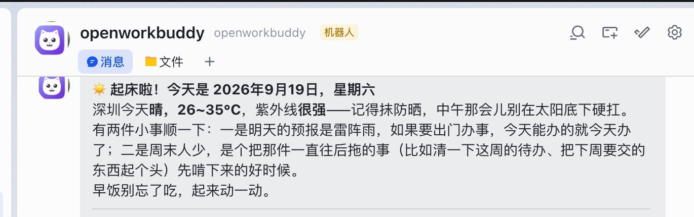
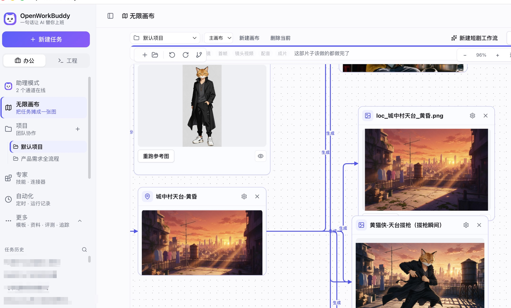
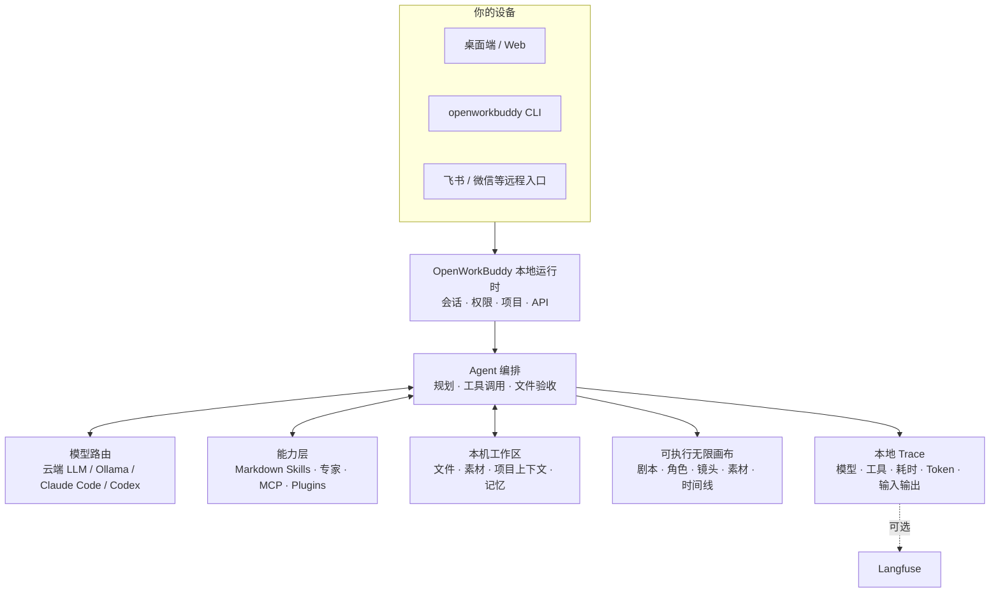

<p align="center">
  
</p>

<h1 align="center">OpenWorkBuddy</h1>

<p align="center">
  <b>跑在你自己电脑上的 AI 办公助理。</b><br>
  交代一句话，它自己规划、动手、验收，把 PPT / Word / Excel / 网页落到你硬盘上。<br>
  <b>给你的是能打开的文件，不是一段聊天记录。</b>
</p>

<p align="center">
  <sub>A local-first AI office agent that hands you files, not chat logs. · <a href="README.en.md"><b>English</b></a></sub>
</p>

<p align="center">
  <a href="https://github.com/CatCatUncle/openworkbuddy/releases"><b>⬇&nbsp;下载安装包</b></a>
  &nbsp;·&nbsp; <a href="#三分钟跑起来">三分钟跑起来</a>
  &nbsp;·&nbsp; <a href="docs/功能清单.md">功能清单</a>
  &nbsp;·&nbsp; <a href="#文档">文档</a>
  &nbsp;·&nbsp; <a href="#交流群">交流群</a>
  &nbsp;·&nbsp; <a href="CHANGELOG.md">变更记录</a>
</p>

<p align="center">
  <a href="https://github.com/CatCatUncle/openworkbuddy/stargazers"></a>
  <a href="LICENSE"></a>
  <a href="docs/功能清单.md"></a>
  <a href="docs/功能清单.md"></a>
  <a href="docs/功能清单.md"></a>
  <a href="docs/功能清单.md"></a>
</p>

<p align="center">
  <sub>自己用、学习用、非营利用 <b>免费</b>；公司里用要授权，<a href="#协议">一句话讲清 ↓</a></sub>
</p>

<p align="center">
  
</p>

---

## 你说一句，它交给你

<p align="center">
  
</p>

| 你说一句 | 它交给你 |
|---|---|
| 帮我出一份 Q3 复盘 PPT，数据用这个 Excel | 读表 → 算 → 一个能直接放的 `.pptx` |
| 调研国内 AI 陪伴产品，出一份报告 | 联网搜 → 逐个打开读 → Markdown / Word |
| 把这份材料做成手机上能看的网页 | 写 HTML → 起本机服务 → 扫码就能看（[成品](https://hunan-travel.pages.dev/)） |
| 每天 9 点抓行业新闻，做成晨报发我飞书 | 定时任务 + IM 推送，错过了会补跑 |

> [!NOTE]
> 多任务并行、目标验收、👍👎 进自进化、双层记忆、权限档位、IM 远程指挥、桌面宠物…… 全部能力见 **[功能清单](docs/功能清单.md)**。

## 为什么是它

<table>
<tr>
<td width="50%" valign="top">

<b>📄 文件是真的。</b>

PPT / Word / Excel / 网页都真生成，成果面板里点开就能验收。说写了文件却不在磁盘上，当场拦下重做。

</td>
<td width="50%" valign="top">

<b>🔌 模型随便换，东西全在你手里。</b>

DeepSeek / 通义 / 智谱 / Kimi / OpenRouter / Ollama 界面点一下就切；本机装了 <b>Claude Code / Codex</b> 的，一键拿它当发动机，不用另买 token。会话、文件、Key 全在本机，默认只听 <code>127.0.0.1</code>。

</td>
</tr>
<tr>
<td width="50%" valign="top">

<b>🧩 加个能力 = 丢一个 Markdown 文件。</b>

存成 <code>skills/&lt;名字&gt;/skill.md</code>，存盘后下一条任务就生效——不改代码、不重启、不打包。

</td>
<td width="50%" valign="top">

<b>🔍 也适合拿来读懂 Agent。</b>

模型路由、工具调用、文件验收、记忆、权限、本地 Trace 全在同一个仓库里：一条真实任务，从它为什么这么做到最后交了什么，你都看得见。

</td>
</tr>
</table>

## 长这样

**「同一个人，换四个场景，手里举块写着字的牌子——要像随手拍的，别像 AI 图」**

<p align="center">
  
</p>

难的不是画人，是**四张里得是同一个人**、牌子上的中文不能糊。它先出一张，再用看图工具真去读自己刚生的那张（不是凭记忆吹），确认了才照这个方向铺开其余三张。

**「做个湖南旅游攻略网站，14 个市州一个都不能少」**

<p align="center">
  <a href="https://hunan-travel.pages.dev/"></a>
</p>

上面是首屏和全省索引两屏。往下还有 14 张城市卡，每张写清门票多少钱、几点开门、玩多久、吃哪口、避哪个坑，外加 3 / 5 / 7 天三条排好的路线。

**<https://hunan-travel.pages.dev/>** —— 点开就能逛。一个 HTML 文件加一个图片文件夹，排版、动效、配色全在那一个文件里，不挂任何外部 CDN，扔到静态托管上就是一个站。这不是截图拼的示意图，是它交出来的那份东西本身。

**「每天早上七点，把今天的天气和该注意的事发到我飞书」**

<p align="center">
  
</p>

这条是一句话排出来的：它自己去查当天的天气，写成人话推到飞书——不是套模板，明天有雨就多说一句「今天能办的今天办」。人不在电脑前也照跑；每一趟的完整执行过程都在「自动化 → 运行记录」里，点开就是那一趟调了哪些工具、为什么这么说。飞书 / 企微 / 钉钉 / Telegram 都是同一条路。

怎么做到的、本机 Claude Code 当发动机长什么样 → **[三个案例，拆开讲](docs/案例.md)**

## AI 短剧无限画布

剧本、角色、场景、分镜、参考图、视频、配音、时间线摆在同一张图上。连线不是装饰——它表示下一步生成真会去读的角色、首帧和声音。改哪个镜头，只有那个镜头重跑。

<p align="center">
  
</p>

左侧点「无限画布」就能开始。空白处拖拽平移，`Shift`+拖拽框选，底部对话框里能 `@` 引用任意节点和素材。

## 三分钟跑起来

三条路都是完整功能，没有哪条是阉割版：

| 🖥️ 装在自己电脑上 | 🐳 放服务器给团队用 | 🏢 公司要落地 |
|---|---|---|
| 下个包双击，五步向导，数据全在本机 | 一台 VPS + Docker，一条命令，自带 HTTPS | 还要 SSO、审计外送、内网部署、SLA |
| [下载安装包 ↓](https://github.com/CatCatUncle/openworkbuddy/releases) | [部署文档 →](docs/部署.md) | [商业授权 →](COMMERCIAL-LICENSE.md) |

<details>
<summary><b>下哪个包 · 第一次打开被系统拦住怎么办</b></summary>

<br>

| 系统 | 下哪个 |
|---|---|
| macOS · Apple 芯片 | `OpenWorkBuddy-*-mac-arm64.dmg` |
| macOS · Intel | `OpenWorkBuddy-*-mac-x64.dmg` |
| Windows 10/11（x64 与 ARM 同一个包） | `OpenWorkBuddy-*-win-setup.exe` |
| Windows 免安装版（**装不了软件时才用**，每次启动要先解压到 `%TEMP%`，第一次可能等几分钟） | `OpenWorkBuddy-*-win-x64-portable.exe` |

**第一次打开会被系统拦一下**，因为这个包没买代码签名证书（苹果一年 99 美元、Windows 一年几千块，这是个免费开源项目），不是有毒。

- **Windows**：弹窗里点灰色小字「更多信息」→「仍要运行」。
- **macOS**：拖进「应用程序」后终端跑 `xattr -dr com.apple.quarantine /Applications/OpenWorkBuddy.app`，或 系统设置 → 隐私与安全性 →「仍要打开」（右键「打开」那条路 macOS 15 起被苹果取消了）。
- 数据在 `~/OpenWorkBuddy`，卸载不删，换电脑整个搬走 → [数据同步与搬家](docs/数据同步与搬家.md)。
- 双击没反应？启动日志在 `~/OpenWorkBuddy/logs/boot.log`，对照 [安装与启动](docs/安装与启动.md#双击了没反应) 排查。

</details>

**从源码跑**（Node.js 18+，零构建零框架，改完刷新就生效）：

```bash
git clone https://github.com/CatCatUncle/openworkbuddy.git
cd openworkbuddy && npm install
npm run app     # 桌面版；或 npm start 走浏览器 http://localhost:3800
```

> [!TIP]
> 起来之后在输入框里说人话就行，比如「帮我做一份介绍 OpenWorkBuddy 的 PPT」。
> 看着不顺眼就改：头像菜单 → **外观**，中文 / English、主题、六套皮肤、字号字体，点一下立刻生效。

镜像、一键脚本、端口占用 → [安装与启动](docs/安装与启动.md)

## 放服务器给团队用

一台干净的 VPS，装好 Docker 之后一条命令：

```bash
git clone https://github.com/CatCatUncle/openworkbuddy.git && cd openworkbuddy
bash deploy.sh --domain buddy.example.com   # 自动 HTTPS，起来就对外能用
```

脚本会**等健康检查真的通过**才说成功，起不来就把日志打给你，不假装。
数据全在 `./openworkbuddy-data` 一个目录里，容器随便删，那个目录别删。

> [!IMPORTANT]
> **起来第一件事是注册管理员。** 第一个注册的就是管理员，之后默认不再允许别人自建账号——空实例挂在公网上，等于谁先访问谁是管理员。

一个进程能同时给多家公司用：成果、会话、账号、席位、用量、审计各租户互相看不见。管理员头像菜单 → **企业管理后台**，建组织、分席位、看用量、配组织级安全策略。

**入职按模板开号，离职一次关完。** 新人按部门模板建账号（角色、月额度一次配好）；人走了点一下，五个口子一起关：扫码连上的手机 / 平板、**他名下的定时任务**（停用账号一个字都拦不住它——调度器不过登录闸，于是他排的「每周一早八拉上月回款发给张总」照跑不误，花的是公司的额度）、他发出去还没用完的邀请码、绑在他手机上的二次验证、正在跑的任务。**关权限，不删数据**——他跑过的任务、花过的额度、写出来的文件原样留着，关完出一张回执，可以直接贴进离职交接单。

**日志和报警不用另外搭。** 每分钟落一行指标快照（任务数、失败率、P95 耗时、token 花销、磁盘余量、每条模型渠道的连败次数），命中阈值就推企业微信 / 钉钉；结构化日志在后台按天、按级别、按关键词翻。要接现成监控就抓 `/api/ops/metrics.prom`——这个口子**和别的接口一样锁在平台管理员后面**，不是开着的（这东西也打包成桌面端发给普通用户，多开一个免认证端口等于在人家机器上开个谁都能读的口）。

反代、升级迁移、安全清单 → [部署](deploy/README.md)

## 配模型

**设置 → 模型**，挑渠道预设（OpenAI / Anthropic / OpenRouter / 火山方舟 / 百炼 / DeepSeek / 智谱 / Kimi / Ollama），地址和协议自动填好，只差粘 Key，保存即热生效。带 reasoning 的模型能在界面里关掉思考或调档。对照表 → [配置模型](docs/配置模型.md)

> [!IMPORTANT]
> `config.json` 是唯一存 API Key 的文件，已经在 `.gitignore` 里，**别手滑提交**。

**Key 粘歪了当场就说。** 从网页或聊天记录里复制 Key，常会多框进来一个空格、换行或中文引号——保存那一刻它就告诉你是第几个字符不对，不用等发出去收一个看不懂的 401。

**生图 / 配音 / 生视频**另配一张表。视频这一路一家一条分支，认五家协议（通义万相 · 火山方舟 Seedance · 智谱 CogVideoX · MiniMax 海螺 · 硅基流动）：提交路径、参数名、怎么轮询没一处对得上，所以认不准是哪家**就不发那一趟**——视频按条计费，白发一趟得等好几分钟才看见错。

## 命令行也能用

`openworkbuddy` 跟桌面版**共用同一份**配置、技能、记忆、连接器和会话——终端里起的活儿，手机和网页上看得见、插得上话；桌面上做到一半，终端里 `openworkbuddy resume` 接着往下走。

```bash
npm link      # 一次性：把 openworkbuddy 装成全局命令（也可以直接 node cli.js …）
```

### 三种用法

```bash
openworkbuddy "帮我写一份本周周报"          # ① 单发：跑完就退，每次都是干净上下文
openworkbuddy                              # ② 交互：连续对话，打一个 / 出命令菜单
cat error.log | openworkbuddy "这是什么问题" # ③ 管道：管道内容当材料一起送进去
```

单发和管道模式下**不会**反问你——那种场合它自己拿主意往下做，脚本和 cron 里不会卡住。交互模式下岔路口会反问一句（「报告交 Word 还是 PDF」这种），每个选项底下写清楚选它意味着什么。

### 子命令

| 命令 | 干什么 |
| --- | --- |
| `openworkbuddy sessions [n]` | 列最近 n 个会话（桌面端开的也在里面） |
| `openworkbuddy resume [id] ["接着做…"]` | 续接会话；不给 id 就接**最近动过的那个**，不管它是在桌面还是终端开的 |
| `openworkbuddy engines` / `openworkbuddy engines use <id>` | 看本机能拿什么当底层，或一键换过去 |
| `openworkbuddy doctor` | 跑不起来时先跑它：Node / 依赖 / 端口 / 配置 / 引擎 一次查清 |
| `openworkbuddy pair` | 把手机/另一台电脑连上来：出一个二维码，扫了就能用，密码不用敲过去 |
| `openworkbuddy completion <shell>` | 生成 Tab 补全脚本（bash / zsh / fish） |

### 选项

| 选项 | 干什么 |
| --- | --- |
| `--mode craft\|goal\|plan\|ask` | 执行模式（默认 craft） |
| `--perm plan\|ask\|auto\|full` | 这一次放多少权。**只影响本次**，不会改配置文件 |
| `-C, --workspace <目录>` | 这次在哪个目录干活（只影响本次） |
| `-f, --file <路径>` | 带一个文件/图片一起问，写几次带几个 |
| `-c, --continue` | 续接最近一次 CLI 会话 |
| `--session <id>` | 续接指定会话 |
| `--list [n]` | 列出最近 n 个 CLI 会话（默认 10） |
| `--json` | 事件按 NDJSON 打到 stdout，给脚本用 |
| `-q, --quiet` | 只出最终答案，不打进度（重定向成文件时用这个） |
| `--raw` | 答案原样输出 Markdown，不在终端里渲染 |
| `--no-mcp` | 跳过 MCP 连接器，启动更快 |
| `--ask-remote` | 没人坐在终端前也允许它提问，答案从手机上给 |
| `-V, --version` / `-h, --help` | 版本号 / 帮助 |
| `--` | 之后的内容一律当任务文本（任务以横杠开头时用） |

### 交互模式里的斜杠命令

敲 `openworkbuddy` 进去之后打一个 `/` 就弹菜单，Tab 补全，打错了当场拦下来（不会被原样喂给模型）：

`/help` `/mode` `/perm` `/model` `/new` `/session` `/status` `/cd` `/files` `/open` `/paste` `/drop` `/clear` `/exit`

其中几个值得单说：`/model` 换这趟活儿谁来干（本机引擎或你配的模型）、`/paste` 把剪贴板里的**截图**或一大段文字直接带进来、`/open` 用系统默认程序打开产出（终端里看不了的 SVG、Excel、视频都能开）。文件也能直接从访达拖进窗口，或者打 `@` 走路径补全。

### 退出码说实话

```bash
openworkbuddy -q "生成本周周报" > 周报.md                    # 文件里只有周报，没有进度条
openworkbuddy -q "检查 src/ 有没有空指针风险" && git commit   # 失败时不会往下走
openworkbuddy --json "整理纪要" | jq -j 'select(.type=="text") | .delta'   # 流式接到别的程序里
```

`0` 成功，`1` 任务失败，`2` 参数写错，`130` Ctrl+C。`openworkbuddy doctor && npm start` 拦得住没配好的机器。

全部参数和更多例子 → [命令行用法](docs/命令行用法.md)

## 它是怎么搭的



这张图也是读代码的路线：从 `server.js` 进去，再看 `agent.js` 怎么编排模型和工具。细节 → [实现细节](docs/实现细节.md)

## 最新动态

- **09-19** 定时任务每跑一趟，都留下**一整段能点开回放的会话**。自动化页每条任务底下是「运行记录」，后面挂着「看执行过程」——点进去就是那一趟调了哪些工具、每一步返回了什么、最后为什么是这个结论。以前那儿只留一句被截到 500 字的结果，想知道它卡在哪一步一点痕迹都没有。定时会话不进侧栏（一天几十条 cron 会把真正的对话挤下去），桌面宠物也不为一条 cron 手舞足蹈
- **09-19** 能排**「只跑一次」**的定时任务了。「五分钟后叫我去准备面试」以前排出来的是一条每天 14:00 的闹钟——cron 五个字段里压根没有「一次」这个概念，模型只能拿「每天这个点」去近似「这个点」。现在认 `+5m`、`14:05`、`2026-09-19 14:05` 三种写法，认不出来一律报错不猜：排期是要弹给你点头的，猜错的那一下你点的是「同意」。响过就是「已完成」，记录留着；关机错过了照样补，隔太久只记一句「错过了」
- **09-19** 资料库里**点一个文件真的能看见内容了**（内容早就渲染进去了，那块板子还挂着 `display:none`，进这一页第一下必挂）。顺手把 Word / Excel / PPT / CSV 的预览补到这一页，跟对话里共用同一套画法：多张表的标签点得动，CSV 自己判分隔符是逗号、分号还是制表符
- **09-19** 输入框左边那个 **＋，一个入口装下六件常干的事**：添加文件、切模式、挑专家、挑技能、看**模型此刻手上到底有哪些工具**、开关已经配好的连接器。以前这六件事散在六个地方，而「有哪些工具」界面上根本没有，只能问它一次、等它答「我没配发信通道」。连接器关掉 ≠ 删掉：配置密钥全留着，只是这一轮不去连、工具表里也不出现——留着定义它就会先想一个用它的方案、调一次、吃一条「连不上」，白烧一轮
- **09-19** **撞不通的模型不再一趟一趟去撞**。看图 / 生图 / 生视频 / 配音 / 转文字都穿过同一道闸：401、402、403、404 这种不换东西永远不会好的错一次就停 30 分钟，超时连不上攒够 3 次停 5 分钟；同一个工具被拦到第二次，这一轮就不再执行它（以前 trace 里是四十条一模一样的「看图 · 失败」）。换把 Key、换个型号立刻重新可用，不用等冷却；设置页顶上一条黄条写清是哪一路、还剩多久。看图模型的下拉也改成按渠道自己报的模态分组——446 个型号里真能接图的 263 个，按名字只认得出 134 个，而 `gemini-3-pro-image` 这种出图的名字里带 image，一直在看图的下拉里排着队
- **09-19** 安全档位**真的落到本机 CLI 的命令行上**了。这两个 CLI 自带工具、自带循环，写文件跑命令不经过本项目的安全中心，以前一边硬写死 `acceptEdits`、一边硬写死 `workspace-write`——你在设置页把档位调到「只看不动」，切到本机引擎照样随便改文件。现在四档一路翻译下去（只看不动 → claude `plan` / codex `read-only`），名单上说要问一下的命令在这条没有审批通道的路上直接禁掉，「只看不动」连借出去的命令行入口都不放进白名单。收紧了会在运行页明说一句，不然你看到的是「它怎么什么都不肯干」
- **09-18** 资料库里点一份产出，**直接落到写出它的那段对话上**——不是打开对话再一脚滚到底，让你自己往回翻十几轮。文件行上有个小气泡按钮，「出自任务」那行还标着第几轮。跳不过去就老实不画这个按钮（老会话没记过），照旧走原来那条路
- **09-18** **能引用某一条回复来追问了**：回复底下按「引用」，那段话以 `>` 落进输入框，你接着在下面写。**先选中一段就只引那一段**。为什么塞输入框不挂标签——引用得能改，真实用法几乎都是「它这段里有一句不对」，你会把那句留下、其余删掉。写了一半的话不会被冲掉，连按两下也不会引两遍
- **09-18** 补上三个**一直在画空框框的图标**（自动化的「上次跑」、安全页的「体检」、画布的「最近一次生成」）。`<use href="#i-打错的名字">` 不报错也不警告，浏览器就安安静静画一个跟正常图标一样大的空格子。顺手加了道闸：界面上 379 处写死的图标名，每一处都对着雪碧图核一遍
- **09-18** 接上了 **Jev 判断模型**：它不写字，只回「选哪个 / 打几分 / 多大概率」，外加一格**有多确定**。所以它不在模型下拉里，走单独一条路——命令行 `openworkbuddy jev`，配过 OpenRouter 的人原来那把 Key 直接能用。第一处真用上它的是**目标模式的验收**：每条验收标准变成一道是非题，**过 70% 才打勾，不到就留着不打、并在卡上写明是「拿不准」而不是「没干」**——这张卡最骗人的地方就是打了勾的人就不再看了。没配的机器照旧走老路
- **09-18** 侧栏的任务历史能**搜对话正文**了，也能按意思搜。以前只筛标题，可标题是它自己起的、你没读过；你记得的是当时说的那句「把这个 csv 里重复的行挑出来」，或者最后拿到的「清洗结果.xlsx」。现在这两种都找得着，**每条结果还标着是靠哪一种找到的**（标题 / 产出文件 / 对话里 / 意思相近），并把命中的那句话摘出来——不然语义搜出来的几条看着就是不相干的任务。打字时立刻筛、不干等网络；搜挂了照实说挂了，而不是显示「没搜到」。终端 `/resume` 一样吃这套
- **09-18** 终端里 `/resume` 接回之前那段对话，从「数序号」变成「挑」：顶上一个一直摆着的搜索框，↑↓ 选、打字就筛、回车接上，桌面端开的那些也在同一张单子里；`/model` 同一个选择器。另外补了 `/init`（让它自己看一遍目录，写份 `AGENTS.md`）、`/compact`、`/diff`、`/mcp`，以及 `Shift+Tab` 切权限档、`Esc Esc` 把问过的话拉回来改
- **09-17** 任务跑完会问一句：这一趟顺手造的几百张帧图、分出来的音轨、打包产物要不要清掉，成片和报告一个不碰。首页「把事情交给我」那屏就有入口，上面写着此刻能腾出多少；还能按任务看地方花在哪了、只整理其中一个。删就是真删，不塞进回收站换个地方继续占着
- **09-17** 资料库不再给你一屏点开说「文件不存在」的行：升级时被整理进「以前的文件_日期」的，跟着搬家找回来、按新地址打开；任务自己清掉的那几百张中间帧，默认不摆出来。底下写着还有几个没显示，想看一点就全回来
- **09-17** 公司买的各家 API 收到一个口子上：真 Key 在后台填一次，发出去的是虚拟 Key，对外是标准 OpenAI 协议，别人的代码一行不用改。对话、向量、生图、生视频、语音合成、转写、联网搜索七条路都在同一道闸子下面，每把 Key 单独勾能力——只给生图的那把去调语音当场 401
- **09-17** 中转站的账按「这家怎么卖」算，额度是硬闸不是报表：生图按张、生视频按秒、语音合成按千字符、转写按分钟，超了当场 402 而不是月底对账才发现；组织 / 部门 / 单把 Key 三级上限，**员工在界面上自己点的也走同一笔预算**
- **09-17** 点开 `.mjs`、`.py` 这类源码不再糊成一坨：行号、五色着色、代码不折行。打包器吐出来那种一行几万字符的压缩产物会自动排好版，横幅上写着最长一行多少字符，一个「看原文」随时切回去
- **09-17** 装别人的技能之前先体检一遍：`curl | bash`、读 `id_rsa` 这类直接拦下，外网地址、装依赖这类把原文摘给你看再确认。看的是组合不是关键词，「不要用 `curl | bash`」这种安全提示不当攻击；拦不住的那部分也写在下面
- **09-17** 本机装了 [toolward](https://github.com/CatCatUncle/toolward) 的话，装技能、存连接器时多一把尺子顺手再扫一遍，两份结论合成一张清单，只会更严不会更松。它不进依赖也不替你 `npx` 现拉，没装或者崩了就当它没跑过，流程一个字不变；连接器的 Key 和令牌不出门，只递变量名，值全换成 `***`
- **09-14** 多了个 AI 短剧无限画布：剧本、角色、分镜、素材、成片摆在同一张画布上改

更早的看 **[变更记录](CHANGELOG.md)**。

## ⚠️ 这个 agent 手里有 shell

> [!WARNING]
> 它能执行命令、读写文件、访问网络——所以闸门是真拦的：命令审批、文件黑名单、URL 白名单、审计日志、四档权限。
> **放到公网前务必先读 [安全](docs/安全.md)**，默认配置只为本机使用而调。

### 装别人的技能之前，它会先体检一遍

一个技能就是一个目录，里头一份 `skill.md`，写的是**给 agent 看的指令**。所以装技能的真实含义是：把陌生人写的指令，接到一个能在你机器上敲命令的东西上。这跟 `npm install` 不一样——npm 包要你 `require` 才跑，技能是 agent 自己会去读、会照着做的。

所以装之前先过一遍静态检查（34 条规则），然后**把看到的摊开给你**：

```
技能「xxx」有 3 处要你看一眼（不是说它有问题，是这几处只有你能判断）：
  · references/setup.md:62  把网上下的东西直接管道给 shell 跑。下载到的内容随时能被换掉，
                            你审过的和实际跑的不是一个东西。
      powershell -ExecutionPolicy Bypass -c "irm https://astral.sh/uv/install.ps1 | iex"
  会连这些地址：astral.sh、github.com
```

几个有代价的选择：

- **不打分，只分三档**：直接装 / 看一眼再装 / 默认不装。分数只会让人养成「42 分应该还行」的习惯。
- **只有 10 条真拦**（反弹 shell、`curl | bash`、读 SSH 私钥、抹盘、抹痕迹……），其余 24 条摊开给人看。拦下的管理员能强装，但那一下会记进 `.install.json`：谁、什么时候、哪个 commit、放行了哪条。不留这个口子，人就直接把目录拷进 `skills/`，那才是真拦不住。
- **看组合，不看关键词。** `curl` 没问题，`printenv` 也没问题；同一个文件里既读密钥又往外发，凑齐了才是外带的形状。
- **frontmatter 里那句 `description` 命中要升一级**，因为它每条任务都进系统提示词——正文里的注入得等技能被加载，这儿的是常驻。
- **技能整台机器共用一份**，所以装 / 改 / 删只有平台管理员能做。

**它不是杀毒。** 公开标注集上纯静态规则大概七成五（认出 74.9%、判到「别装」60.1%），**四个漏一个**。反过来拿自带的 34 个真技能量，误拦 2 个，还都是真命中——其中一个是资讯技能缓存的博客正文在**讲解**这种攻击。同一句话写在指令里是攻击，出现在资讯里是新闻，正则分不出来。这就是静态检查的天花板，也是强装那个口子必须留着的原因。

**想多一把尺子：本机装了 [toolward](https://github.com/CatCatUncle/toolward)，它就自动用上。** 同一个作者的另一个项目，专做这件事，37 条规则分六族。装技能、存连接器时顺手再扫一遍，两份结论并成一张清单，哪条是谁说的都标着；**合的规矩是只严不松**，挂上它不可能让本来拦得住的变成放行。它不在依赖里，也不替你 `npx` 现拉一个——`npm i -g toolward` 你自己装过才算数，没装、崩了、超时了一律当没跑过。（一边查供应链一边现拉个没审过的版本，正是它自己要拦的事。）它跟本项目一样是 PolyForm Noncommercial，**公司里用要单独授权**，所以不能替你写进 `package.json`。连接器那边它只提醒不拦，**你的 Key 也不出门**：递过去的只有变量名，值全换成 `***`。

最后这条比上面所有规则都重要：**装之前自己读一眼 `skill.md`**。它是 Markdown，不是二进制。

## 交流群

用崩了、有想法、想一起改，进飞书群直接说：

<p align="center">
  
</p>

## 一起把它做下去

- **用崩了、卡住了，开个 [issue](https://github.com/CatCatUncle/openworkbuddy/issues/new)**，哪怕只贴一句报错——你以为「只有我遇到」的坑，多半所有人都在踩。贴之前扫一眼，别把 API Key 带上。
- **10 分钟** 写个技能：一个 Markdown 存成 `skills/<名字>/skill.md`，存盘即生效，[模板在这](CONTRIBUTING.md#提交一个技能3-分钟)
- **一晚上** 挑个 issue 改：`npm install && npm start` 就跑起来，`npm test` 不用 API Key 也能全绿

项目结构、测试、PR 规范都在 [参与贡献](CONTRIBUTING.md)。不用先开 issue 问，直接发 PR。

## 文档

| 文档 | 一句话 | 文档 | 一句话 |
|---|---|---|---|
| [功能清单](docs/功能清单.md) | 全部能力、技能与工具 | [部署](docs/部署.md) | 服务器 / Docker / 反代 |
| [案例](docs/案例.md) | 上面那几张图怎么做出来的 | [多人协作](docs/多人协作.md) | 多租户、账号、权限、额度 |
| [安装与启动](docs/安装与启动.md) | 安装包、源码、常见卡壳 | [安全](docs/安全.md) | 审批闸门、黑白名单、审计 |
| [配置模型](docs/配置模型.md) | 各家 base_url / 模型名对照 | [数据同步与搬家](docs/数据同步与搬家.md) | 数据存哪、换电脑怎么搬 |
| [命令行用法](docs/命令行用法.md) | CLI 参数、管道、`--json`、cron | [开源与商业版边界](docs/开源与商业版边界.md) | 买授权到底买到什么 |
| [扩展](docs/扩展.md) | 写技能、接 MCP、装插件、建专家 | [路线图](docs/路线图.md) | 接下来做什么、怎么算做完 |
| [IM 与定时任务](docs/IM与定时任务.md) | 飞书 / QQ / 企微 / 微信 / 钉钉 | [变更记录](CHANGELOG.md) | 一句话一条，最新在上 |
| [实现细节](docs/实现细节.md) | agent 主循环怎么转的 | [参与贡献](CONTRIBUTING.md) | 项目结构、测试、提 PR |
| [安全基线](docs/安全基线.md) | 数据落在哪、谁看得见、哪些没做到 | [远程访问](docs/远程访问.md) | 手机/外网连本机，两个开关默认关着 |

## 同一个作者的其他项目

- **[toolward](https://github.com/CatCatUncle/toolward)** —— 给 agent 用的技能 / MCP 连接器静态安检：37 条规则分六族（提示词注入与工具投毒、供应链、密钥、执行与权限、网络与外传、治理），零运行时依赖，Node 20.10 以上。`npm i -g toolward` 装上，OpenWorkBuddy 会自动把它当第二把尺子用（上面「装别人的技能之前，它会先体检一遍」那一节讲了两份结论怎么合），不装也完全不影响。它跟本项目一样是 PolyForm Noncommercial：个人、教学、学术、公益、政府免费，公司里用要单独授权。

## 协议

一句话：**自己用、学习用、非营利机构用——免费；拿去赚钱（公司内部提效也算）——找作者买商业授权。**
协议是 [PolyForm Noncommercial 1.0.0](LICENSE)，哪些算商用、怎么谈见 [COMMERCIAL-LICENSE.md](COMMERCIAL-LICENSE.md)。

**买授权不解锁功能。** 只有一份代码，就是这个仓库，你看到的就是全部：Agent 主循环、40+ 工具、短剧画布、IM 远程指挥、执行追踪、自进化与记忆，连多租户和企业管理后台都在里面——没有功能开关，没有试用倒计时，没有「此功能需商业版」的灰按钮。买授权买的是另外三样：**一张允许你拿它赚钱的许可证、商标与白标的口子、能找到人的支持**。线是怎么划的、以后会多出什么 → [开源与商业版边界](docs/开源与商业版边界.md)

**有一部分连非商业限制都没有。** 部署配置、CI 流水线、脚本、评测集、技能模板、文档里的示例代码，额外按 MIT 发布，商用也随便拿 → [LICENSE-ECOSYSTEM.md](LICENSE-ECOSYSTEM.md)。而**你自己写的技能、插件、连接器配置是你自己的作品**，不是本项目的衍生作品，跟这份协议无关。

这份协议**不授予**任何第三方产品、商标、logo、品牌素材或截图的权利，那些归各自权利人。向本仓库提交素材时，只提交你有权提交的东西。

Copyright (c) 2026 开发者猫叔

## 免责与边界

**这是什么。** OpenWorkBuddy（仓库 `CatCatUncle/openworkbuddy`）是 开发者猫叔 从零写起的独立开源项目，源码全在本仓库。架构、工具协议、权限模型、记忆与自进化都是自行设计实现；借鉴过的外部项目在 [NOTICE.md](NOTICE.md) 第四节逐条列了（看过、学过、没抄）。

**名字怎么来的。** `Work` + `Buddy` 是两个通用英文词（办公 + 搭档），`Open-` 前缀沿用开源项目的通行做法，合起来直白描述这个项目做的事：一个开源的办公搭档。

**与第三方的关系：没有。** 本项目与腾讯公司及其 WorkBuddy 产品无任何关联、授权、赞助或背书，不含其任何代码、素材、界面资源或非公开信息。「WorkBuddy」若为他人注册商标，权利归各自权利人；文档中提及第三方名称时仅为说明兼容性或做事实区分（指示性使用）。对接飞书、企业微信、QQ 等一律走各自**公开发布**的开放接口，不涉及逆向工程。

**权利人若觉得哪里不妥**，请通过 [Issues](https://github.com/CatCatUncle/openworkbuddy/issues) 或 [COMMERCIAL-LICENSE.md](COMMERCIAL-LICENSE.md) 里的方式直接联系我，核实后尽快改——这比走别的路都快。

## 支持这个项目

<p align="center">
  <a href="https://github.com/CatCatUncle/openworkbuddy">
    
  </a>
</p>

<p align="center">
  <a href="https://github.com/CatCatUncle/openworkbuddy"></a>
</p>

<p align="center">
  <sub>顺手把它转给一个天天手搓 PPT、周报、会议纪要的同事，比一百次曝光管用。</sub>
</p>

## 贡献者

感谢每一个动手改过这个项目的人。想加入他们：[参与贡献](CONTRIBUTING.md)。

<p align="center">
<a href="https://github.com/CatCatUncle/openworkbuddy/graphs/contributors">
  
</a>
</p>

## Star 历史

<p align="center">
<a href="https://star-history.com/#CatCatUncle/openworkbuddy&Date">
  <picture>
    <source media="(prefers-color-scheme: dark)" srcset="https://api.star-history.com/svg?repos=CatCatUncle/openworkbuddy&type=Date&theme=dark">
    
  </picture>
</a>
</p>
