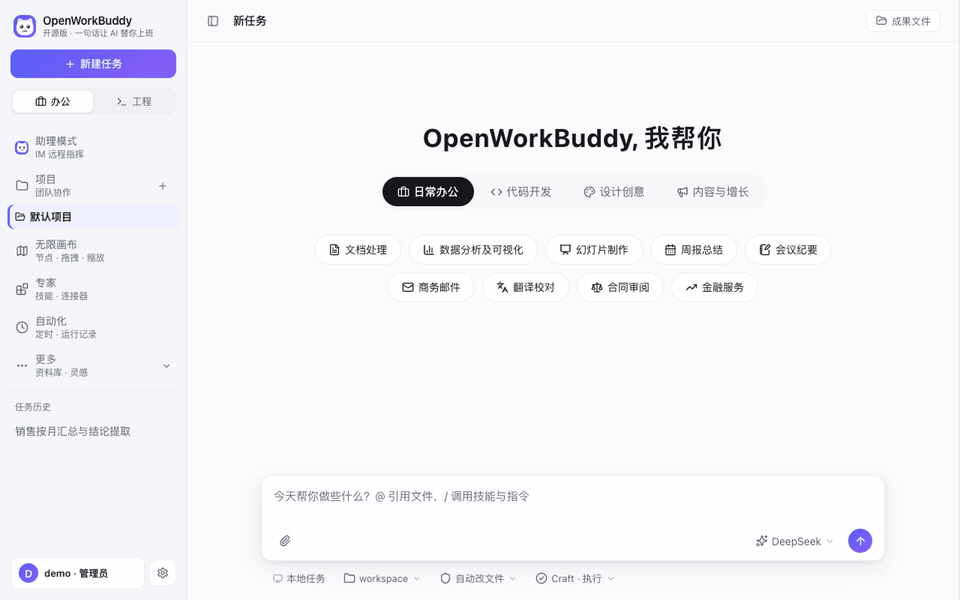
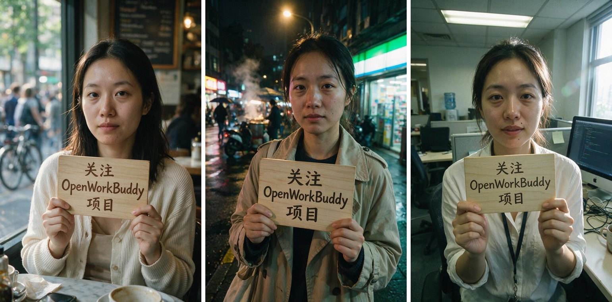
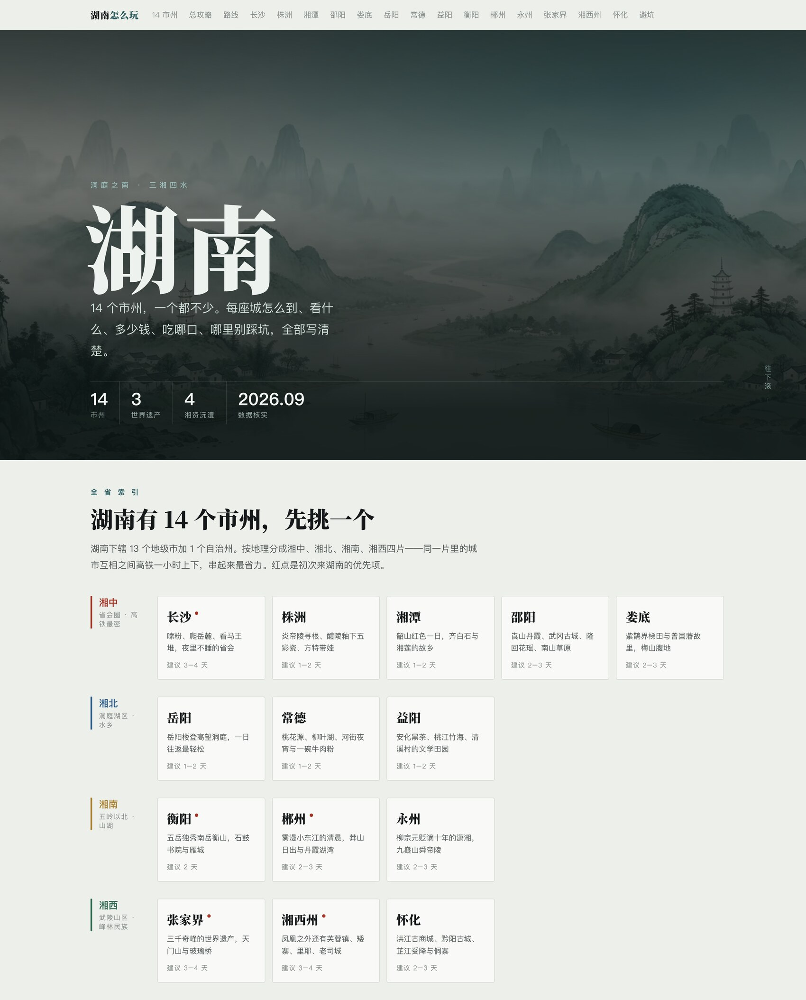
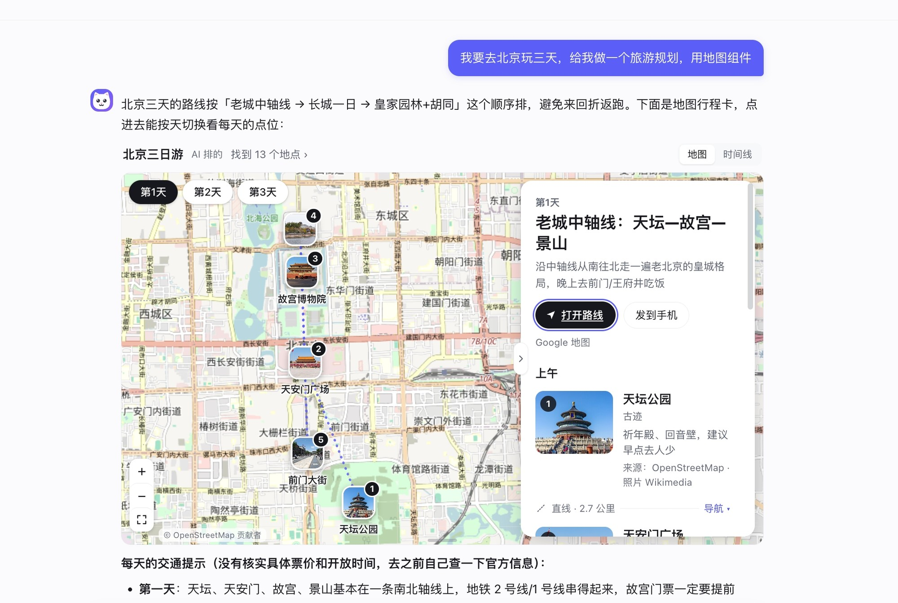
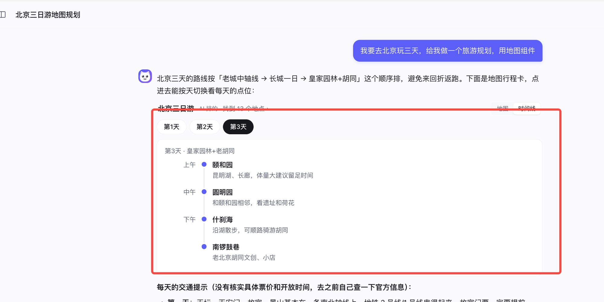
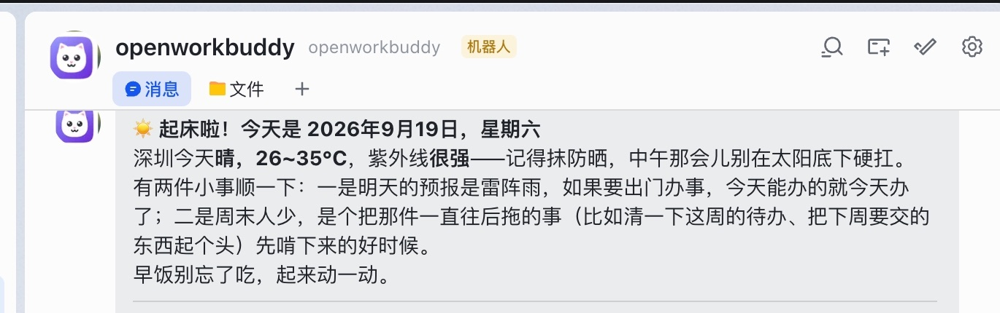
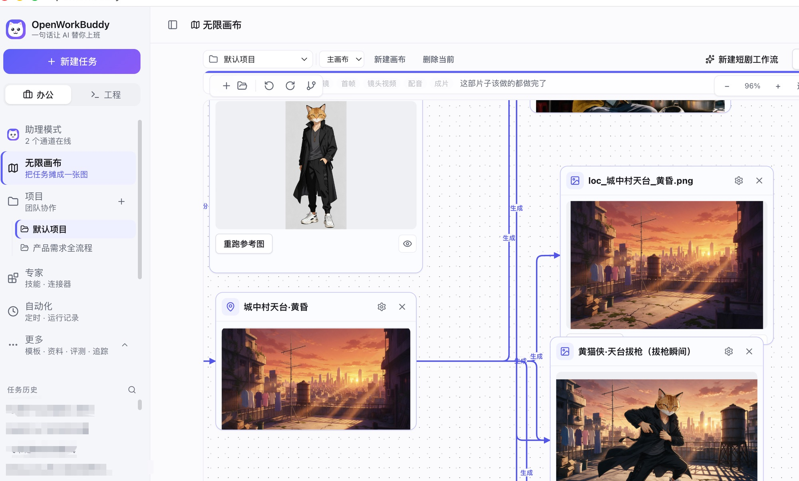
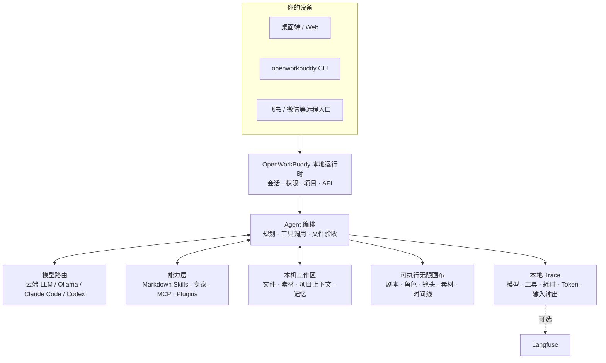
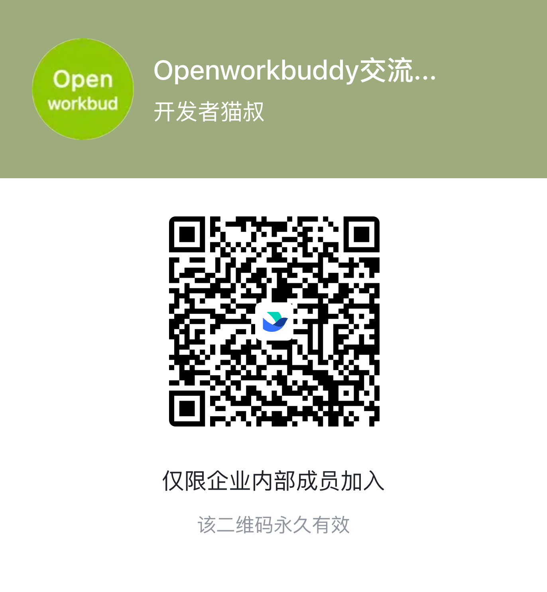

<p align="center">
 
</p>

<h1 align="center">OpenWorkBuddy</h1>

<p align="center">
 <b>跑在你自己电脑上的 AI 办公助理。</b><br>
 交代一句话，它自己规划、动手、验收，把 PPT / Word / Excel / 网页落到你硬盘上。<br>
 <b>给你的是能打开的文件，不是一段聊天记录。</b>
</p>

<p align="center">
 <sub>A local-first AI office agent that hands you files, not chat logs. · <a href="README.en.md"><b>English</b></a></sub>
</p>

<p align="center">
 <a href="#三分钟跑起来"><b>▶&nbsp;三分钟跑起来</b></a>
 &nbsp;·&nbsp; <a href="https://github.com/CatCatUncle/openworkbuddy/releases">下载安装包</a>
 &nbsp;·&nbsp; <a href="docs/功能清单.md">功能清单</a>
 &nbsp;·&nbsp; <a href="#文档">文档</a>
 &nbsp;·&nbsp; <a href="#商用授权--企业服务"><b>商用授权 · 企业服务</b></a>
 &nbsp;·&nbsp; <a href="#交流群">交流群</a>
 &nbsp;·&nbsp; <a href="CHANGELOG.md">变更记录</a>
</p>

<p align="center">
 <a href="https://github.com/CatCatUncle/openworkbuddy/stargazers"></a>
 <a href="LICENSE"></a>
 <a href="docs/功能清单.md"></a>
 <a href="docs/功能清单.md"></a>
 <a href="docs/功能清单.md"></a>
 <a href="docs/功能清单.md"></a>
</p>

<p align="center">
 个人非商用、学校和公益机构 <b>免费</b>；公司使用（哪怕只在内部）和个人商用，须买 <b>商业授权</b><br>
 公司可免费试用 30 天（还没用在实际业务上），长期用必须买：<a href="mailto:contact@aijentra.com"><b>contact@aijentra.com</b></a><br>
 我们承接 <b>企业 FDE 驻场</b> · <b>AI 培训</b> · <b>AI 落地咨询</b>，<a href="#商用授权--企业服务">怎么合作 ↓</a>
</p>

<p align="center">
 
</p>

---

## 你说一句，它交给你

| 你说一句 | 它交给你 |
|---|---|
| 帮我出一份 Q3 复盘 PPT，数据用这个 Excel | 读表 → 算 → 一个能直接放的 `.pptx` |
| 调研国内 AI 陪伴产品，出一份报告 | 联网搜 → 逐个打开读 → Markdown / Word |
| 把这份材料做成手机上能看的网页 | 写 HTML → 起本机服务 → 扫码就能看（[成品](https://hunan-travel.pages.dev/)） |
| 每天 9 点抓行业新闻，做成晨报发我飞书 | 定时任务 + IM 推送，错过了会补跑 |
| 做个 30 秒产品宣传片，竖版横版各一份 | 填表挑时长、画幅、声音 → 配音、动效、合成 → `.mp4` |

<p align="center">
 
</p>

> [!NOTE]
> 多任务并行、目标验收、👍👎 进自进化、双层记忆、权限档位、IM 远程指挥、桌面宠物…… 全部能力见 **[功能清单](docs/功能清单.md)**。

## 商用授权 · 企业服务

> [!IMPORTANT]
> **个人非商用、学校公益免费；公司使用（哪怕只在内部用）和个人商用，必须买商业授权。**
> 公司可以免费试用 30 天（前提是还没用在实际业务上），长期用必须买。
> 发邮件到 **[contact@aijentra.com](mailto:contact@aijentra.com)**，写清楚公司、怎么用、大概多少人用，我们尽快回你。细则见 [COMMERCIAL-LICENSE.md](COMMERCIAL-LICENSE.md)。

| 你的情况 | 要不要买授权 |
|---|---|
| 个人非商用：自用、学习、研究、业余项目 | 免费 |
| 学校、科研机构、公益组织、政府机构 | 免费 |
| 公司评估试用：最长 30 天，还没用在实际业务上 | 免费 |
| 公司 / 团队用在实际业务里，**哪怕只在内部** | **必须买** |
| **个人商用**：个人接单、给客户干活、做付费产品或服务 | **必须买** |
| 做 SaaS 对外服务、打包售卖、给客户交付 / 外包 / 定制 | **必须买** |

买授权不解锁任何功能：只有这一份代码，没有功能锁、不倒计时，授权不联网验证。软件不向作者或任何第三方回传使用数据；检查更新时会去 GitHub Releases 查有没有新版（GitHub 能看到本机 IP）。
没授权就商用，权利人可以依法追究民事责任；未经许可删改版权声明，还可能单独构成侵权——依据和判例见 [未授权商用的法律后果](COMMERCIAL-LICENSE.md#未授权商用的法律后果)。

除了授权，我们还承接企业 AI 业务：

| 服务 | 做什么 |
|---|---|
| **企业 FDE（驻场工程）** | 工程师进你们团队，把 Agent 接进真实业务流程，跑起来再交接 |
| **AI 培训** | 企业内训，让团队把 AI 用进日常工作，不停在尝鲜 |
| **AI 落地咨询** | 挑场景、定方案、算成本；私有化部署、行业智能体都能谈 |

作者是前大厂 Agent 工程师，服务过跨境电商、制造业、AI 初创、私募金融机构、消费品巨头、国央企等客户。常驻深圳，欢迎来交流和考察。

📮 合作邮箱：**[contact@aijentra.com](mailto:contact@aijentra.com)**

## 为什么是它

<table>
<tr>
<td width="50%" valign="top">

<b>📄 文件是真的。</b>

PPT / Word / Excel / 网页都真生成，成果面板里点开就能验收。说写了文件却不在磁盘上，当场拦下重做。

</td>
<td width="50%" valign="top">

<b>🔌 模型随便换，东西全在你手里。</b>

DeepSeek / 通义 / 智谱 / Kimi / OpenRouter / Ollama 界面点一下就切；本机装了 <b>Claude Code / Codex</b> 的，一键拿它当发动机，不用另买 token。会话、文件、Key 全在本机，默认只听 <code>127.0.0.1</code>。

</td>
</tr>
<tr>
<td width="50%" valign="top">

<b>🧩 加个能力 = 丢一个 Markdown 文件。</b>

存成 <code>skills/&lt;名字&gt;/skill.md</code>，存盘后下一条任务就生效——不改代码、不重启、不打包。

</td>
<td width="50%" valign="top">

<b>🔍 也适合拿来读懂 Agent。</b>

模型路由、工具调用、文件验收、记忆、权限、本地 Trace 全在同一个仓库里：一条真实任务，从它为什么这么做到最后交了什么，你都看得见。

</td>
</tr>
</table>

## 三分钟跑起来

**macOS**（一个弹窗都没有）：

```bash
curl -fsSL https://raw.githubusercontent.com/CatCatUncle/openworkbuddy/main/install-mac.sh | bash
```

**Windows**：[Releases](https://github.com/CatCatUncle/openworkbuddy/releases) 下 `-win-setup.exe`（x64 / ARM 通用）；不让装软件就用免安装版 `-win-x64-portable.exe`。

**源码**（Node.js 18+，零构建）：

```bash
git clone https://github.com/CatCatUncle/openworkbuddy.git
cd openworkbuddy && npm install
npm run app # 桌面版；或 npm start → http://localhost:3800
```

填一个模型 Key，然后说人话就行。数据都在 `~/OpenWorkBuddy`，卸载不删。字号、主题在右上角头像 →「外观」。

<details open>
<summary><b>第一次打开被系统拦住</b></summary>

<br>

证书还在申请，包是 ad-hoc 签名：系统拦的是「没见过的开发者」，不是文件有毒。

- **macOS 无法验证**：弹窗点「完成」→ 系统设置 → 隐私与安全性 → 拉到底点「仍要打开」。或者把 .app 拖进「应用程序」后跑 `xattr -dr com.apple.quarantine /Applications/OpenWorkBuddy.app`。网上「右键 → 打开」只对 macOS 14 及更早有效。
- **macOS 已损坏**：签名被网盘/解压工具弄坏了，重下一次。
- **Windows**：「更多信息」→「仍要运行」。
- **双击没反应**：看 `~/OpenWorkBuddy/logs/boot.log` → [安装与启动](docs/安装与启动.md#双击了没反应)

</details>

## 长这样

**「同一个人，换四个场景，手里举块写着字的牌子——要像随手拍的，别像 AI 图」**

<p align="center">
 
</p>

难的不是画人，是四张里得是同一个人、牌子上的中文不能糊。它先出一张，再用看图工具真去读自己刚生的那张（不是凭记忆吹），确认了才照这个方向铺开其余三张。

**「做个湖南旅游攻略网站，14 个市州一个都不能少」**

<p align="center">
 <a href="https://hunan-travel.pages.dev/"></a>
</p>

**<https://hunan-travel.pages.dev/>** —— 点开就能逛。一个 HTML 加一个图片文件夹，不挂任何外部 CDN，扔到静态托管上就是一个站。这不是截图拼的示意图，是它交出来的那份东西本身。

**「我要去北京玩三天，给我做一个旅游规划，用地图组件」**

<p align="center">
 
</p>

<p align="center">
 
</p>

回答里的行程直接画成一张行程卡：按天切换，地图上按顺序标好每个地点，右边是带照片的地点卡片，点「导航」就能走；右上角切到「时间线」，一天从上午排到晚上。不填 Key 也能用；在 设置 → 地图 填了高德 Key，国内地点更准。

**「每天早上七点，把今天的天气和该注意的事发到我飞书」**

<p align="center">
 
</p>

一句话排出来的定时任务，人不在电脑前也照跑；每趟调了哪些工具、为什么这么说，都在「自动化 → 运行记录」里点得开。飞书 / 企微 / 钉钉 / Telegram 同一条路。

怎么做到的、本机 Claude Code 当发动机长什么样 → **[三个案例，拆开讲](docs/案例.md)**

## AI 短剧无限画布

剧本、角色、场景、分镜、参考图、视频、配音、时间线摆在同一张图上。连线不是装饰——它表示下一步生成真会去读的角色、首帧和声音。改哪个镜头，只有那个镜头重跑。

<p align="center">
 
</p>

**一句话做出来的 AI 短剧**：说一句「做一集《不烧心》竖屏短剧」，剧本、定妆、分镜、首帧、镜头视频、成片一路做到底，下面这集 75 秒就是这么出来的（点封面看成片）。

<p align="center">
 <a href="docs/videos/ai-short-drama-ep01.mp4"></a>
</p>

左侧点「无限画布」就能开始。空白处拖拽平移，`Shift`+拖拽框选，`Shift`/`⌘` 点节点加选减选，底部对话框里能 `@` 引用任意节点和素材。

## 放服务器给团队用

```bash
git clone https://github.com/CatCatUncle/openworkbuddy.git && cd openworkbuddy
bash deploy.sh --domain buddy.example.com # Docker + 自动 HTTPS
```

多租户、席位、额度、离职一键收权限都有。**起来先注册管理员**——第一个注册的就是超管。
→ [部署](docs/部署.md) · [运维手册](deploy/README.md) · [多人协作](docs/多人协作.md) · [账号与部署运维](docs/账号与部署运维.md)

## 配模型

**设置 → 模型**，挑预设（OpenAI / Anthropic / OpenRouter / DeepSeek / 通义 / 智谱 / Kimi / 火山方舟 / Ollama），粘 Key，保存即生效。生图、配音、生视频另有一张表。对照表 → [配置模型](docs/配置模型.md)

> [!IMPORTANT]
> Key 只存在 `config.json`，已在 `.gitignore` 里，别手滑提交。

## 命令行也能用

`openworkbuddy` 跟桌面版**共用同一份**配置、技能、记忆、连接器和会话——终端里起的活儿，手机和网页上看得见、插得上话；桌面上做到一半，终端里 `openworkbuddy resume` 接着往下走。

```bash
npm link # 一次性：装成全局命令（也可以直接 node cli.js …）

openworkbuddy "帮我写一份本周周报" # 单发：跑完就退
openworkbuddy # 交互：连续对话，打一个 / 出命令菜单
cat error.log | openworkbuddy "这是什么问题" # 管道：管道内容当材料送进去
openworkbuddy -q "生成本周周报" > 周报.md # 文件里只有周报，没有进度条

openworkbuddy engines use claude-code # 换执行引擎：跑在你已经付过钱的订阅上，不烧 API 额度
```

单发和管道模式下**不会**反问你，脚本和 cron 里不会卡住。退出码说实话：`0` 成功、`1` 任务失败、`2` 参数写错、`130` Ctrl+C，所以 `openworkbuddy doctor && npm start` 拦得住没配好的机器。

`sessions` / `resume` / `engines` / `doctor` / `pair`（扫码把手机连上来）/ `worktree`，以及 `--mode` `--perm` `-C` `-f` `--json` 等全部参数 → **[命令行用法](docs/命令行用法.md)**

## 它是怎么搭的


```mermaid
flowchart TB
 subgraph Entry["你的设备"]
 Desktop["桌面端 / Web"]
 CLI["openworkbuddy CLI"]
 IM["飞书 / 微信等远程入口"]
 end

 Entry --> Runtime["OpenWorkBuddy 本地运行时\n会话 · 权限 · 项目 · API"]
 Runtime --> Agent["Agent 编排\n规划 · 工具调用 · 文件验收"]
 Agent <--> Models["模型路由\n云端 LLM / Ollama / Claude Code / Codex"]
 Agent <--> Capabilities["能力层\nMarkdown Skills · 专家 · MCP · Plugins"]
 Agent <--> Workspace["本机工作区\n文件 · 素材 · 项目上下文 · 记忆"]
 Agent --> Canvas["可执行无限画布\n剧本 · 角色 · 镜头 · 素材 · 时间线"]
 Agent --> Trace["本地 Trace\n模型 · 工具 · 耗时 · Token · 输入输出"]
 Trace -. 可选 .-> Langfuse["Langfuse"]
```

这张图也是读代码的路线：从 `server.js` 进去，再看 `src/agent/agent.js` 怎么编排模型和工具。细节 → [实现细节](docs/实现细节.md)，代码怎么分层 → [代码架构](docs/代码架构.md)

## 最新动态

- **10-07** 闲着更省电：没任务、没人用时，服务每秒醒来从约 40 次降到 2 次；窗口不在前台也不再盯卡顿
- **10-07** 行程卡换了个样：地图铺满整张卡，地点浮在右边一栏；钉子带照片和地名，点卡片地图就滑过去；国内一天四站以上也能一键打开整条路线
- **10-06** 系统沙箱：AI 跑的命令和脚本在 macOS、Windows 上读不到 Key 和账本、改不了应用；设置 → 安全 能关，每条多花 7–16 毫秒
- **10-06** 只用你配过的模型：中转站、判断模型、记忆向量都不碰没登记的型号；设了额度时，没价目的型号直接拦下
- **10-06** 额度闸补漏：换备用渠道、看图、出图都先过价；只靠前缀对上价目的贵档型号也拦
- **10-06** Key 不进 AI 手里：子进程默认不带 Key 类变量；联网工具打不到本机、内网和云元数据
- **10-06** 外部引擎必须指定型号，多人共用默认关；Codex 默认不联网、只写工作区
- **10-06** 行程卡：回答里的行程画成能拖能点的地图，按天切换，地点卡片、照片都有；点导航国外开 Google 地图、国内开高德；不填 Key 也能用
- **10-06** README 放了行程卡的两张截图：北京三日游，地图看每天的点位，时间线从上午排到晚上
- **10-06** 本机 Codex 自带生图出的图自动放进对话文件夹，成果栏能预览
- **10-06** 授权说明补上授权码作废的三种情形和申诉办法；写明软件没有统计和遥测
- **10-06** 源码按层搬进 src/，各层只准往下引用；二次开发先看[代码架构](docs/代码架构.md)
- **10-05** 新建项目：连接器、专家、技能能全选、筛选、Shift 连选，还能照搬已有项目的选择
- **10-05** 评测：评委看得到过程，提示词能改，加人工评测和多维成绩单
- **10-03** README 放了一集一句话做出来的 AI 短剧成片，75 秒，点封面看
- **10-02** 参考模板用起来先弹填空表：有选项、默认值、实时预览；写模板时选中文字点「设为填空」就行，删了能撤销
- **10-02** Windows 安装包改成向导：能选装在哪个盘、看得到进度；包里文件从一万多个减到四千个
- **10-02** Windows 起任务不再闪黑窗，中文路径、GBK 输出、高 DPI 显示都修好；拦删除的命令补上二十多种写法
- **10-02** PPT 预览按每页真实版式画；画布按图片原比例摆，时间线改成胶片条；成果栏窄窗口也关得掉
- **10-02** 模型渠道修一轮：火山方舟上的 GLM 不再被拦，挂错渠道会提示；通义国际站、万相出图修好
- **10-01** 对话里说「装这个技能」直接装进技能库；接 MCP 直接跳连接器页
- **10-01** 飞书长回复不再截断：超长自动拆成几条发；回复里的图表转成图片发出去
- **10-01** 分文件夹以前的老对话：根上已有的文件原地改，换过目录后附件照样点得开
- **10-01** 命令行也按对话分文件夹；有任务在跑时点「新任务」不再落进上一条的文件夹；「复制」修好
- **09-30** 成果按对话分文件夹：没填目录的项目、飞书微信消息、定时任务也各归各的，不再互相盖
- **09-30** 参考模板库能自己加、改、删：「我的」只有自己看得见，「公司」管理员改、全组织共用
- **09-30** 同时开好几个对话不再卡：共用一条实时通道，存盘、截图挪出主线程，侧栏每行能单独停
- **09-30** 首次配置能直接填自定义接口；输入法选词按回车不再误发，长对话能连着往上翻
- **09-30** 一台服务器带几家公司：平台超管建组织、发第一张码；到期后停新任务，历史照常能看
- **09-30** 多人部署权限补漏：成员看不到连接器地址，租户开不了命令行，停用再启用要过席位
- **09-30** 定时任务按负责人本人跑，负责人停用或离职就停；每次登录成败都有记录
- **09-30** 新写[账号与部署运维](docs/账号与部署运维.md)：开号、离职、找回密码、备份升级、带几家组织
- **09-28** 授权写清楚了：个人非商用免费；公司使用（含只在内部用）和个人商用要向作者买商业授权，公司可先免费试用 30 天
- **09-28** 管理后台加「商业授权」页：填授权码本机验证，不联网、不锁任何功能
- **09-28** 通义渠道算记忆向量不再被判「不可用」：按各家上限分批发
- **09-28** Word 技能重写；Excel、PPT 技能里的模板照抄就能跑
- **09-28** 回复说到一半就断却报「完成」：现在自动接着说完，交付整句
- **09-28** 渠道能选接口格式：OpenAI / Responses / Anthropic / Gemini / Ollama 原生，本地部署都能接
- **09-28** 对话在别处还跑着，这边发「继续」不再报错：当场接上那一趟，这句话插进去

更早的看 **[变更记录](CHANGELOG.md)**。

## ⚠️ 这个 agent 手里有 shell

它能跑命令、读写文件、上网，所以有命令审批、文件黑名单、URL 白名单、审计日志和四档权限；macOS 和 Windows 上，它跑的命令还套一层系统沙箱，读不到 Key 和账本。装别人的技能前会先过一遍静态体检，危险的默认不装——但它不是杀毒，装前自己读一眼 `skill.md`。
**放公网前先读 [安全](docs/安全.md)**，默认配置只为本机调。

## 交流群

用崩了、有想法、想一起改，进飞书群直接说：

<p align="center">
 
</p>

## 一起把它做下去

- **用崩了、卡住了，开个 [issue](https://github.com/CatCatUncle/openworkbuddy/issues/new)**，哪怕只贴一句报错——你以为「只有我遇到」的坑，多半所有人都在踩。贴之前扫一眼，别把 API Key 带上。
- **10 分钟** 写个技能：一个 Markdown 存成 `skills/<名字>/skill.md`，存盘即生效，[模板在这](CONTRIBUTING.md#提交一个技能3-分钟)
- **一晚上** 挑个 issue 改：`npm install && npm start` 就跑起来，`npm test` 不用 API Key 也能全绿

项目结构、测试、PR 规范都在 [参与贡献](CONTRIBUTING.md)。不用先开 issue 问，直接发 PR。

## 从别家换过来

在找 **Claude Cowork、Codex、豆包办公、千问办公的开源替代**，或者想给 **DeepSeek 找一个 agent 外壳（harness）**？每一家都写了一页老实对比，也写了什么时候还是用它更合适：

| 你在用 / 在找 | 对比页 |
|---|---|
| Claude Cowork | [Claude Cowork 开源替代：本机运行、模型随便换](https://catcatuncle.github.io/openworkbuddy/zh/alternatives/claude-cowork/) |
| Codex | [Codex 办公版替代：交付的是文件，还能拿 Codex 当发动机](https://catcatuncle.github.io/openworkbuddy/zh/alternatives/codex/) |
| 豆包办公 | [豆包办公开源替代：也能用豆包模型](https://catcatuncle.github.io/openworkbuddy/zh/alternatives/doubao/) |
| 千问办公 | [千问办公开源替代：通义模型照样用](https://catcatuncle.github.io/openworkbuddy/zh/alternatives/qwen/) |
| DeepSeek | [DeepSeek agent 外壳：填上 Key 就能干活](https://catcatuncle.github.io/openworkbuddy/zh/alternatives/deepseek-agent/) |

OpenWorkBuddy 是独立开源项目，跟上面这些公司都没有关联。

## 文档

| 文档 | 一句话 | 文档 | 一句话 |
|---|---|---|---|
| [功能清单](docs/功能清单.md) | 全部能力、技能与工具 | [部署](docs/部署.md) | 服务器 / Docker / 反代 |
| [案例](docs/案例.md) | 上面那几张图怎么做出来的 | [多人协作](docs/多人协作.md) | 多租户、账号、权限、额度 |
| [安装与启动](docs/安装与启动.md) | 安装包、源码、常见卡壳 | [安全](docs/安全.md) | 审批闸门、黑白名单、审计 |
| [配置模型](docs/配置模型.md) | 各家 base_url / 模型名对照 | [数据同步与搬家](docs/数据同步与搬家.md) | 数据存哪、换电脑怎么搬 |
| [命令行用法](docs/命令行用法.md) | CLI 参数、管道、`--json`、cron | [开源与商业版边界](docs/开源与商业版边界.md) | 买授权到底买到什么 |
| [扩展](docs/扩展.md) | 写技能、接 MCP、装插件、建专家 | [路线图](docs/路线图.md) | 接下来做什么、怎么算做完 |
| [IM 与定时任务](docs/IM与定时任务.md) | 飞书 / QQ / 企微 / 微信 / 钉钉 | [变更记录](CHANGELOG.md) | 一句话一条，最新在上 |
| [实现细节](docs/实现细节.md) | agent 主循环怎么转的 | [参与贡献](CONTRIBUTING.md) | 项目结构、测试、提 PR |
| [安全基线](docs/安全基线.md) | 数据落在哪、谁看得见、哪些没做到 | [远程访问](docs/远程访问.md) | 手机/外网连本机，两个开关默认关着 |
| [账号与部署运维](docs/账号与部署运维.md) | 开号、离职、找回密码、备份升级、带几家组织 | [代码架构](docs/代码架构.md) | 代码分几层、谁能引谁、新代码放哪 |

## 同一个作者的其他项目

- **[toolward](https://github.com/CatCatUncle/toolward)** —— 给 agent 用的技能 / MCP 连接器静态安检：37 条规则分六族，零运行时依赖。`npm i -g toolward` 装上，OpenWorkBuddy 自动把它当第二把尺子用，不装也完全不影响。同样是 PolyForm Noncommercial。

## 协议

**个人非商用、学校公益免费；公司使用（哪怕只在内部）和个人商用要买商业授权**，公司可先免费试用 30 天。购买发邮件到 [contact@aijentra.com](mailto:contact@aijentra.com)。

协议 [PolyForm Noncommercial 1.0.0](LICENSE)，细则和没授权商用的后果见 [COMMERCIAL-LICENSE.md](COMMERCIAL-LICENSE.md)。部署配置、脚本、技能模板另按 MIT（[清单](COMMERCIAL-LICENSE.md#按-mit-授权的部分)）；名称和图标不在授权范围内。

复制或分发本软件的任何部分，都要带上协议全文（或网址）和 [LICENSE](LICENSE) 开头所有以 `Required Notice:` 开头的行。

官方发布只有 GitHub 上的 CatCatUncle/openworkbuddy 及其 Releases。非官方渠道的安装包不由作者提供更新和支持，使用者的授权以 PolyForm Noncommercial 1.0.0 的条件和商业授权为准。

**KylinWork 等项目未经作者许可拿本项目代码二次开发，还擅自改了开源协议，作者已要求其全网下架。**

Copyright (c) 2026 开发者猫叔 (DeveloperCatUncle)

## 免责声明

独立开源项目，与腾讯及其 WorkBuddy 产品无任何关联，不含其代码或素材；对接的 IM 均走公开接口。借鉴来源见 [NOTICE.md](NOTICE.md)。有问题请开 [Issue](https://github.com/CatCatUncle/openworkbuddy/issues)。

## 支持这个项目

<p align="center">
 <a href="https://github.com/CatCatUncle/openworkbuddy">
 
 </a>
</p>

<p align="center">
 <a href="https://github.com/CatCatUncle/openworkbuddy"></a>
</p>

<p align="center">
 <sub>顺手把它转给一个天天手搓 PPT、周报、会议纪要的同事，比一百次曝光管用。</sub>
</p>

## 贡献者

感谢每一个动手改过这个项目的人。想加入他们：[参与贡献](CONTRIBUTING.md)。

<p align="center">
<a href="https://github.com/CatCatUncle/openworkbuddy/graphs/contributors">
 
</a>
</p>

## Star 历史

<p align="center">
<a href="https://star-history.com/#CatCatUncle/openworkbuddy&Date">
 <picture>
 <source media="(prefers-color-scheme: dark)" srcset="https://api.star-history.com/svg?repos=CatCatUncle/openworkbuddy&type=Date&theme=dark">
 
 </picture>
</a>
</p>
